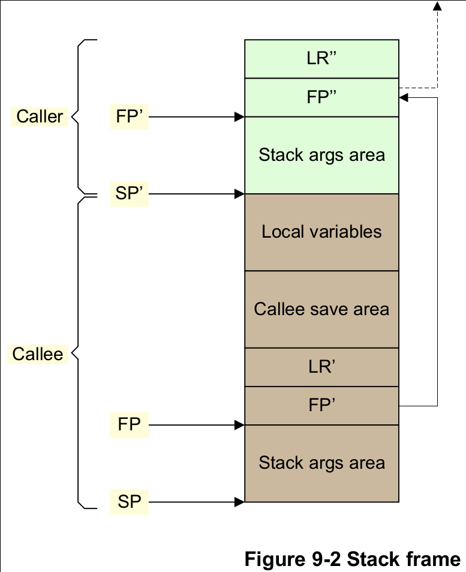
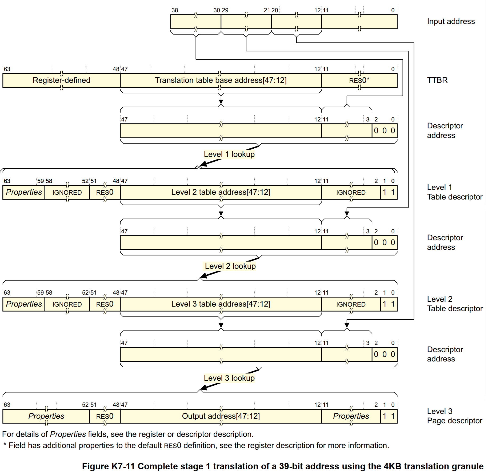

# 寄存器
## 通用寄存器
* 提供 31 个`64 bit`的通用寄存器
* 每个通用寄存器，用 **x** 表示`64`位宽，**w** 表示`32`位宽

# ABI

* 参数寄存器（**X0-X7**）：8 个寄存器可用于传递参数
  * 用作临时寄存器
  * 可以保存函数内 *调用者保存的寄存器变量* 的中间值，调用其他函数之间的值
* 调用者保存（Caller-saved）的临时寄存器（**X9-X15**）： 如果调用者要求在任何这些寄存器中保留值调用另一个函数，调用者必须将受影响的寄存器保存在自己的堆栈帧中。它们可以通过被调用的子程序进行修改，而无需保存并在返回调用者之前恢复它们。
* 被调用者保存（Callee-saved）的寄存器（**X19-X29**）： 这些寄存器保存在被调用者帧中。它们可以被被调用者修改子程序，只要它们在返回之前保存并恢复。
* 特殊用途寄存器（**X8，X16-X18，X29，X30**）：
  * **X8**： 是间接结果寄存器，用于保存子程序返回地址，尽量不使用
  * **X16** 和 **X17**： 程序内调用临时寄存器
  * **X18**： 平台寄存器，保留用于平台 ABI，尽量不使用
  * **X29**： 帧指针寄存器（**FP**）
  * **X30**： 链接寄存器（**LR**）
  * **X31**： 堆栈指针寄存器 **SP** 或零寄存器 **ZXR**



# 异常
* 对于 ARM64 而言，exception 是指 CPU 的某些异常状态或者一些系统的事件（可能来自外部，也可能来自内部），这些状态或者事件可以导致 CPU 去执行一些预先设定的，具有更高执行权利的软件（也叫 exception handler）
* 执行 exception handler 可以进行异常的处理，从而让系统平滑的运行。exception handler 执行完毕之后，需要返回发生异常的现场。

## 异常级别
* Armv8 为了支持虚拟化扩展在CPU的运行级别上引入了 Exception Level 的概念


* **EL0**：用户态程序的运行级别，Guest 内部的 App 也运行在这个级别
* **EL1**：内核的运行级别，Guest 的内核也运行在这个级别
* **EL2**：Hypervisor 的运行级别，Guest 在运行的过程中会触发特权指令后陷入到 EL2 级别，将控制权交给 Hypervisor。Hypervisor 属于 Non Secure 的
* **EL3**：Monitor Mode，CPU 在 Secure World 和 Normal World 直接切换的时候会先进入 EL3，然后发生 World 切换
* 当 CPU 的 Visualization Extension 被 disable 的时候，软件就运行在 EL0 和 EL1 上，这时候 EL1 有权限访问所有的硬件
* 当发生异常的时候，系统的 exception 会迁移到更高的 exception level 或者维持不变，但是绝不会降低
* 此外，不会有任何的异常会去到 EL0

## 异常分类
### 异步异常（asynchronous exception）和同步异常（synchronous exception）
#### 异步异常（asynchronous exception）
* **异步异常 asynchronous exception** 基本上可以类似大家平常说的中断，它是毫无预警的，丝毫不考虑 CPU core 感受的外部事件
  * 需要注意的是：*外部* 并不是表示 *外设*，这里的外部是针对 CPU core 而言。MMU 就属于 CPU core，因此它产生的异常就不属于异步异常
  * 有些 *中断* 是来自 SoC 的其他 HW block，例如 GIC，这时候，对于处理器或者 CPU（指SoC）而言，这些事件是内部的），这些事件打断了 CPU core 对当前软件的执行，因此称之 **interrupt**
* Interrupt 或者说 asynchronous exception 有下面的特点：
  * 异常和 CPU 执行的指令无关
  * 返回地址是硬件保存下来并提供给 handler，以便进行异常返回现场的处理。这个返回地址并非产生异常时的指令
* 异步异常分类
  * IRQ
  * FIQ
  * SError （System Error）

#### 同步异常（synchronous exception）
* **同步异常 synchronous exception** 和 asynchronous exception 相反，其特点是：
  * 异常的产生是和 CPU core 执行的指令或者试图执行执行相关
  * 硬件提供给 handler 的返回地址就是产生异常的那一条指令所在的地址
* 同步异常分类
  * synchronous abort，例如未定义的指令、data abort、prefetch instruction abort、SP未对齐异常、debug exception等等。
  * 专门产生异常的指令
    * `svc`：Call Supervisor，主要被 EL0（user mode）的软件用来申请 EL1（OS service）软件的服务
    * `hvc`：Call Hypervisor，主要被 Guest OS 用来请求 hypervisor 的服务
    * `smc`：Call Secure Monitor，用来切换不同的 world，normal world 或是 secure world

## SError interrupt
* SError 本质上是一种异步外部 abort（asynchronous external abort）
* 在 ARM64 中，只有 SError 为 imprecise exception，其他的异常为 precise exception
* 首先要了解 **External abort** 这个术语
  * External abort 来自内存系统，当然不是所有的来自内存系统的 abort 都是 external abort
    * 例如来自 MMU 的 abort 就不是 external abort（这里的 external 是针对处理器（而非CPU core）而言，因此 MMU 实际上是 internal 的）。
  * External abort 发生在处理器通过总线访问内存的时候（可能是直接对某个地址的读或者写，也可能是取指令导致的内存访问），处理器在总线上发起一次 transaction，在这个过程中发生了 abort，abort 来自处理器之外的 memory block、device block 或者 interconnection block，用来告知处理器，搞不定了，你自己看着办吧。
  * External abort 可以被实现成 synchronous exception（precise exception），也可以实现成 asynchronous exception（imprecise exception）。
  * 如果 external abort 是异步的，那么它可以通过 SError interrupt 来通知 CPU core。
### SError产生的原因
* 根据Arm相关手册的说明，其可能原因有很多，比较常见的原因包括：
  * Asynchronous Data Aborts，异步数据异常，数据异常即CPU读写内存数据时产生的异常
    * 比如：如果误将 ROM 对应的区域的页表项设置为 RW，同时该内存熟悉为 write-back cacheable，当尝试写这段区域内存时，数据会先写入 cache，而在后面的某个时间点，当其他操作触发相应的脏的 cacheline 回写内存时，此时内存系统就会返回错误（因为 ROM 是只读的)，从而触发一个异步数据异常。在 Armv8 环境中，这就是一个标准的 SError
  * 外部引脚触发
    * 部分处理器，比如 Cortex-A5x，拥有独立的引脚来触发 SError，也就是说此时的 SError 是由 SoC 设计者自己定义的，比如：ECC 和奇偶校验错误就常作为 SError 来触发。具体应该参考 SoC 的参考手册来确认 SError 可能的对应的错误类型

## 简述异常处理
### 异常发生
1. 更新`SPSR_ELx`，**保存** PSTATE
2. 更新 PSTATE（EL 不变或变高）
3. 返回地址 **保存** 到`ELR_ELx`
4. PC 设置为对应异常向量的地址
5. 更新`ESR_ELx`为异常产生的原因
   * 只有当异常为同步异常或 SError 时
### 异常返回
* 程序执行`ERET`指令从异常返回
1. 从`SPSR_ELx`**恢复** PSTATE
2. 从`ELR_ELx`**恢复** PC

# PSTATE
* Armv8-A 中 **进程状态（Process state, PSTATE）** 是一个进程状态信息的抽象
* AArch64 为每个 Exception level 提供了一组 Banked Special-purpose Registers
  * 所谓的 Banked Register 是指一个寄存器在不同模式下有对应不同的寄存器，比如栈指针寄存器`SP`，在 EL0 下是`SP_EL0`，在 EL1 下是`SP_EL1`，在 EL2 下是`SP_EL2`等，进入各种模式后会自动切换映射到各个模式下对应的寄存器
* AArch64 用 PSTATE 位域（而不是一个寄存器）来指明或者控制程序状态
* 一些 PSTATE 位域可以通过 Special-purpose **Current Program Status Register (CPSR)** 访问
  * `CPSR`寄存器可以用`MRS`指令直接读取，用`MSR`指令直接写入
* `mrs x0, CurrentEL` 读取当前 Exception level，`msr sctlr_el1, x0`修改 EL1 系统控制寄存器的值


#### The Condition flags
* **N**：Negative Condition flag.
* **Z**：Zero Condition flag.
* **C**：Carry Condition flag.
* **V**：Overflow Condition flag.
#### DAIF, Interrupt Mask Bits
* **D**：AArch64 执行模式时为 Debug 异常掩码位，目标为当前 Exception level 的 Watchpoint，Breakpoint 和 Software Step exceptions
* **E**：AArch32 执行模式时为 Endianness of data accesses，与`D`是同一个 bit。
* **A**：SError 中断掩码位，System Error 是一种异步异常，本质上是一种异步外部 abort（asynchronous external abort）
* **I**：IRQ 中断掩码位
* **F**：FIQ 中断掩码位

#  地址翻译
* 在 AArch64 模式下，处理器能够访问更大范围的地址空间，不再仅仅是`2^32`Byte，地址可以用 *64位* 表示，但其中 **有效位是48位**。也就是可以访问`256T`字节范围的物理地址。
* 在不同的 Exception level 下，MMU 使用的地址转换机制不同，进而使用的地址转换控制寄存器也不同。MMU 最关键的寄存器是 **TTBR（Translation Table Base Register）** 和 **TCR（Translation Control Register）**。
* VA 的最高有效位（MSB）为 0 时 MMU 使用`TTBR0`的转换表来翻译，VA 的最高有效位为 1 时 MMU 使用`TTBR1`的转换表来翻译
* EL2 和 EL3 有`TTBR0`，但是没有`TTBR1`，这意味着 EL2 和 EL3 下只能使用`0x0~0x0000_FFFF_FFFF_FFFF`范围的虚拟地址空间
* 在 EL1，根据 TCR 配置的不同，MMU 访问的地址范围也有所不同，使用不同的基址寄存器进行地址转换
  * `TTBR0_ELx`指向以`0x0000_0000_0000_0000`起始的低段虚拟地址的翻译表
  * `TTBR1_ELx`指向以`0xFFFF_FFFF_FFFF_FFFF`结束的高段虚拟地址的翻译表
* 通常情况下，用户程序使用`TTBR0`，内核空间使用`TTBR1`如下图：
  * `TCR_EL1.T1SZ==16`，所以`TTBR1_EL1`地址翻译的范围是 2<sup>64-T1SZ</sup>，即`0xFFFF_0000_0000_0000 ~ 0xFFFF_FFFF_FFFF_FFFF`
  * `TCR_EL1.T0SZ==16`，所以`TTBR0_EL1`地址翻译的范围是 2<sup>64-T0SZ</sup>，即`0x0000_0000_0000_0000 ~ 0x0000_FFFF_FFFF_FFFF`


* AArch64 模式有 3 个不同的地址转换粒度，4KB、16KB 和 64KB，不同的粒度大小定义了不同的内存页大小和各级页表大小：

Property | 4KB granule | 16KB granule | 64KB granule | Notes
---------|-------------|--------------|--------------|------
Maximum number of entries in a translation table | 512 | 2048 (2k) | 8192 (8K) | -
Address bits resolved in one level of lookup | 9 | 11 | 13 | 2<sup>9</sup>=512, 2<sup>11</sup>=2K, 2<sup>13</sup>=8K
Page size | 4KB | 16KB | 64KB | -
Page address range | VA[11:0]=PA[11:0] | VA[13:0]=PA[13:0] | VA[15:0]=PA[15:0] | 2<sup>12</sup>=4K, 2<sup>14</sup>=16K, 2<sup>16</sup>=64K

## 虚拟地址支持
* 64 位虚拟地址中，并不是所有位都用上，除了高 16 位用于区分内核空间和用户空间外，有效位的配置可以是：36，39，42，47，48。
* 对于 4KB 页，有 3 级`pgd(pud)-->pmd-->pte`或 4 级页表`pgd-->pud-->pmd-->pte`，允许 39 位或 48 位虚拟地址
```c
+--------+--------+--------+--------+--------+--------+--------+--------+
|63    56|55    48|47    40|39    32|31    24|23    16|15     8|7      0|
+--------+--------+--------+--------+--------+--------+--------+--------+
 |                 |         |         |         |         |
 |                 |         |         |         |         v
 |                 |         |         |         |   [11:0]  in-page offset
 |                 |         |         |         +-> [20:12] L3 index
 |                 |         |         +-----------> [29:21] L2 index
 |                 |         +---------------------> [38:30] L1 index
 |                 +-------------------------------> [47:39] L0 index
 +-------------------------------------------------> [63] TTBR0/1
```
* 于是我们可以决定 Linux 内核中地址空间的大小，比如将内核中有效位配置为 **39** 时，即`CONFIG_ARM64_VA_BITS=39`
  * 用户空间地址范围：`0x0000_0000_0000_0000 ~ 0x0000_007F_FFFF_FFFF`，大小为 512G
  * 内核空间地址范围：`0xFFFF_FF80_0000_0000 ~ 0xFFFF_FFFF_FFFF_FFFF`，大小为 512G
* 39 位有效位的虚拟地址的翻译过程如下：



# 地址空间布局
* 查看 [Memory Layout on AArch64 Linux](https://www.kernel.org/doc/html/latest/arm64/memory.html)
* 内核源码目录也由 Documentation/arm64/memory.rst
  * AArch64 Linux memory layout with 4KB pages + 4 levels (48-bit):
  ```c
  Start                 End                     Size            Use
  -----------------------------------------------------------------------
  0000000000000000      0000ffffffffffff         256TB          user
  ffff000000000000      ffff7fffffffffff         128TB          kernel logical memory map
  [ffff600000000000      ffff7fffffffffff]         32TB          [kasan shadow region]
  ffff800000000000      ffff800007ffffff         128MB          bpf jit region
  ffff800008000000      ffff80000fffffff         128MB          modules
  ffff800010000000      fffffbffefffffff         124TB          vmalloc
  fffffbfff0000000      fffffbfffdffffff         224MB          fixed mappings (top down)
  fffffbfffe000000      fffffbfffe7fffff           8MB          [guard region]
  fffffbfffe800000      fffffbffff7fffff          16MB          PCI I/O space
  fffffbffff800000      fffffbffffffffff           8MB          [guard region]
  fffffc0000000000      fffffdffffffffff           2TB          vmemmap
  fffffe0000000000      ffffffffffffffff           2TB          [guard region]
  ```
  * arch/arm64/include/asm/memory.h
  ```c
  /*
   * VMEMMAP_SIZE - allows the whole linear region to be covered by
   *                a struct page array
   *
   * If we are configured with a 52-bit kernel VA then our VMEMMAP_SIZE
   * needs to cover the memory region from the beginning of the 52-bit
   * PAGE_OFFSET all the way to PAGE_END for 48-bit. This allows us to
   * keep a constant PAGE_OFFSET and "fallback" to using the higher end
   * of the VMEMMAP where 52-bit support is not available in hardware.
   */
  #define VMEMMAP_SIZE ((_PAGE_END(VA_BITS_MIN) - PAGE_OFFSET) \
              >> (PAGE_SHIFT - STRUCT_PAGE_MAX_SHIFT))

  /*
   * PAGE_OFFSET - the virtual address of the start of the linear map, at the
   *               start of the TTBR1 address space.
   * PAGE_END - the end of the linear map, where all other kernel mappings begin.
   * KIMAGE_VADDR - the virtual address of the start of the kernel image.
   * VA_BITS - the maximum number of bits for virtual addresses.
   */
  #define VA_BITS         (CONFIG_ARM64_VA_BITS)
  #define _PAGE_OFFSET(va)    (-(UL(1) << (va)))
  #define PAGE_OFFSET     (_PAGE_OFFSET(VA_BITS))
  #define KIMAGE_VADDR        (MODULES_END)
  #define BPF_JIT_REGION_START    (KASAN_SHADOW_END)
  #define BPF_JIT_REGION_SIZE (SZ_128M)
  #define BPF_JIT_REGION_END  (BPF_JIT_REGION_START + BPF_JIT_REGION_SIZE)
  #define MODULES_END     (MODULES_VADDR + MODULES_VSIZE)
  #define MODULES_VADDR       (BPF_JIT_REGION_END)
  #define MODULES_VSIZE       (SZ_128M)
  #define VMEMMAP_START       (-VMEMMAP_SIZE - SZ_2M)
  #define VMEMMAP_END     (VMEMMAP_START + VMEMMAP_SIZE)
  #define PCI_IO_END      (VMEMMAP_START - SZ_2M)
  #define PCI_IO_START        (PCI_IO_END - PCI_IO_SIZE)
  #define FIXADDR_TOP     (PCI_IO_START - SZ_2M)

  #if VA_BITS > 48
  #define VA_BITS_MIN     (48)
  #else
  #define VA_BITS_MIN     (VA_BITS)
  #endif

  #define _PAGE_END(va)       (-(UL(1) << ((va) - 1)))

  #define KERNEL_START        _text
  #define KERNEL_END      _end
  ..._
  ```
## 内核起始地址
* `KIMAGE_VADDR`：为内核的起始虚拟地址，但内核镜像并不一定就放这里
* `TEXT_OFFSET` bootloader 会把内核镜像从外设拷贝到 RAM 中，那么具体拷贝到什么位置呢？从 RAM 的起始地址开始吗？
  * 实际上是从`TEXT_OFFSET`开始的，偏移这么一小段内存估计是为了 bootloader 和 kernel 之间传递一些信息。
  * 所以，这里`TEXT`是指 kernel text segment，而`OFFSET`是相对于 RAM 的首地址而言的。
  * `TEXT_OFFSET`必须要 *4K 对齐* 并且`TEXT_OFFSET`的大小不能大于 2M
* `PAGE_OFFSET`：线性映射的起始地址，这里用`PAGE`确实很容易误导
* arch/arm64/kernel/vmlinux.lds.S
  ```c
  ...
  . = KIMAGE_VADDR + TEXT_OFFSET;

  .head.text : {
      _text = .;
      HEAD_TEXT
  }
  .text : {           /* Real text segment        */
      _stext = .;     /* Text and read-only data  */
          __exception_text_start = .;
          *(.exception.text)
          __exception_text_end = .;
          IRQENTRY_TEXT
          SOFTIRQENTRY_TEXT
          ENTRY_TEXT
          TEXT_TEXT
          SCHED_TEXT
          CPUIDLE_TEXT
          LOCK_TEXT
          KPROBES_TEXT
          HYPERVISOR_TEXT
          IDMAP_TEXT
          HIBERNATE_TEXT
          TRAMP_TEXT
          *(.fixup)
          *(.gnu.warning)
      . = ALIGN(16);
      *(.got)         /* Global offset table      */
  }
  ..._```
  ```
* 文本段的入口点`stext`会放到 section `.head.text`
  * `#define __HEAD      .section    ".head.text","ax"`
* 链接器脚本把`HEAD_TEXT`放到了`_text`
  * `#define HEAD_TEXT  KEEP(*(.head.text))`
* 这样`_text`就是内核镜像的起始地址了，启动内核的时候要跳转到这执行内核的第一条指令，即`stext`例程

# 代码转换地址
## 物理地址转虚拟地址
* 首先是宏`__va(x)`
  * arch/arm64/include/asm/memory.h
  ```c
  ...
  extern s64          memstart_addr;
  /* PHYS_OFFSET - the physical address of the start of memory. */
  #define PHYS_OFFSET     ({ VM_BUG_ON(memstart_addr & 1); memstart_addr; })
  ...
  #define __phys_to_virt(x)   ((unsigned long)((x) - PHYS_OFFSET) | PAGE_OFFSET)
  #define __va(x)         ((void *)__phys_to_virt((phys_addr_t)(x)))
  ...*
  ```
* 对于`CONFIG_ARM64_VA_BITS`为 39，`VA_BITS` 就是 (39)，此时`PAGE_OFFSET`
  ```c
  = 0xffffffffffffffff - (1 << (VA_BITS - 1)) + 1
  = 0xffffffffffffffff - 0x4000000000 + 1
  = 0xffff_ffc0_0000_0000
  ```
* `PHYS_OFFSET`是内存起始的物理地址，在系统初始化的过程中，会把`PHYS_OFFSET`开始的物理内存映射到`PAGE_OFFSET`的虚拟内存上去。不同系统选定的起始地址可能不同
  * `memstart_addr`可以通过`/proc/iomem`简单地查看，一般是第一条`System RAM`类型的起始地址

# References
- ARM Cortex -A Series - Programmer’s Guide for ARMv8-A
- [ARM64的启动过程之（一）：内核第一个脚印](http://www.wowotech.net/armv8a_arch/arm64_initialize_1.html)
- [ARM64的启动过程之（二）：创建启动阶段的页表](http://www.wowotech.net/armv8a_arch/create_page_tables.html)
- [ARM64的启动过程之（三）：为打开MMU而进行的CPU初始化](http://www.wowotech.net/armv8a_arch/arm64_initialize_1.html)
- [ARM64的启动过程之（四）：打开MMU](http://www.wowotech.net/armv8a_arch/turn-on-mmu.html)
- [ARM64的启动过程之（五）：UEFI](http://www.wowotech.net/armv8a_arch/UEFI.html)
- [ARM64的启动过程之（六）：异常向量表的设定](http://www.wowotech.net/armv8a_arch/238.html)
- [（一）ARMv8 MMU及Linux页表映射](https://www.cnblogs.com/LoyenWang/p/11406693.html)
- [armv8 memory translation](https://www.cnblogs.com/-9-8/p/8406345.html)
- [ARMv8 Virtualization Overview](https://kernelgo.org/armv8-virt-guide.html)
- [闲聊System Error(SError) in AArch64](http://happyseeker.github.io/kernel/2016/03/03/about-system-error-in-AArach64.html)
