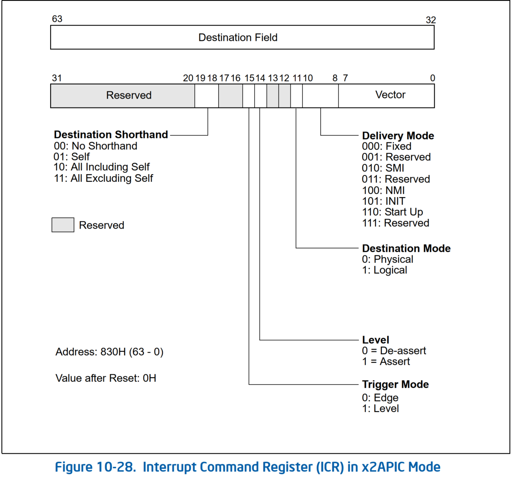

# APIC


### ICR 的组成
* 对于 xAPIC 是 MMIO 映射的寄存器地址 `0xFEE0 0300`（0-31 bit）和 `0xFEE0 0310`（32-63 bit）


* 对于 x2APIC 是 MSR 地址 `0x830`



* **Vector**：目标 CPU 收到的中断向量号，其中 0-15 号被视为非法，会给目标 CPU 的 APIC 产生一个 Illegal Vector 错误
* **Delivery Mode**：指定要发送的 IPI 类型。该字段也称为 **IPI 消息类型** 字段
  * **000 (Fixed)**：按 *Vector* 的值向所有目标 CPU 发送相应的中断向量号
  * **001 (Lowest Priority)**：按 *Vector* 的值向所有目标 CPU 中优先级最低的 CPU 发送相应的中断向量号
    * 发送 Lowest Priority 模式的 IPI 的能力取决于 CPU 型号，不总是有效，建议 BIOS 和 OS 不要发送 Lowest Priority 模式的 IPI
  * **010 (SMI)**：向所有目标 CPU 发送一个SMI，为了兼容性 *Vector* 必须为 `0`
  * **011 (Reserved)**：保留
  * **100 (NMI)**：向所有目标 CPU 发送一个 NMI，此时 *Vector* 会被忽略
  * **101 (INIT)**：向目标处理器或多个处理器发送 INIT 请求，使它们执行 INIT。作为此 IPI 消息的结果，所有目标处理器都执行 INIT。*Vector* 必须编程为 `0x0` 以实现未来兼容性
    * CPU 在 INIT 后其 APIC ID 和 Arb ID（只在奔腾和 P6 上存在）不变
  * **101 (INIT Level De-assert)**：向所有 CPU 广播一个同步的消息，将所有 CPU 的 APIC 的 Arb ID（只在奔腾和 P6 上存在）重置为初始值（初始 APIC ID）
    * 要使用此模式，*Level* 必须取 `0`，*Trigger Mode* 必须取 `1`，*Destination Shorthand* 必须设置为 `All Including Self`
    * 不支持 Pentium 4 和 Intel Xeon 处理器
  * **110 (Start-Up)**：向目标处理器发送一个特殊的“start-up”IPI（称为 SIPI）。该向量通常指向作为 BIOS 引导代码一部分的启动例程（请参阅第 8.4 节“多处理器 (MP) 初始化”）。如果源 APIC 无法交付使用此 delivery mode 发送的 IPI，则不会自动重试。由软件确定 SIPI 是否未成功交付，并在必要时重新发布 SIPI
    * 目标会从物理地址 `0x000VV000` 开始执行，其中 `0xVV`为 *Vector* 的值


## 设置 Local APIC

### BSP 设置 Local APIC
```cpp
arch/x86/kernel/head_64.S
secondary_startup_64
   init/main.c
-> start_kernel()
      arch/x86/kernel/time.c
   -> time_init()
          late_time_init = x86_late_time_init;
      if (late_time_init)
   ->       late_time_init()
      arch/x86/kernel/time.c
   => x86_late_time_init()
      -> x86_init.irqs.intr_mode_init()
         arch/x86/kernel/apic/apic.c
      => apic_intr_mode_init()
            switch (apic_intr_mode)
            case APIC_SYMMETRIC_IO:
                pr_info("APIC: Switch to symmetric I/O mode setup\n");
         -> apic_bsp_setup(upmode)
            -> setup_local_APIC()
```
* arch/x86/kernel/x86_init.c
```cpp
/*
 * The platform setup functions are preset with the default functions
 * for standard PC hardware.
 */
struct x86_init_ops x86_init __initdata = {
...
    .irqs = {
        .pre_vector_init    = init_ISA_irqs,
        .intr_init      = native_init_IRQ,
        .intr_mode_select   = apic_intr_mode_select,
        .intr_mode_init     = apic_intr_mode_init,
        .create_pci_msi_domain  = native_create_pci_msi_domain,
    },
...
}
```

### AP 设置 Local APIC
* 启动地址变为 `start_secondary` 见 [Multiple-Processors Management](MP_management.md)
```cpp
arch/x86/kernel/head_64.S
secondary_startup_64
   arch/x86/kernel/smpboot.c
-> start_secondary()
   -> smp_callin()
         arch/x86/kernel/apic/apic.c
      -> apic_ap_setup()
         -> setup_local_APIC()
```

### 设置 Local APIC 的 LVT
* 在 `setup_local_APIC()` 这个函数中可以看到对 LVT 中各个条目的设置
  * `APIC_LVT0` 对 LINT0 引脚进行设置
  * `APIC_LVT1` 对 LINT1 引脚进行设置，可见其投递类型为 NMI
* arch/x86/kernel/apic/apic.c
```cpp
/**
 * setup_local_APIC - setup the local APIC
 *
 * Used to setup local APIC while initializing BSP or bringing up APs.
 * Always called with preemption disabled.
 */
static void setup_local_APIC(void)
{
    int cpu = smp_processor_id();
    unsigned int value;

    if (disable_apic) {
        disable_ioapic_support();
        return;
    }

    /*
     * If this comes from kexec/kcrash the APIC might be enabled in
     * SPIV. Soft disable it before doing further initialization.
     */
    value = apic_read(APIC_SPIV);
    value &= ~APIC_SPIV_APIC_ENABLED;
    apic_write(APIC_SPIV, value);
...
    /*
     * Double-check whether this APIC is really registered.
     * This is meaningless in clustered apic mode, so we skip it.
     */
    BUG_ON(!apic->apic_id_registered());

    /*
     * Intel recommends to set DFR, LDR and TPR before enabling
     * an APIC.  See e.g. "AP-388 82489DX User's Manual" (Intel
     * document number 292116).  So here it goes...
     */
    apic->init_apic_ldr();
...
    /*
     * Set Task Priority to 'accept all except vectors 0-31'.  An APIC
     * vector in the 16-31 range could be delivered if TPR == 0, but we
     * would think it's an exception and terrible things will happen.  We
     * never change this later on.
     */
    value = apic_read(APIC_TASKPRI);
    value &= ~APIC_TPRI_MASK;
    value |= 0x10;
    apic_write(APIC_TASKPRI, value);

    /* Clear eventually stale ISR/IRR bits */
    apic_pending_intr_clear();

    /*
     * Now that we are all set up, enable the APIC
     */
    value = apic_read(APIC_SPIV);
    value &= ~APIC_VECTOR_MASK;
    /*
     * Enable APIC
     */
    value |= APIC_SPIV_APIC_ENABLED;
...
    /*
     * Set spurious IRQ vector
     */
    value |= SPURIOUS_APIC_VECTOR;
    apic_write(APIC_SPIV, value);

    perf_events_lapic_init();

    /*
     * Set up LVT0, LVT1:
     *
     * set up through-local-APIC on the boot CPU's LINT0. This is not
     * strictly necessary in pure symmetric-IO mode, but sometimes
     * we delegate interrupts to the 8259A.
     */
    /*
     * TODO: set up through-local-APIC from through-I/O-APIC? --macro
     */
    value = apic_read(APIC_LVT0) & APIC_LVT_MASKED;
    if (!cpu && (pic_mode || !value || skip_ioapic_setup)) {
        value = APIC_DM_EXTINT;
        apic_printk(APIC_VERBOSE, "enabled ExtINT on CPU#%d\n", cpu);
    } else {
        value = APIC_DM_EXTINT | APIC_LVT_MASKED;
        apic_printk(APIC_VERBOSE, "masked ExtINT on CPU#%d\n", cpu);
    }
    apic_write(APIC_LVT0, value);

    /*
     * Only the BSP sees the LINT1 NMI signal by default. This can be
     * modified by apic_extnmi= boot option.
     */
    if ((!cpu && apic_extnmi != APIC_EXTNMI_NONE) ||
        apic_extnmi == APIC_EXTNMI_ALL)
        value = APIC_DM_NMI;
    else
        value = APIC_DM_NMI | APIC_LVT_MASKED;

    /* Is 82489DX ? */
    if (!lapic_is_integrated())
        value |= APIC_LVT_LEVEL_TRIGGER;
    apic_write(APIC_LVT1, value);

#ifdef CONFIG_X86_MCE_INTEL
    /* Recheck CMCI information after local APIC is up on CPU #0 */
    if (!cpu)
        cmci_recheck();
#endif
}
```
* 对 LAPIC 中 PMU 产生的 PMI 条目设置为 NMI 的投递类型
  * `APIC_LVTPC` 即 LVT Performance Monitoring Counters Register 的位置，（xAPIC MMIO 的 APIC page 或 x2APIC 的 MSR 中）偏移为 `0x0340`
  * `APIC_DM_NMI` 即 NMI Delivery Mode，编码为 `100`，占据条目的 `8 ~ 10 bit`，故其宏定义为 `0x00400`
* arch/x86/events/core.c
```c
void perf_events_lapic_init(void)
{
    if (!x86_pmu.apic || !x86_pmu_initialized())
        return;

    /*
     * Always use NMI for PMU
     */
    apic_write(APIC_LVTPC, APIC_DM_NMI);
}
```