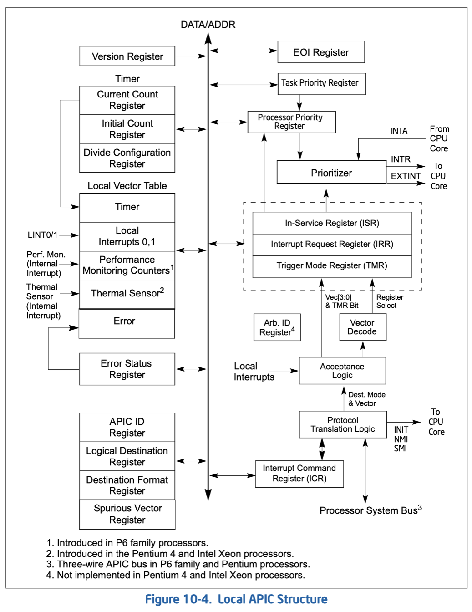

# APIC

### ICR 的组成
* 对于 xAPIC 是 MMIO 映射的寄存器地址 `0xFEE0 0300`（0-31 bit）和 `0xFEE0 0310`（32-63 bit）

* 对于 x2APIC 是 MSR 地址 `0x830`

* **Vector**：目标 CPU 收到的中断向量号，其中 0-15 号被视为非法，会给目标 CPU 的 APIC 产生一个 Illegal Vector 错误
* **Delivery Mode**：指定要发送的 IPI 类型。该字段也称为 **IPI 消息类型** 字段
  * **000 (Fixed)**：按 *Vector* 的值向所有目标 CPU 发送相应的中断向量号
  * **001 (Lowest Priority)**：按 *Vector* 的值向所有目标 CPU 中优先级最低的 CPU 发送相应的中断向量号
    * 发送 Lowest Priority 模式的 IPI 的能力取决于 CPU 型号，不总是有效，建议 BIOS 和 OS 不要发送 Lowest Priority 模式的 IPI
  * **010 (SMI)**：向所有目标 CPU 发送一个SMI，为了兼容性 *Vector* 必须为 `0`
  * **011 (Reserved)**：保留
  * **100 (NMI)**：向所有目标 CPU 发送一个 NMI，此时 *Vector* 会被忽略
  * **101 (INIT)**：向目标处理器或多个处理器发送 INIT 请求，使它们执行 INIT。作为此 IPI 消息的结果，所有目标处理器都执行 INIT。*Vector* 必须编程为 `0x0` 以实现未来兼容性
    * CPU 在 INIT 后其 APIC ID 和 Arb ID（只在奔腾和 P6 上存在）不变
  * **101 (INIT Level De-assert)**：向所有 CPU 广播一个同步的消息，将所有 CPU 的 APIC 的 Arb ID（只在奔腾和 P6 上存在）重置为初始值（初始 APIC ID）
    * 要使用此模式，*Level* 必须取 `0`，*Trigger Mode* 必须取 `1`，*Destination Shorthand* 必须设置为 `All Including Self`
    * 不支持 Pentium 4 和 Intel Xeon 处理器
  * **110 (Start-Up)**：向目标处理器发送一个特殊的“start-up”IPI（称为 SIPI）。该向量通常指向作为 BIOS 引导代码一部分的启动例程（请参阅第 8.4 节“多处理器 (MP) 初始化”）。如果源 APIC 无法交付使用此 delivery mode 发送的 IPI，则不会自动重试。由软件确定 SIPI 是否未成功交付，并在必要时重新发布 SIPI
    * 目标会从物理地址 `0x000VV000` 开始执行，其中 `0xVV`为 *Vector* 的值