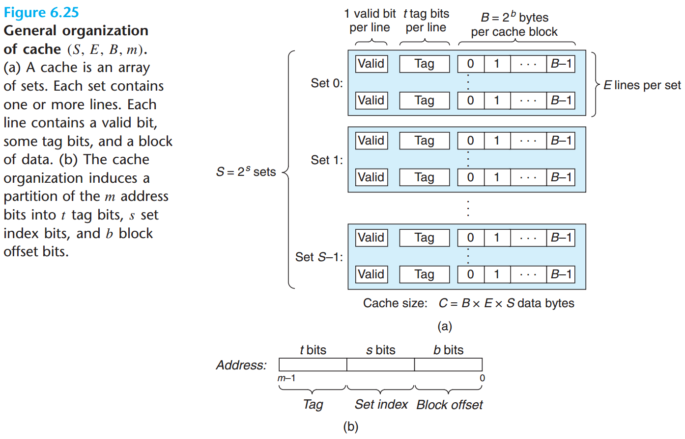
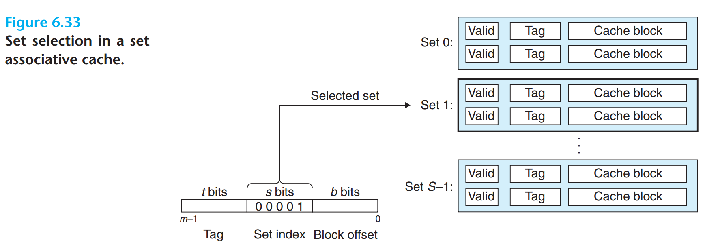

#Cache

## Cache的通用结构

* `m`位（虚拟或物理）地址
  * `s`位作为 *组索引（Set index）*
  * `b`位作为 *块偏移（Block offset）*
  * 剩下的`t = m-(b+s)`位作为 *标记（tag）*
* **抖动（thrash）** 高速缓存反复地加载和驱逐高速缓存块相同的组

## Cache的几种结构
### 直接映射高速缓存

* 直接映射高速缓存（direct-mapped cache）每组只有一行

### 组相联高速缓存

* 组相联高速缓存（set associative cache）每组有多个高速缓存行
* 组中的任何一行都可以包含任何映射到这个组的存储块
  * 所以，在组内搜索时必须并行搜索组中的每一行，而不是逐行依次匹配
  * 寻找一个有效的行，其标记与地址中的标记相匹配
#### 组相联高速缓存不命中时的行替换
* 随机选择策略
* **最不常使用（least-frequently-used, LFU）** 策略
  * 替换在过去某个时间窗口内引用次数最少的那一行
* **最近最少使用（leaset-recently-used，LRU）** 策略
  * 最后一次访问时间最久远的那一行

### 全相联高速缓存

* 全相联高速缓存（fully associative cache）所有的高速缓存行组成一个组
* 因为高速缓存电路必须并行地搜索许多相匹配的行，构造一个又大又快的相联的高速缓存很困难，而且很昂贵。因此，全相联高速缓存只适合做小的高速缓存，如 TLB

## 写策略
* **write policy** or **update policy**
* 表明数据是如何保存到高速缓存和主存的
* 大多数情况下，直写高速缓存都是非写分配的，写回高速缓存是写分配的
### 写命中
* 写命中（write hit）CPU 写一个已经缓存了的字
* **直写（write-through）** 来自 CPU 的数据既会写入高速缓存也会写入主存
  * 优点：主存始终保持在“最新”状态，与 cache 保持一致
  * 缺点：每条存储指令都会引起总线上的一个写事务，有可能会降低系统速度
* **写回（write-back）** 尽可能地推迟主存的更新，只有当替换算法要驱逐已更新的块时，才把它写到主存
  * 优点：显著地减少总线事务的数量
  * 缺点：增加复杂性，主存和高速缓存的数据有可能不一致。为了重获一致性，往往需要操作系统的介入
  * 必须为每个高速缓存行维护一个额外的 **修改位（dirty bit）**，表明这个高速缓存块是否被修改过
### 写不命中
* **写分配（write allocate）** 当要写入的字不在高速缓存中时，加载相应存储块到高速缓存中，然后更新这个高速缓存块
  * 优点：利用时间局部性和空间局部性
  * 缺点：每次不命中都会导致一个块从主存传送到高速缓存
* **非写分配（non-write allocate）** 不命中时，避开高速缓存，直接把这个字写到主存中，而高速缓存的内容不变

## 高速缓存参数的性能影响
* **不命中率（miss rate）** 不命中数量/引用数量
* **命中率（hit rate）** 1-不命中率
* **命中时间（hit time）** 从高速缓存传送一个字到 CPU 所需的时间，包括组选择、行确认和字选择的时间
* **不命中处罚（miss penalty）** 由于不命中所需要的额外时间。需要从下一级缓存中得到服务的处罚
### 高速缓存大小的影响
* 较大的缓存可能会提高命中率
* 使大存储器运行的更快总是要难一些的，结果，较大的高速缓存可能会增加命中时间
### 块大小的影响
* 较大的块能利用程序中可能存在的空间局部性，帮助提高命中率
* 对于给定的高速缓存大小，块越大意味着高速缓存行数越少，这会损害时间局部性比空间局部性更好的程序的命中率
* 较大的块对不命中处罚也有负面影响，因为块越大，传送时间就越长
### 相联度的影响
* 组中的行较多，降低了高速缓存由于冲突不命中出现抖动的可能性
* 较高的相联度的缺点
  * 会造成较高的成本。实现起来很昂贵，且很难使之速度变快
  * 每一行需要更多的标记位
  * 每一行需要额外的 LRU 状态位和额外的控制逻辑
  * 增加命中时间，因为复杂度增加了
* 相联度的选择最终变成了命中时间和不命中处罚之间的折中
### 写策略的影响
* 直写高速缓存比较容易实现
* 写回高速缓存引起的传送比较少，因此允许更多的到存储器的带宽用于执行 DMA 的 I/O 设备
* 层次结构越往下走，传送时间增加，减少传送的数量就变得更加重要
* 一般而言，高速缓存越往下层，越可能使用写回而不是回写

## 虚拟高速缓存
### 歧义（ambiguity）
### 别名（alias）
## 物理高速缓存
