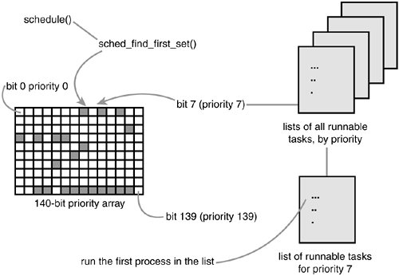
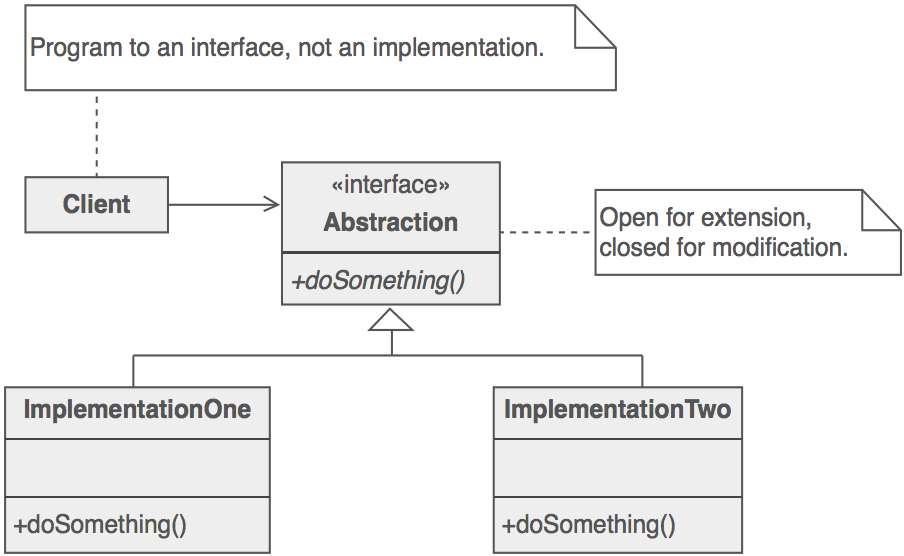

# Linux进程调度（Linux Process Scheduling)
***

# 目录
* [Linux缺省调度器](#linux%E7%BC%BA%E7%9C%81%E8%B0%83%E5%BA%A6%E5%99%A8)
* [O(1)调度](#o1%E8%B0%83%E5%BA%A6)
* [完全公平调度（Completely Fair Scheduler）](#%E5%AE%8C%E5%85%A8%E5%85%AC%E5%B9%B3%E8%B0%83%E5%BA%A6completely-fair-scheduler)
* [参考资料](#%E5%8F%82%E8%80%83%E8%B5%84%E6%96%99)

# Linux缺省调度器
Operating System | Algorithm
------------ | -------------
Linux kernel before 2.6.0 | [O(n) scheduler](https://en.wikipedia.org/wiki/O(1)%5fscheduler)
Linux kernel 2.6.0–2.6.23 | [O(1) scheduler](https://en.wikipedia.org/wiki/O(n)%5fscheduler)
Linux kernel after 2.6.23 | [Completely Fair Scheduler](https://en.wikipedia.org/wiki/Completely_Fair_Scheduler)

# O(1)调度
### 运行队列
```c
struct runqueue {
    spinlock_t lock; /* spin lock that protects this runqueue */
    unsigned long nr_running; /* number of runnable tasks */
    unsigned long nr_switches; /* context switch count */
    unsigned long expired_timestamp; /* time of last array swap */
    unsigned long nr_uninterruptible; /* uninterruptible tasks */
    unsigned long long timestamp_last_tick; /* last scheduler tick */
    struct task_struct *curr; /* currently running task */
    struct task_struct *idle; /* this processor's idle task */
    struct mm_struct *prev_mm; /* mm_struct of last ran task */
    struct prio_array *active; /* active priority array */
    struct prio_array *expired; /* the expired priority array */
    struct prio_array arrays[2]; /* the actual priority arrays */
    struct task_struct *migration_thread; /* migration thread */
    struct list_head migration_queue; /* migration queue */
    atomic_t nr_iowait; /* number of tasks waiting on I/O */
};
```

### 优先级数组
```c
struct prio_array {
    int nr_active; /* number of tasks in the queues */
    unsigned long bitmap[BITMAP_SIZE]; /* priority bitmap */
    struct list_head queue[MAX_PRIO]; /* priority queues */
};
```


### 优先级位图映射


### O(1)调度算法的问题
1. 将nice值映射到时间片，就必须将nice值对应到绝对的处理器时间，这会导致进程切换无法最优化进行。例如，两个高nice值（低优先级）的后台进程，往往是CPU密集型，分配到的时间片太短，导致频繁切换。
2. nice值变化的效果极大的取决于nice的初始值。
3. 时间片受定时器节拍的影响比较大。
4. 为提高交互进程性能的优化有可能被利用，打破公平原则，获得更多的处理器时间。

# 完全公平调度（Completely Fair Scheduler）

## 调度的目标
* 任何进程获得的处理器时间是由它自己和其他所有可运行进程nice值的相对差值决定的
* 任何nice值对应的时间不再是一个绝对值，而是处理器的使用比
* nice值对时间片的作用不再是算术级增加，而是几何级增加
* 公平调度，确保每个进程有公平的处理器使用比

## 算术级数、几何级数与增长率

### 增长率


_V<sub>f</sub>_：最终值

_V<sub>i</sub>_：初始值


### 算术级数
数列中每一个数跟前一个数的差额是固定的。每期增长率不一样。如增长幅度是正的，越往后增长率越小。

数列|2|4|6|8|10|12
---|---|---|---|---|---|---
增长率|-|100%|50%|33%|25%|16.67%

如果采用算术级数，比如相邻两个nice值之间差额是5ms，
* 进程A的nice值为0，进程B的nice值为1，则它们分别映射到时间片100ms和95ms，差别并不大
* 进程A的nice值为18，进程B的nice值为19，则它们分别映射到时间片10ms和5ms，前者比后者多了100%的处理器时间

### 几何级数
数列中的数按固定的增长率增长。如增长率是正的，越往后增长幅度越大。

数列|2|4|8|16|32|64
---|---|---|---|---|---|---
增长率|-|100%|100%|100%|100%|100%

如果采用几何级数，比如说，权值增长率约为-20%，目标延迟是20ms，
* 进程A的nice值为0，进程B的nice值为5，则它们分别获得的处理器时间15ms和5ms
* 进程A的nice值为10，进程B的nice值为15，它们分别获得的处理器时间仍然是15ms和5ms

> **目标延迟（targeted latency）**
> Each process then runs for a “timeslice” proportional to its weight divided by the total
> weight of all runnable threads. To calculate the actual timeslice, CFS sets a target for its
> approximation of the “infinitely small” scheduling duration in perfect multitasking. This
> target is called the **targeted latency**.
> Smaller targets yield better interactivity and a closer approximation to perfect
> multitasking, at the expense of higher switching costs and thus worse overall throughput.

> **时间片的最小粒度（minimum granularity）**
> Note as the number of runnable tasks approaches infinity, the proportion of allotted
> processor and the assigned timeslice approaches zero. As this will eventually result in
> unacceptable switching costs, CFS imposes a floor on the timeslice assigned to each
> process. This floor is called the minimum granularity. By default it is 1 millisecond. Thus,
> even as the number of runnable processes approaches infinity, each will run for at least 1
> millisecond, to ensure there is a ceiling on the incurred switching costs.

## 基本原理
* 设定一个调度周期（sched_latency_ns），目标是让每个进程在这个周期内至少有机会运行一次。换一种说法就是每个进程等待CPU的时间最长不超过这个调度周期。
* 根据进程的数量，大家平分这个调度周期内的CPU使用权，由于进程的优先级即nice值不同，分割调度周期的时候要加权。
* 每个进程的经过加权后的累计运行时间保存在自己的vruntime字段里。
* 哪个进程的vruntime最小就获得本轮运行的权利。

## 原理解析
* 将进程的nice值映射到对应的权重
  * kernel/sched/core.c
```c
const int sched_prio_to_weight[40] = {
   /* -20 */ 88761, 71755, 56483, 46273, 36291,
   /* -15 */ 29154, 23254, 18705, 14949, 11916,
   /* -10 */ 9548, 7620, 6100, 4904, 3906,
   /* -5 */ 3121, 2501, 1991, 1586, 1277,
   /* 0 */ 1024, 820, 655, 526, 423,
   /* 5 */ 335, 272, 215, 172, 137,
   /* 10 */ 110, 87, 70, 56, 45,
   /* 15 */ 36, 29, 23, 18, 15,
};
```

  由此可见，**nice值越小, 进程的权重越大**。

* CFS调度器的调度周期由sysctl_sched_latency变量保存。
  * 该变量可以通过sysctl调整，见kernel/sysctl.c
```
       >sysctl kernel.sched_latency_ns
       kernel.sched_latency_ns = 24000000
       >sysctl kernel.sched_min_granularity_ns
       kernel.sched_min_granularity_ns = 3000000
```

  * 任务过多的时候调度周期会延长，见kernel/sched/fair.c
```c
/*
 * The idea is to set a period in which each task runs once.
 *
 * When there are too many tasks (sched_nr_latency) we have to stretch
 * this period because otherwise the slices get too small.
 *
 * p = (nr <= nl) ? l : l*nr/nl
 */
static u64 __sched_period(unsigned long nr_running)
{
    if (unlikely(nr_running > sched_nr_latency))
        return nr_running * sysctl_sched_min_granularity;
    else
        return sysctl_sched_latency;
}
```

* 一个进程在一个调度周期中的运行时间为:
```js
    分配给进程的运行时间 = 调度周期 * 进程权重 / 所有可运行进程权重之和
```

  可以看到, 进程的权重越大，分到的运行时间越多。

* 一个进程的实际运行时间和虚拟运行时间之间的关系为:
```js
    vruntime = 实际运行时间 * NICE_0_LOAD / 进程权重
             = 实际运行时间 * 1024 / 进程权重
             (NICE_0_LOAD = 1024, 表示nice值为0的进程权重)
```

  可以看到, 进程权重越大, 运行同样的实际时间, vruntime增长的越慢。

* 一个进程在一个调度周期内的虚拟运行时间大小为:
```js
    vruntime = 进程在一个调度周期内的实际运行时间 * NICE_0_LOAD / 进程权重
             = (调度周期 * 进程权重 / 所有进程总权重) * NICE_0_LOAD / 进程权重
             = 调度周期 * NICE_0_LOAD / 所有可运行进程总权重
```
  可以看到，一个进程在一个调度周期内的vruntime值大小是不和该进程自己的权重相关的，所以所有进程的vruntime值大小都是一样的。
* 在非常短的时间内，也许看到的vruntime值并不相等。
  * vruntime值小，说明它以前占用cpu的时间较短，受到了“不公平”对待。
  * 但为了确保公平，我们总是选出vruntime最小的进程来运行，形成一种“追赶”的局面。
  * 这样既能公平选择进程，又能保证高优先级进程获得较多的运行时间。


* 理想情况下，由于vruntime与进程自身的权重是不相关的，所有进程的vruntime值是一样的。
* 怎么解释进程间的实际执行时间与它们的权重是成比例的？
  * 假设有进程A，其虚拟运行时间为`vruntime_A`，其实际运行的时间为`delta_exec_A`，权重为`weight_A`，于是`vruntime_A = delta_exec_A * NICE_0_LOAD / weight_A`
  * 假设有进程B，其虚拟运行时间为`vruntime_B`，其实际运行的时间为`delta_exec_B`，权重为`weight_B`，于是`vruntime_B = delta_exec_B * NICE_0_LOAD / weight_B`
  * 由于进程虚拟运行时间相同，即 `vruntime_A == vruntime_B`，
  * 则 `delta_exec_A * NICE_0_LOAD / weight_A == vruntime_B = delta_exec_B * NICE_0_LOAD / weight_B`
  * 也就是 `delta_exec_A : delta_exec_B == weight_A : weight_B`

  可见进程间的实际执行时间和它们的权重也是成比例的。

* 各个进程追求的公平时间vruntime其实就是一个nice值为0的进程在一个调度周期内应分得的时间，就像是一个基准。

# 核心调度器

## 调度器类

### 策略模式（Stragegy Pattern）


### 调度器类
* fair (Completely_Fair_Scheduler)
* real-time
* stop-task (sched_class_highest)
* Deadline Scheduling: Earliest Deadline First (EDF) + Constant Bandwidth Server (CBS)
* idle-task

### 调度器类的顺序
* stop-task --> deadline --> real-time --> fair --> idle

## 调度策略
* include/uapi/linux/sched.h
```c
/*
 * Scheduling policies
 */
#define SCHED_NORMAL        0
#define SCHED_FIFO      1
#define SCHED_RR        2
#define SCHED_BATCH     3
/* SCHED_ISO: reserved but not implemented yet */
#define SCHED_IDLE      5
#define SCHED_DEADLINE      6
```
* 调度策略与调度器类是多对一的映射关系

调度器类 | 调度策略 |
---|---
fair|SCHED_NORMAL
fair|SCHED_BATCH
fair|SCHED_IDLE
real-time|SCHED_FIFO
real-time|SCHED_RR
deadline|SCHED_DEADLINE


## 调度实体结构
```c
struct sched_entity {
    struct load_weight  load;       /* for load-balancing */
    struct rb_node      run_node;
    struct list_head    group_node;
    unsigned int        on_rq;

    u64         exec_start;
    u64         sum_exec_runtime;
    u64         vruntime;
    u64         prev_sum_exec_runtime;

    u64         nr_migrations;
};
```


# 参考资料
* https://en.wikipedia.org/wiki/Scheduling_%28computing%29
* https://en.wikipedia.org/wiki/O(n)%5fscheduler
* https://en.wikipedia.org/wiki/O(1)%5fscheduler
* https://en.wikipedia.org/wiki/Completely_Fair_Scheduler
* https://en.wikipedia.org/wiki/Brain_Fuck_Scheduler
* https://en.wikipedia.org/wiki/Strategy_pattern
* https://sourcemaking.com/design_patterns/strategy
