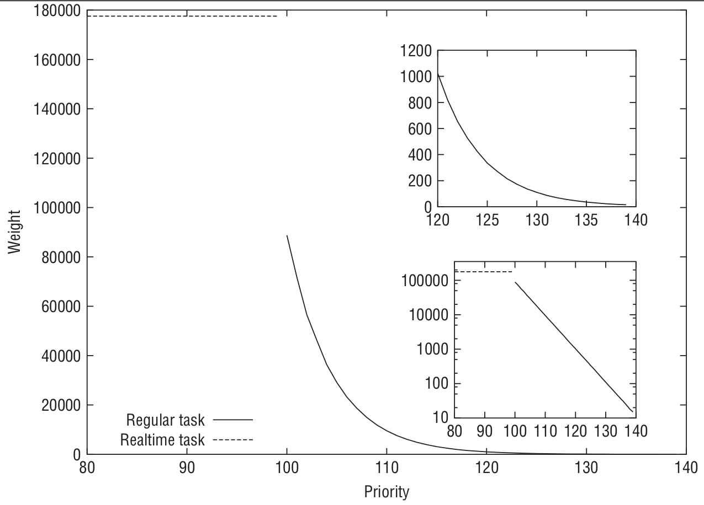
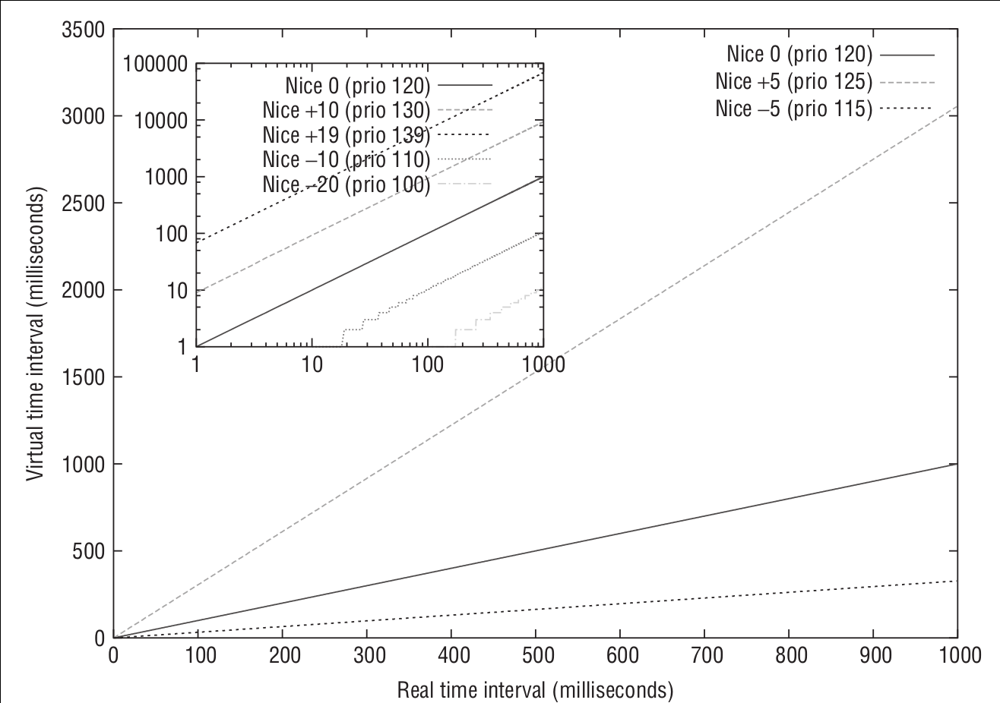
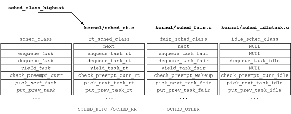
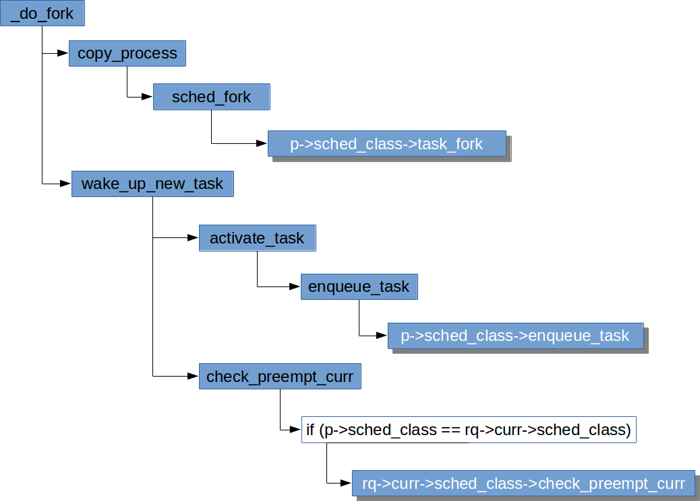
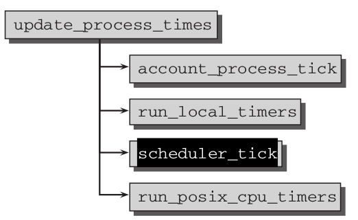
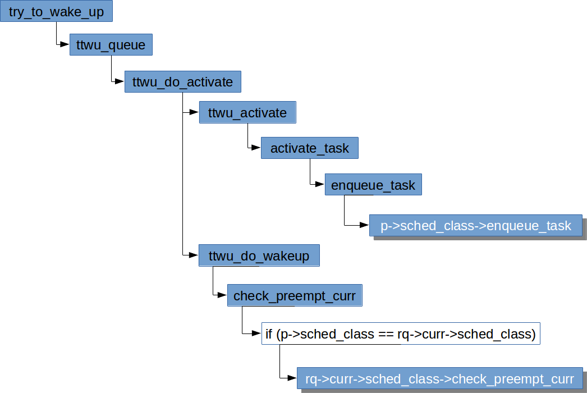

# Linux进程调度（Linux Process Scheduling)
***

# 目录
* [Linux缺省调度器](#linux%E7%BC%BA%E7%9C%81%E8%B0%83%E5%BA%A6%E5%99%A8)
* [O(1)调度](#o1%E8%B0%83%E5%BA%A6)
* [完全公平调度（Completely Fair Scheduler）](#%E5%AE%8C%E5%85%A8%E5%85%AC%E5%B9%B3%E8%B0%83%E5%BA%A6completely-fair-scheduler)
  * [调度的目标](#调度的目标)
  * [算术级数几何级数与增长率](#算术级数几何级数与增长率)
  * [基本原理](#基本原理)
  * [原理解析](#原理解析)
* [核心调度器](#核心调度器)
  * [调度器类](#调度器类)
  * [调度策略](#调度策略)
  * [调度相关的数据结构](#调度相关的数据结构)
  * [优先级](#优先级)
  * [周期性调度](#周期性调度)
  * [创建进程](#创建进程)
  * [进程唤醒](#进程唤醒)
  * [主调度函数schedule()](#主调度函数schedule())
* [参考资料](#%E5%8F%82%E8%80%83%E8%B5%84%E6%96%99)

# Linux缺省调度器
Operating System | Algorithm
------------ | -------------
Linux kernel before 2.6.0 | [O(n) scheduler](https://en.wikipedia.org/wiki/O(1)%5fscheduler)
Linux kernel 2.6.0–2.6.23 | [O(1) scheduler](https://en.wikipedia.org/wiki/O(n)%5fscheduler)
Linux kernel after 2.6.23 | [Completely Fair Scheduler](https://en.wikipedia.org/wiki/Completely_Fair_Scheduler)

# O(1)调度
### 运行队列
```c
struct runqueue {
    spinlock_t lock; /* spin lock that protects this runqueue */
    unsigned long nr_running; /* number of runnable tasks */
    unsigned long nr_switches; /* context switch count */
    unsigned long expired_timestamp; /* time of last array swap */
    unsigned long nr_uninterruptible; /* uninterruptible tasks */
    unsigned long long timestamp_last_tick; /* last scheduler tick */
    struct task_struct *curr; /* currently running task */
    struct task_struct *idle; /* this processor's idle task */
    struct mm_struct *prev_mm; /* mm_struct of last ran task */
    struct prio_array *active; /* active priority array */
    struct prio_array *expired; /* the expired priority array */
    struct prio_array arrays[2]; /* the actual priority arrays */
    struct task_struct *migration_thread; /* migration thread */
    struct list_head migration_queue; /* migration queue */
    atomic_t nr_iowait; /* number of tasks waiting on I/O */
};
```

### 优先级数组
```c
struct prio_array {
    int nr_active; /* number of tasks in the queues */
    unsigned long bitmap[BITMAP_SIZE]; /* priority bitmap */
    struct list_head queue[MAX_PRIO]; /* priority queues */
};
```


### 优先级位图映射


### O(1)调度算法的问题
1. 将nice值映射到时间片，就必须将nice值对应到绝对的处理器时间，这会导致进程切换无法最优化进行。例如，两个高nice值（低优先级）的后台进程，往往是CPU密集型，分配到的时间片太短，导致频繁切换。
2. nice值变化的效果极大的取决于nice的初始值。
3. 时间片受定时器节拍的影响比较大。
4. 为提高交互进程性能的优化有可能被利用，打破公平原则，获得更多的处理器时间。

# 完全公平调度（Completely Fair Scheduler）

## 调度的目标
* 任何进程获得的处理器时间是由它自己和其他所有可运行进程nice值的相对差值决定的
* 任何nice值对应的时间不再是一个绝对值，而是**处理器的使用比**
* nice值对时间片的作用不再是算术级增加，而是几何级增加
* 公平调度，确保每个进程有公平的处理器使用比

## 算术级数、几何级数与增长率

### 增长率


_V<sub>f</sub>_：最终值

_V<sub>i</sub>_：初始值


### 算术级数
数列中每一个数跟前一个数的差额是固定的。每期增长率不一样。如增长幅度是正的，越往后增长率越小。

数列|2|4|6|8|10|12
---|---|---|---|---|---|---
增长率|-|100%|50%|33%|25%|16.67%

如果采用算术级数，比如相邻两个nice值之间差额是5ms，
* 进程A的nice值为0，进程B的nice值为1，则它们分别映射到时间片100ms和95ms，差别并不大
* 进程A的nice值为18，进程B的nice值为19，则它们分别映射到时间片10ms和5ms，前者比后者多了100%的处理器时间

### 几何级数
数列中的数按固定的增长率增长。如增长率是正的，越往后增长幅度越大。

数列|2|4|8|16|32|64
---|---|---|---|---|---|---
增长率|-|100%|100%|100%|100%|100%

如果采用几何级数，比如说，增长率约为-20%，目标延迟是20ms，
* 进程A的nice值为0，进程B的nice值为5，则它们分别获得的处理器时间15ms和5ms
* 进程A的nice值为10，进程B的nice值为15，它们分别获得的处理器时间仍然是15ms和5ms

> **目标延迟（targeted latency）**
> Each process then runs for a “timeslice” proportional to its weight divided by the total
> weight of all runnable threads. To calculate the actual timeslice, CFS sets a target for its
> approximation of the “infinitely small” scheduling duration in perfect multitasking. This
> target is called the **targeted latency**.
> Smaller targets yield better interactivity and a closer approximation to perfect
> multitasking, at the expense of higher switching costs and thus worse overall throughput.

> **时间片的最小粒度（minimum granularity）**
> Note as the number of runnable tasks approaches infinity, the proportion of allotted
> processor and the assigned timeslice approaches zero. As this will eventually result in
> unacceptable switching costs, CFS imposes a floor on the timeslice assigned to each
> process. This floor is called the minimum granularity. By default it is 1 millisecond. Thus,
> even as the number of runnable processes approaches infinity, each will run for at least 1
> millisecond, to ensure there is a ceiling on the incurred switching costs.

## 基本原理
* 设定一个调度周期（`sched_latency_ns`），目标是让每个进程在这个周期内至少有机会运行一次。换一种说法就是每个进程等待CPU的时间最长不超过这个调度周期。
* 根据进程的数量，大家平分这个调度周期内的CPU使用权，由于进程的优先级即nice值不同，分割调度周期的时候要加权。
* 每个进程的经过加权后的累计运行时间保存在自己的`vruntime`字段里。
* 哪个进程的`vruntime`最小就获得本轮运行的权利。

## 原理解析

### 静态优先级与权重
* 将进程的nice值映射到对应的权重
  * 数组项之间的乘数因子为1.25，这样概念上可以使进程每降低一个nice值可以多获得10%的CPU时间，每升高一个nice值则放弃10%的CPU时间。
  * kernel/sched/core.c
```c
const int sched_prio_to_weight[40] = {
 /* -20 */     88761, 71755, 56483, 46273, 36291,
 /* -15 */     29154, 23254, 18705, 14949, 11916,
 /* -10 */      9548,  7620,  6100,  4904,  3906,
 /*  -5 */      3121,  2501,  1991,  1586,  1277,
 /*   0 */      1024,   820,   655,   526,   423,
 /*   5 */       335,   272,   215,   172,   137,
 /*  10 */       110,    87,    70,    56,    45,
 /*  15 */        36,    29,    23,    18,    15,
};
```

  由此可见，**nice值越小, 进程的权重越大**。

* 静态优先级与权重之间的关系，分普通和实时进程两种情况


### CFS里的调度周期
* CFS调度器的调度周期由`sysctl_sched_latency`变量保存。
  * 该变量可以通过`sysctl`调整，见kernel/sysctl.c
```
       >sysctl kernel.sched_latency_ns
       kernel.sched_latency_ns = 24000000
       >sysctl kernel.sched_min_granularity_ns
       kernel.sched_min_granularity_ns = 3000000
```

  * 任务过多的时候调度周期会延长，见kernel/sched/fair.c
```c
/*
 * The idea is to set a period in which each task runs once.
 *
 * When there are too many tasks (sched_nr_latency) we have to stretch
 * this period because otherwise the slices get too small.
 *
 * p = (nr <= nl) ? l : l*nr/nl
 */
static u64 __sched_period(unsigned long nr_running)
{
    if (unlikely(nr_running > sched_nr_latency))
        return nr_running * sysctl_sched_min_granularity;
    else
        return sysctl_sched_latency;
}
```
### CFS里关于时间计算的两个公式

#### 公式1
* 一个进程在一个调度周期中的运行时间为:
```js
    分配给进程的运行时间 = 调度周期 * 进程权重 / 所有可运行进程权重之和
```

  可以看到, 进程的权重越大，分到的运行时间越多。

#### 公式2
* 一个进程的实际运行时间和虚拟运行时间之间的关系为:
```js
    vruntime = 实际运行时间 * NICE_0_LOAD / 进程权重
             = 实际运行时间 * 1024 / 进程权重
             (NICE_0_LOAD = 1024, 表示nice值为0的进程权重)
```


* 可以看到, **进程权重越大, 运行同样的实际时间, vruntime增长的越慢**。

### 关于CFS的公平性的推理
* 一个进程在一个调度周期内的虚拟运行时间大小为:
```js
    vruntime = 进程在一个调度周期内的实际运行时间 * NICE_0_LOAD / 进程权重
             = (调度周期 * 进程权重 / 所有进程总权重) * NICE_0_LOAD / 进程权重
             = 调度周期 * NICE_0_LOAD / 所有可运行进程总权重
```
  可以看到，一个进程在一个调度周期内的`vruntime`值大小是不和该进程自己的权重相关的，所以所有进程的`vruntime`值大小都是一样的。

* 在非常短的时间内，也许看到的`vruntime`值并不相等。
  * `vruntime`值小，说明它以前占用cpu的时间较短，受到了“不公平”对待。
  * 但为了确保公平，我们**总是选出`vruntime`最小的进程来运行**，形成一种“追赶”的局面。
  * 这样既能公平选择进程，又能保证高优先级进程获得较多的运行时间。


* 理想情况下，由于`vruntime`与进程自身的权重是不相关的，所有进程的`vruntime`值是一样的。

* 怎么解释进程间的实际执行时间与它们的权重是成比例的？
  * 假设有进程A，其虚拟运行时间为`vruntime_A`，其实际运行的时间为`delta_exec_A`，权重为`weight_A`，于是`vruntime_A = delta_exec_A * NICE_0_LOAD / weight_A`
  * 假设有进程B，其虚拟运行时间为`vruntime_B`，其实际运行的时间为`delta_exec_B`，权重为`weight_B`，于是`vruntime_B = delta_exec_B * NICE_0_LOAD / weight_B`
  * 由于进程虚拟运行时间相同，即 `vruntime_A == vruntime_B`，
  * 则 `delta_exec_A * NICE_0_LOAD / weight_A == vruntime_B = delta_exec_B * NICE_0_LOAD / weight_B`
  * 也就是 `delta_exec_A : delta_exec_B == weight_A : weight_B`

  可见进程间的实际执行时间和它们的权重也是成比例的。

* 各个进程追求的公平时间`vruntime`其实就是一个nice值为0的进程在一个调度周期内应分得的时间，就像是一个基准。

# 核心调度器

## 调度器类

### 调度器类
* fair (Completely_Fair_Scheduler)
* real-time
* stop-task (sched_class_highest)
* Deadline Scheduling: Earliest Deadline First (EDF) + Constant Bandwidth Server (CBS)
* idle-task



### 调度器类的顺序
* stop-task --> deadline --> real-time --> fair --> idle
* 在各调度器类定义的时候通过`next`指针定义好了下一级调度器类
* `stop-task`是通过宏`#define sched_class_highest (&stop_sched_class)`指定的
* 编译时期就已决定，不能动态扩展

## 调度策略
* include/uapi/linux/sched.h
```c
/*
 * Scheduling policies
 */
#define SCHED_NORMAL        0
#define SCHED_FIFO      1
#define SCHED_RR        2
#define SCHED_BATCH     3
/* SCHED_ISO: reserved but not implemented yet */
#define SCHED_IDLE      5
#define SCHED_DEADLINE      6
```
* 调度策略与调度器类是多对一的映射关系

调度器类 | 调度策略 |
---|---
fair|SCHED_NORMAL
... |SCHED_BATCH
... |SCHED_IDLE
real-time|SCHED_FIFO
... |SCHED_RR
deadline|SCHED_DEADLINE

## stop-task,idle-task与SCHED_IDLE

* `stop`任务是系统中优先级最高的任务，它可以抢占所有的进程并且不会被任何进程抢占，其专属调度器类即`stop-task`。
* `idle-task`调度器类与CFS里要处理的`SCHED_IDLE`没有关系。
* `idle`任务会被任意进程抢占，其专属调度器类为`idle-task`。
* `idle-task`和`stop-task`没有对应的调度策略。
* 采用`SCHED_IDLE`调度策略的任务其调度器类为 **CFS**。

> The stop task is the highest priority task in the system, it preempts
> everything and will be preempted by nothing.
* stop_task.c Comment

> NOTE: these are not related to SCHED_IDLE tasks which are handled in sched/fair.c
* idle_task.c Comment

> The stop_sched_class is to stop cpu, using on SMP system, for load balancing
> and cpu hotplug. This class have the highest scheduling priority.
* http://stackoverflow.com/questions/15399782/what-is-the-use-of-stop-sched-class-in-linux-kernel

> Idle is used to schedule the per-cpu idle task (also called *swapper* task)
> which is run if no other task is runnable.

## 调度相关的数据结构

### 进程结构 task_struct
* include/linux/sched.h::task_struct
```c
struct task_struct {
...
 int prio, static_prio, normal_prio;
 unsigned int rt_priority;
 const struct sched_class *sched_class;
 struct sched_entity se;
 struct sched_rt_entity rt;
 struct sched_dl_entity dl;
...
 unsigned int policy;
 int nr_cpus_allowed;
 cpumask_t cpus_allowed;
...
}
```
* 优先级 `prio`, `static_prio`, `normal_prio`
  * **静态优先级**`static_prio` 进程启动时的优先级，除非用`nice`或`sched_setscheduler`修改，否则进程运行期间一直保持恒定。
  * **普通优先级**`normal_prio` 基于进程静态优先级和调度策略计算出的优先级。进程fork时，子进程继承的是普通优先级。
  * **动态优先级**`prio` 暂时的，非持久的优先级，调度器考虑的是这个优先级。
* **实时进程优先级**`rt_priority` 值越大表示优先级越高（后面会看计算的时候用的是减法）。
* `sched_class` 指向调度器类。在fork的时候会根据优先级决定进程该采用哪种调度策略。
* 调度实体`se`, `rt`, `dl`
  * 调度器调度的是*可调度实体*，而不限于进程
  * 一组进程可以构成一个*可调度实体*，实现*组调度*
  * 注意：这里用的都是实体而不是指针
* `SCHED_IDLE`进程**不负责**调度空闲进程。空闲进程由内核提供单独的机制来处理。

### 调度器类 sched_class
* kernel/sched/sched.h::sched_class
```c
struct sched_class {
    const struct sched_class *next;

    void (*enqueue_task) (struct rq *rq, struct task_struct *p, int flags);
    void (*dequeue_task) (struct rq *rq, struct task_struct *p, int flags);
    void (*yield_task) (struct rq *rq);
    bool (*yield_to_task) (struct rq *rq, struct task_struct *p, bool preempt);

    void (*check_preempt_curr) (struct rq *rq, struct task_struct *p, int flags);

    /*   
     * It is the responsibility of the pick_next_task() method that will
     * return the next task to call put_prev_task() on the @prev task or
     * something equivalent.
     *
     * May return RETRY_TASK when it finds a higher prio class has runnable
     * tasks.
     */
    struct task_struct * (*pick_next_task) (struct rq *rq,
                        struct task_struct *prev);
    void (*put_prev_task) (struct rq *rq, struct task_struct *p);

    void (*set_curr_task) (struct rq *rq);
    void (*task_tick) (struct rq *rq, struct task_struct *p, int queued);
    void (*task_fork) (struct task_struct *p);
    void (*task_dead) (struct task_struct *p);
#ifdef CONFIG_SMP
...
#endif
    /*   
     * The switched_from() call is allowed to drop rq->lock, therefore we
     * cannot assume the switched_from/switched_to pair is serliazed by
     * rq->lock. They are however serialized by p->pi_lock.
     */
    void (*switched_from) (struct rq *this_rq, struct task_struct *task);
    void (*switched_to) (struct rq *this_rq, struct task_struct *task);
    void (*prio_changed) (struct rq *this_rq, struct task_struct *task,
                 int oldprio);

    unsigned int (*get_rr_interval) (struct rq *rq,
                     struct task_struct *task);

    void (*update_curr) (struct rq *rq);
#ifdef CONFIG_FAIR_GROUP_SCHED
...
#endif
```
* `next` 指向下一个调度器类。
* `enqueue_task` 向运行队列添加新进程。
* `dequeue_task` 从运行队列删除进程。
* `yield_task` 进程自愿放弃对处理器的控制权，相应的系统调用为`sched_yield`。
* `yield_to_task` 让出处理器，并期望将控制权交给指定的进程。
* `pick_next_task` 选择下一个将要运行的进程。
* `put_prev_task` 用另外一个进程**替换当前进程之前**调用。
* `set_curr_task` 改变当前进程的调度策略时调用。
* `task_tick` 每次激活周期性调度器时，由周期性调度器调用。
* `task_fork` 用于建立`fork`系统调用和调度器之间的关联，在`sched_fork()`函数中被调用。
* `get_rr_interval` 返回进程的缺省时间片，对于CFS返回的是该调度周期内分配的实际时间片。相关系统调用为`sched_rr_get_interval`。
* `update_curr` 更新当前进程的运行时间统计。
* `check_preempt_curr` 检查当前进程是否需要重新调度。

### 运行队列 rq
* 每个CPU有各自的运行队列
* 各个活动进程只出现在一个运行队列中。在多个CPU上运行同一个进程是不可能的
* 发源于同一进程的线程可以在不同CPU上执行
* **注意**：特定于调度器类的子运行队列是实体，而不是指针
* kernel/sched/sched.h::rq
```c
/*
 * This is the main, per-CPU runqueue data structure.
   ...
 */
struct rq {
...
    unsigned int nr_running;
...
    /* capture load from *all* tasks on this cpu: */
    struct load_weight load;
    struct cfs_rq cfs;
    struct rt_rq rt;
    struct dl_rq dl;
...
    struct task_struct *curr, *idle, *stop;
...
    u64 clock;
}
```
* `nr_running` 队列上可运行进程的数目，**不考虑优先级或调度类**。
* `load` 运行队列当前的累计权重。
* `curr` 指向当前运行进程的`task_struct`实例。
* `idle` 指向空闲进程的`task_struct`实例。该进程在没有其他可运行进程时执行。
* `clock` 每个运行队列的时钟。每次周期性调度器被调用的时候会更新这个值。

#### runqueues
* 系统的所有运行队列都在`runqueues`数组中，该数组中的每一个元素对应于系统中的一个CPU
* kernel/sched/core.c
```c
DEFINE_PER_CPU_SHARED_ALIGNED(struct rq, runqueues);
```
在SMP开启的情况下该宏展开为：
```c
__percpu __attribute__((section(".data..percpu..shared_aligned"))) \
  __typeof__(struct rq) runqueues \
  ____cacheline_aligned_in_smp;
```
关于kernel的Per-CPU变量值得用一篇文章来详叙，这里不深入讲解。
Per-CPU相关代码见：
* include/linux/percpu-defs.h
* include/asm-generic/percpu.h
* include/linux/compiler-gcc.h
* arch/x86/kernel/setup_percpu.c
* include/asm-generic/vmlinux.lds.h

### 调度实体
不同的调度器类分别使用各自的调度实体，谈具体调度器类的时候再详细讨论。
* sched_entity
* sched_rt_entity
* sched_dl_entity

## 优先级


### 计算优先级
* `static_prio` 通常是优先级计算的起点
* `prio` 是调度器关心的优先级，通常由`effective_prio()`计算，计算时考虑当前的优先级的值
* `prio` 有可能会因为*非实时进程*要使用实时互斥量(RT-Mutex)而临时提高优先级至实时优先级
* `normal_prio` 通常由`normal_prio()`计算，计算时考虑调度策略的因素

```c
/*
 * __normal_prio - return the priority that is based on the static prio
 */
static inline int __normal_prio(struct task_struct *p)
{
    return p->static_prio;
}

/*
 * Calculate the expected normal priority: i.e. priority
 * without taking RT-inheritance into account. Might be
 * boosted by interactivity modifiers. Changes upon fork,
 * setprio syscalls, and whenever the interactivity
 * estimator recalculates.
 */
static inline int normal_prio(struct task_struct *p)
{
    int prio;

    if (task_has_dl_policy(p))
        prio = MAX_DL_PRIO-1;
    else if (task_has_rt_policy(p))
        prio = MAX_RT_PRIO-1 - p->rt_priority;
    else
        prio = __normal_prio(p);
    return prio;
}

/*
 * Calculate the current priority, i.e. the priority
 * taken into account by the scheduler. This value might
 * be boosted by RT tasks, or might be boosted by
 * interactivity modifiers. Will be RT if the task got
 * RT-boosted. If not then it returns p->normal_prio.
 */
static int effective_prio(struct task_struct *p)
{
    p->normal_prio = normal_prio(p);
    /*   
     * If we are RT tasks or we were boosted to RT priority,
     * keep the priority unchanged. Otherwise, update priority
     * to the normal priority:
     */
    if (!rt_prio(p->prio))
        return p->normal_prio;
    return p->prio;
}
```
* `fork`子进程时
  * 子进程的静态优先级`static_prio`继承自父进程
  * 动态优先级`prio`设置为父进程的普通优先级`normal_prio`。这是为了确保实时互斥量引起的优先级提高**不会**传递到子进程


## 创建进程



* 涉及到特定调度器类相关的工作需根据新进程使用的调度器类，委托给具体调度器类的方法处理。
* 在创建进程过程中与调度器密切相关的任务
  * 进程优先级的初始化
  * 进程放入队列
  * 检查进程是否需要调度


#### sched_fork
* kernel/sched/core.c
```c
/*
 * fork()/clone()-time setup:
 */
int sched_fork(unsigned long clone_flags, struct task_struct *p)
{
    unsigned long flags;
    int cpu = get_cpu();

    __sched_fork(clone_flags, p);
    /*   
     * We mark the process as running here. This guarantees that
     * nobody will actually run it, and a signal or other external
     * event cannot wake it up and insert it on the runqueue either.
     */
    p->state = TASK_RUNNING;

    /*   
     * Make sure we do not leak PI boosting priority to the child.
     */
    /* 这里就是之前提到的，确保fork后父进程提高的优先级不会泄漏到子进程 */
    p->prio = current->normal_prio;

    /*   
     * Revert to default priority/policy on fork if requested.
     */
    /* sched_reset_on_fork参数对policy和priority的影响 */
    if (unlikely(p->sched_reset_on_fork)) {
        if (task_has_dl_policy(p) || task_has_rt_policy(p)) {
            p->policy = SCHED_NORMAL;
            p->static_prio = NICE_TO_PRIO(0);
            p->rt_priority = 0;
        } else if (PRIO_TO_NICE(p->static_prio) < 0)
            p->static_prio = NICE_TO_PRIO(0);

        p->prio = p->normal_prio = __normal_prio(p);
        set_load_weight(p);

        /*   
         * We don't need the reset flag anymore after the fork. It has
         * fulfilled its duty:
         */
        p->sched_reset_on_fork = 0;
    }
    /* 根据动态优先级决定该采用哪个调度器类，这就是之前为什么说：动态优先级是调度器考虑的优先级 */
    if (dl_prio(p->prio)) {
        put_cpu();
        return -EAGAIN;
    } else if (rt_prio(p->prio)) {
        p->sched_class = &rt_sched_class;
    } else {
        p->sched_class = &fair_sched_class;
    }

    if (p->sched_class->task_fork)
        p->sched_class->task_fork(p);

    /*
     * The child is not yet in the pid-hash so no cgroup attach races,
     * and the cgroup is pinned to this child due to cgroup_fork()
     * is ran before sched_fork().
     *
     * Silence PROVE_RCU.
     */
    raw_spin_lock_irqsave(&p->pi_lock, flags);
    set_task_cpu(p, cpu);
    raw_spin_unlock_irqrestore(&p->pi_lock, flags);

...
#if defined(CONFIG_SMP)
    p->on_cpu = 0;
#endif
    init_task_preempt_count(p);
...
    put_cpu();
    return 0;
}
```

#### check_preempt_curr()
* kernel/sched/core.c
```c
void check_preempt_curr(struct rq *rq, struct task_struct *p, int flags)
{
    const struct sched_class *class;
    /* 同一调度器类之间的进程是否需要被重新调度，交由该调度器类内部去决定 */
    if (p->sched_class == rq->curr->sched_class) {
        rq->curr->sched_class->check_preempt_curr(rq, p, flags);
    } else {
        /* 由高到低检查不同调度器类之间的进程是否需要重新调度 */
        for_each_class(class) {
            /* 低级别的调度器类的进程无法抢占高级别的调度器类的进程，
               例如rq->curr->sched_class是实时调度器类，而p->sched_class是CFS，
               则循环会在class等于&rt_sched_class时break。
             */
            if (class == rq->curr->sched_class)
                break;            /* 无法抢占，故跳出循环 */
            /* 反之，高级别的调度器类的进程可以抢占低级别的调度器类的进程，
               例如p->sched_class是实时调度器类，而rq->curr->sched_class是CFS，
               则循环会在class等于&rt_sched_class时设置标志位后break。
             */
            if (class == p->sched_class) {
                resched_curr(rq); /* 设置重新调度标志位 */
                break;
            }
        }
    }
...
}
```

## 周期性调度
* 每次周期性的时钟中断，时钟中断处理函数会地调用`update_process_times()`
  * kernel/time/timer.c

  

* `scheduler_tick()`函数为周期性调度的入口，
  1. 管理内核中与整个系统和各个进程的调度相关的统计量
  2. 调用当前进程所属调度器类的周期性调度方法
  * kernel/sched/core.c
```c
/*
 * This function gets called by the timer code, with HZ frequency.
 * We call it with interrupts disabled.
 */
void scheduler_tick(void)
{
    int cpu = smp_processor_id();
    struct rq *rq = cpu_rq(cpu);
    struct task_struct *curr = rq->curr;

    sched_clock_tick();  /* 更新sched_clock_data */

    raw_spin_lock(&rq->lock);
    update_rq_clock(rq); /* 更新rq->clock */
    curr->sched_class->task_tick(rq, curr, 0); /*调用调度器类的周期性调度方法*/
...
    raw_spin_unlock(&rq->lock);
...
}
```
* 如果需要重新调度，`curr->sched_class->task_tick()`会在`task_struct`（更准确的说是在`thread_info`）中设置`TIF_NEED_RESCHED`标志位表示请求重新调度
* 但**并不意味着立即抢占**，仍然需要等待内核在适当的时间完成该请求（参考[这里](http://www.linuxinternals.org/blog/2016/03/20/tif-need-resched-why-is-it-needed/)）


## 进程唤醒



* 进程唤醒的时候，将`enqueue_task`和`check_preempt_curr`等工作 *委托* 给具体的调度器类。
* 进程唤醒过程中与调度器相关的任务
  * 进程重新放入运行队列
  * 进程是否需要重新调度


## 主调度函数schedule()

* `__schedule()`是主调度函数，其主要任务是：
  * 选出下一个将要调度的进程
  * 切换到要调度的进程
  * kernel/sched/core.c
```c
/*
 * __schedule() is the main scheduler function.
 *
 * The main means of driving the scheduler and thus entering this function are:
 *
 *   1. Explicit blocking: mutex, semaphore, waitqueue, etc.
 *
 *   2. TIF_NEED_RESCHED flag is checked on interrupt and userspace return
 *      paths. For example, see arch/x86/entry_64.S.
 *
 *      To drive preemption between tasks, the scheduler sets the flag in timer
 *      interrupt handler scheduler_tick().
 *
 *   3. Wakeups don't really cause entry into schedule(). They add a
 *      task to the run-queue and that's it.
 *
 *      Now, if the new task added to the run-queue preempts the current
 *      task, then the wakeup sets TIF_NEED_RESCHED and schedule() gets
 *      called on the nearest possible occasion:
 *
 *       - If the kernel is preemptible (CONFIG_PREEMPT=y):
 *
 *         - in syscall or exception context, at the next outmost
 *           preempt_enable(). (this might be as soon as the wake_up()'s
 *           spin_unlock()!)
 *
 *         - in IRQ context, return from interrupt-handler to
 *           preemptible context
 *
 *       - If the kernel is not preemptible (CONFIG_PREEMPT is not set)
 *         then at the next:
 *
 *          - cond_resched() call
 *          - explicit schedule() call
 *          - return from syscall or exception to user-space
 *          - return from interrupt-handler to user-space
 *
 * WARNING: must be called with preemption disabled!
 */
 static void __sched notrace __schedule(bool preempt)
 {
     struct task_struct *prev, *next;
     unsigned long *switch_count;
     struct rq *rq;
     int cpu;

     cpu = smp_processor_id();
     rq = cpu_rq(cpu);
     prev = rq->curr;
     ...
     local_irq_disable();
     ...
     raw_spin_lock(&rq->lock);
     lockdep_pin_lock(&rq->lock);

     rq->clock_skip_update <<= 1; /* promote REQ to ACT */

     switch_count = &prev->nivcsw;
     if (!preempt && prev->state) {
         /* 如果不是发生内核抢占，且进程状态不是TASK_RUNNING */
         if (unlikely(signal_pending_state(prev->state, prev))) {
           /* 当前进程原来处于可中断睡眠状态，现在接收到信号，则需提升为运行进程 */
           prev->state = TASK_RUNNING;
         } else {
           /* 否则委托相应调度器类的方法停止进程的活动 */
           deactivate_task(rq, prev, DEQUEUE_SLEEP);
           prev->on_rq = 0;
           ...
         }
         switch_count = &prev->nvcsw;
     }
     /* 反之，如果是因为发生了内核抢占而调用__schedule()，则无需停止当前进程的活动，
      * 这样是为了确保能尽快选择下一个进程。如果此时一个高优先级进程在等待调度，则调度器类
      * 会选择该进程，使其运行。
      */

     /* 更新就绪队列的时钟 */
     /* 这里会根据rq->clock_skip_update决定要不要更新时钟，如果是RQCF_ACT_SKIP则不更新。
      * 通常在yeild_task的时候会将rq->clock_skip_update置为RQCF_REQ_SKIP,
      * 这样，在上面将rq->clock_skip_update移位的操作会使其变为RQCF_ACT_SKIP。
      */
     if (task_on_rq_queued(prev))
         update_rq_clock(rq);
     /* 调度最重要的任务 - 选出下一个要执行的进程 */
     next = pick_next_task(rq, prev);
     clear_tsk_need_resched(prev); /* 清除重新调度标志TIF_NEED_RESCHED */
     clear_preempt_need_resched(); /* 抢占计数器清零 */
     rq->clock_skip_update = 0;

     if (likely(prev != next)) {
         /* 选择了一个新的进程 */
         rq->nr_switches++;
         rq->curr = next;
         ++*switch_count;

         trace_sched_switch(preempt, prev, next);
         /* 执行硬件级的进程切换 */
         rq = context_switch(rq, prev, next); /* unlocks the rq */
     } else {
         /*仍然是当前进程，最常见的情况是当前队列其他进程都在睡，只有一个进程能运行*/
         lockdep_unpin_lock(&rq->lock);
         raw_spin_unlock_irq(&rq->lock);
     }
     /* 调用做负载均衡时添加到列表里的回调 */
     balance_callback(rq);
}
```
* 调完`__schedule()`后，都需要重新调用`need_resched()`检查`TIF_NEED_RESCHED`标志看是否需要重新调度。
* `context_switch()`调用特定于体系结构的方法，由后者负责执行底层的上下文切换。
* 上下文切换通过调用两个特定于处理器的函数完成：
  * **switch_mm**： 更换通过`task_struct->mm`描述的内存管理单元。
  * **switch_to**： 切换处理器寄存器内容和内核栈。
  * **惰性FPU模式** (Lazy FPU mode)

### 选择下一个进程
* `pick_next_task()`完成选择下一个进程的工作
  * kernel/sched/core.c::pick_next_task
```c
/*
 * Pick up the highest-prio task:
 */
static inline struct task_struct *
pick_next_task(struct rq *rq, struct task_struct *prev)
{
    const struct sched_class *class = &fair_sched_class;
    struct task_struct *p;

    /*
     * Optimization: we know that if all tasks are in
     * the fair class we can call that function directly:
     */
    if (likely(prev->sched_class == class &&
           rq->nr_running == rq->cfs.h_nr_running)) {
        p = fair_sched_class.pick_next_task(rq, prev);
        if (unlikely(p == RETRY_TASK))
            goto again;

        /* assumes fair_sched_class->next == idle_sched_class */
        if (unlikely(!p))
            p = idle_sched_class.pick_next_task(rq, prev);

        return p;
    }

again:
    for_each_class(class) {
        p = class->pick_next_task(rq, prev);
        if (p) {
            if (unlikely(p == RETRY_TASK))
                goto again;
            return p;
        }
    }
    /*当所有调度器类都选不出可运行的进程时，会运行idle task，并且总是一个可运行的任务*/
    BUG(); /* the idle class will always have a runnable task */
}
```

* `pick_next_task()`对所有进程都是CFS类的情况做了些优化
* 主要工作还是 *委托* 给各调度器类去完成

# 参考资料
* https://en.wikipedia.org/wiki/Scheduling_%28computing%29
* https://en.wikipedia.org/wiki/O(n)%5fscheduler
* https://en.wikipedia.org/wiki/O(1)%5fscheduler
* https://en.wikipedia.org/wiki/Completely_Fair_Scheduler
* https://en.wikipedia.org/wiki/Brain_Fuck_Scheduler
* https://en.wikipedia.org/wiki/Strategy_pattern
* https://sourcemaking.com/design_patterns/strategy
* http://www.ibm.com/developerworks/cn/linux/l-cn-scheduler/index.html
* http://linuxperf.com/?p=42
* http://www.linuxinternals.org/blog/2016/03/20/tif-need-resched-why-is-it-needed/
