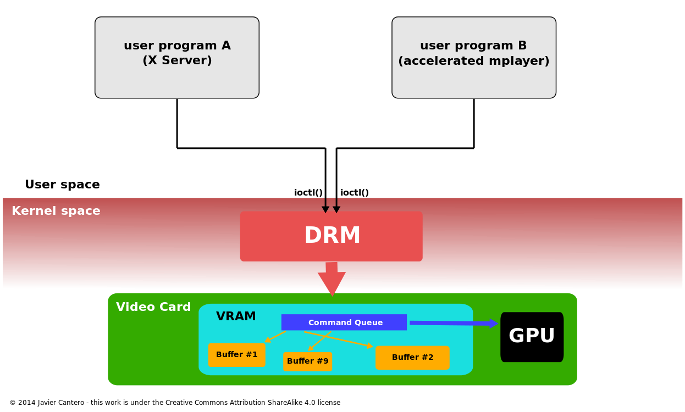
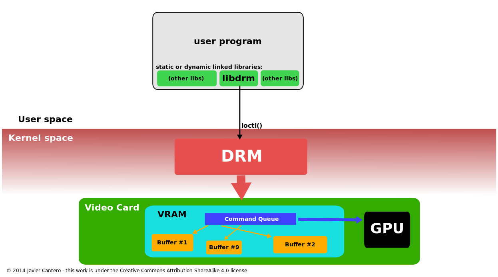
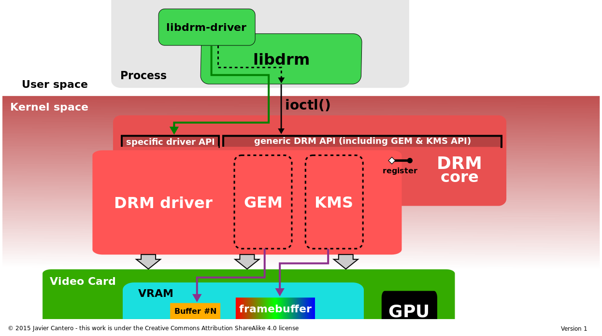
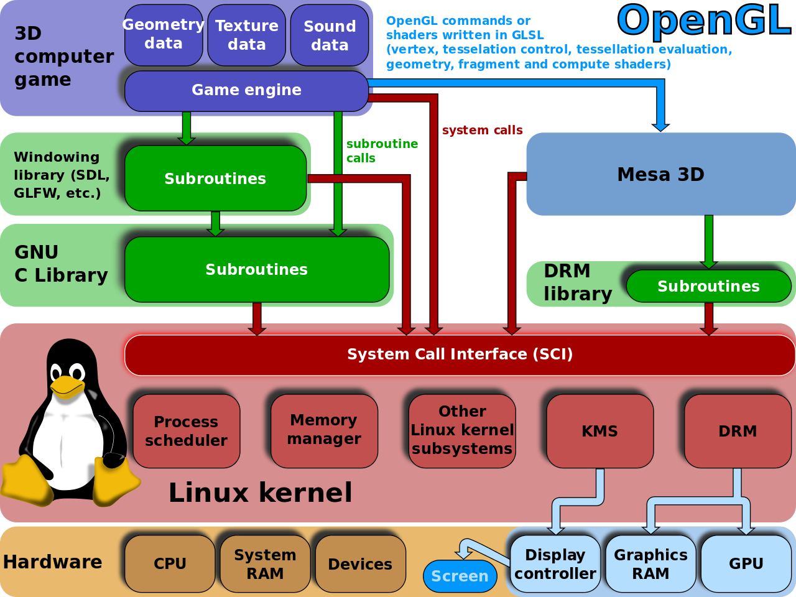
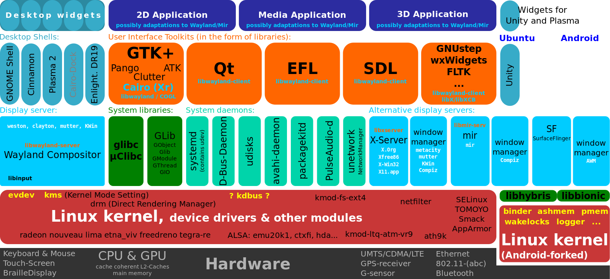
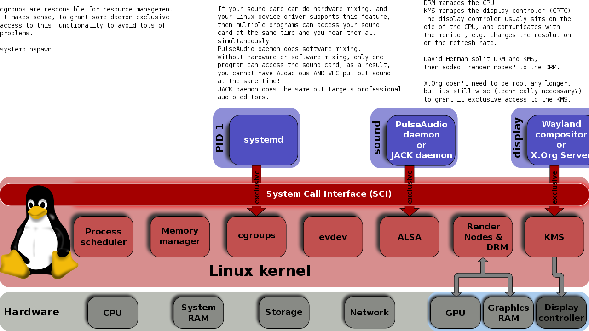
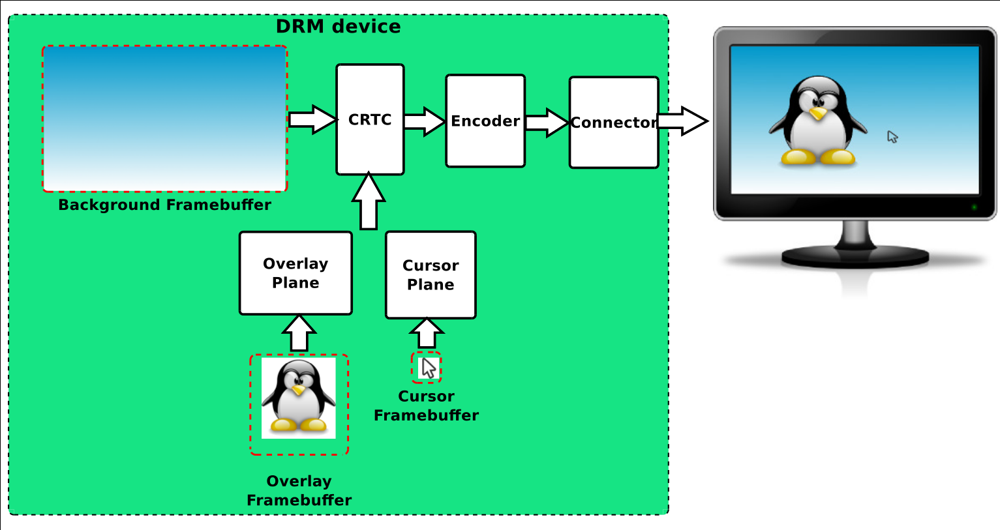
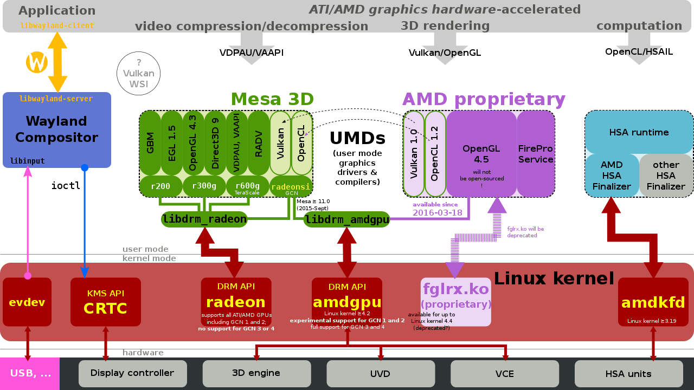

# 目录

- [DRM](#drm)
- [概览](#概览)
- [软件架构](#软件架构)
	- [API](#api)
		- [DRM-Master 和 DRM-Auth](#drm-master-和-drm-auth)
	- [图像执行管理器](#图像执行管理器)
		- [翻译表映射](#翻译表映射)
		- [DRM 缓冲区共享和 PRIME](#drm-缓冲区共享和-prime)
	- [内核模式设定（Kernel Mode Setting）](#内核模式设定kernel-mode-setting)
		- [KMS设备模型](#kms设备模型)
		- [原子显示](#原子显示)
	- [渲染节点](#渲染节点)
- [硬件支持](#硬件支持)
- [开发](#开发)
- [历史](#历史)
- [Adoption](#adoption)
- [另请参阅](#另请参阅)
- [参考资料](#参考资料)

# DRM

在计算机领域里，**直接渲染管理器（Direct Rendering Manager (DRM)）** 是 Linux 内核负责与现代显卡的 GPU 交互的子系统。DRM 暴露一个 API 给用户空间程序，可以用于发送命令和数据给 GPU，执行例如配置[显示模式设定](https://en.wikipedia.org/wiki/Mode_setting)的操作。DRM 最初作为 X Server 的[直接渲染基础](https://en.wikipedia.org/wiki/Direct_Rendering_Infrastructure)的内核空间的组件而开发，但如今它也被其他图形栈替代方案，如 [Wayland](https://en.wikipedia.org/wiki/Wayland_(display_server_protocol))所使用。

用户空间程序可以用 DRM API 命令 GPU 完成[硬件加速](https://en.wikipedia.org/wiki/Hardware_acceleration)[3D渲染](https://en.wikipedia.org/wiki/3D_rendering)和[视频解码](https://en.wikipedia.org/wiki/Video_decoding)，以及[GPGPU计算](https://en.wikipedia.org/wiki/General-purpose_computing_on_graphics_processing_units)。

# 概览

Linux 内核已经有一个允许管理一个图形适配器的 [framebuffer](https://en.wikipedia.org/wiki/Framebuffer) 的 API，叫 [fbdev](https://en.wikipedia.org/wiki/Linux_framebuffer)，但它无法用于处理基于现代3D加速 [GPU](https://en.wikipedia.org/wiki/GPU) 的显卡的需求。这类显卡通常需要设置和管理一个位于显存（[Video RAM](https://en.wikipedia.org/wiki/Video_RAM)）的命令队列，分发命令给 GPU，并且它们也需要恰当地管理缓冲区和自身空闲显存。最初的用户空间程序（如 X Server）直接管理这些资源，但这些程序通常把它们当作访问该显卡资源的唯一的使用者。当两个或更多程序同时尝试去控制同一显卡，并以它们各自的方式去设置它们的资源时，大部分时候都以灾难告终。

直接渲染管理器被创建的最初目的是让多个程序可以通过它使用显卡的资源。DRM 以互斥的方式访问显卡，并负责初始化和维护命令队列、显存和任何其他的硬件资源。想使用 GPU 的程序将它们的请求发送给 DRM，DRM 作为仲裁者小心地避免可能的冲突。

此后，DRM 的范围逐年扩大以涵盖更多之前由用户空间程序处理的功能，例如 framebuffer 管理和模式设定，内存共享对象和内存同步。一些这样的扩充有它们自己特定的名字，如图形执行管理器（GEM）或者内核模式设定（KMS），以及当它们提供的功能被特别提及时所暗指的盛行术语。但它们确实时整个内核 DRM 子系统的一部分。

在一个计算机里有两个 GPU 的趋势 —— 一个独立的GPU和一个集成的 —— 导致了新的问题，例如，GPU 切换也应该由 DRM 层解决。为了适应 [Nvidia Optimus](https://en.wikipedia.org/wiki/Nvidia_Optimus) 技术，DRM 提供 GPU offloading 的能力，叫做 PRIME。

##### DRM允许多个程序并发访问3D显卡避免冲突

* without DRM

* with DRM

# 软件架构

直接渲染管理器运行在内核空间，所以用户空间程序必须使用内核系统调用来请求它的服务。然而，DRM没有定义它自己的专属的系统调用。反而，它遵循 UNIX “一切皆文件”的原则，通过在`/dev`层次下用设备文件的方式在文件系统名字空间暴露 GPU。DRM 探测到的每个 GPU 被引用为DRM设备，且一个设备文件`/dev/dri/cardX`（X是一个连续的数字）被创建出来用于交互。想和该 GPU 交互的用户空间程序必须打开文件并使用`ioctl`调用来和 DRM 交互。不同的`ioctl`对应不同的 DRM API 函数。

一个叫 *libdrm* 的库被创建来帮助用户空间的程序与DRM子系统交互。这个库仅仅是用 C 实现的函数封装了每个 DRM API 的`ioctl`，也包括常量、结构和其他辅助元素。libdrm 的使用不仅避免将内核接口直接暴露给用户空间，而且体现出常见的在程序间重用和共享的优点。

##### 一个进程使用内核的直接渲染管理器访问3D加速图形卡

DRM 由两部分组成：一个通用的“DRM 核心”和一个为每种支持的硬件特定的（”DRM 驱动”）部分。DRM 核心提供基本的框架，以供不同的的 DRM 驱动注册，并且提供给用户空间一个通用的硬件无关功能的`ioctl`的最小集。在另一方面，一个 DRM 驱动实现硬件相关部分的 API，特定于它所支持的 GPU 类型；它还需要提供剩下的没有被 DRM 核覆盖到的`ioctl`实现，但它也可以扩展 API，提供额外的`ioctl`以支持只在这些硬件上可用的额外的功能。当一个特定的 DRM 驱动提供一个增强 API，用户空间 libdrm 也由一个额外的libdrm驱动库扩展，这样用户空间可以籍此与额外的`ioctl`交互。

##### 直接渲染管理器架构细节：DRM 核心和 DRM 驱动（包含 GEM 和 KMS）和 libdrm 的交互

## API
DRM 核心导出几个接口到用户空间应用程序，通常通过相应的 libdrm 封装的函数来使用。此外，驱动导出设备相关的接口给用户空间驱动和 device-aware 的应用程序通过`ioctl`和`sysfs`文件使用。外部的接口包括：内存映射，上下文管理，DMA 操作，AGP 管理，vblank 控制，fence 管理，内存管理和输出管理。

### DRM-Master 和 DRM-Auth
在DRM API里有几个操作（ioctls）要么是为了安全的目的，要么是为了并发的问题，必须被限制被一个单用户空间的每设备的进程使用。为了实现这个限制，DRM 限制这些 ioctls 只被那些被认为是一个 DRM 设备的“master”的进程调用，通常叫做 *DRM-Master*。所有进程中只有一个被标识为 master，该进程拥有被打开的`/dev/dri/cardX`的设备节点的文件句柄，特别是第一个调用`SET_MASTER`的`ioctl`的那个进程。任何不是 DRM-Master 进程尝试使用一个这些受限的 ioctls 会返回一个错误。一个进程也可以放弃他的 master 角色 —— 并让其他进程获取它 —— 通过调用`DROP_MASTER`的`ioctl`。

X Server —— 或任何其他显示服务器 —— 通常是在每个它管理的 DRM 设备中获取 DRM-Master 状态的进程，通常它会在它启动的时候打开相应的设备节点，并为整个图形会话持有这些权限，直至它结束或死亡。

对于剩下的用户空间进程，有其他的方式去获取一些在 DRM 设备上调用受限操作的权限，叫做 *DRM-Auth*。对于 DRM 设备它是一个基本的认证方法，为了证明这点，进程得有 DRM-Master 的允许去获取这些权限。这些过程的组成：
* 客户使用`GET_MAGIC`的`ioctl`从 DRM 设备得到一个唯一的 token —— 一个32位整数，并把它传给 DRM-Master 进程，无论通过何种方式（通常是某种 IPC，例如，在[DRI2](https://en.wikipedia.org/wiki/DRI2) 中有一个任何 X client 可以发送给 X Server 的`DRI2Authenticate`请求）
* DRM-Master 进程通过调用 `AUTH_MAGIC`的`ioctl`轮流发回 token 给 DRM 设备
* 设备放行特定的权限给那些认证 token 与从 DRM-Master 收到的 token 匹配的进程的文件句柄。

## 图像执行管理器
由于显存大小的增加和图形 API 复杂度的增长，例如 [OpenGL](https://en.wikipedia.org/wiki/OpenGL)，在每次上下文切换时重新初始化图形卡状态的策略付出的性能代价太昂贵了。现代 Linux 桌面也需要一个优化的方式去与[合成管理器](https://en.wikipedia.org/wiki/Compositing_manager)共享 off-screen 缓冲区。这些需求促使管理内核内部的图形缓冲区新方法的开发。*图像执行管理器（Graphics Execution Manager，GEM)）* 作为这些方法之一应运而生。

GEM 提供了一个有着明确的内存管理原语的 API。通过 GEM，一个用户空间程序可以创建，处理和销毁存活在 GPU 的显存中的内存对象。这些对象叫做“GEM 对象”，从用户空间程序的视角来看，它们是持久的，并且每次在程序重新获得 GPU 控制权的时候不需要重新载入。当一个用户空间程序需要一块显存（去存储一个 framebuffer，[纹理](https://en.wikipedia.org/wiki/Texture_mapping)或任何其他 GPU 需要的数据）的时候，它使用 GEM 的 API 请求分配给 DRM 驱动。DRM 驱动跟踪显存的使用，并且在有空闲内存可用的时候能够遵守请求，将一个“句柄”返回给用户空间以便随后在即将到来的操作里引用分配的内存。GEM API 也提供填充和不再需要时释放缓冲区的操作。当用户空间进程关闭 DRM 驱动文件描述符时，来自未释放的 GEM 句柄的内存得到恢复 —— 有意地或者因为它的终结。

GEM 也允许两个或更多的用户空间进程使用相同的 DRM 设备（因此 DRM 驱动也是相同的）去共享一个 GEM 对象。GEM 句柄对一个进程来说是一个本地唯一的32位整数，但对其他进程来说是可重复的，因此并不适合共享。所需要的是一个全局的名字空间，且 GEM 通过使用被叫做 *GEM names* 的全局句柄提供了这样一个名字空间。一个 GEM name 引用一个且只有一个 GEM 对象，这个对象用一个唯一的32位整数，由相同的 DRM 驱动在相同的 DRM 设备中创建。GEM 提供一个操作，*flink*，从一个 GEM 句柄中去获取一个 GEM name。然后进程可以传递这个 GEM name —— 这个32位整数 —— 以任何可用的IPC机制给其他进程。GEM name 可以被接收进程用于获得一个指向原来的 GEM 对象的本地 GEM 句柄。

不幸的是，用 GEM names 共享缓冲区并不安全。一个有恶意的访问相同的 DRM 设备的第三方进程可以简单地依靠探测32位整数的方式尝试和猜测一个被其他两个进程共享的缓冲区的 GEM name。一旦 GEM name 被找到，它的内容可以被访问和修改，侵犯缓冲区的信息的保密性和完整性。这个缺点在 [DMA-BUF](https://en.wikipedia.org/wiki/DMA-BUF) 支持被引入到 DRM 之后被克服了。

除了管理显存空间之外，任何显存管理系统的另一个重要的任务是处理 GPU 和 CPU 之间的内存同步。当前的[内存架构](https://en.wikipedia.org/wiki/Memory_architecture)非常复杂，并且包含各种级别的系统内存cache，有时也有显存的。因此，显存管理器也应该处理 [cache一致性](https://en.wikipedia.org/wiki/Cache_coherence)来确保 CPU 和 GPU 之间共享的数据是一致的。这意味着常用的内存管理内部高度依赖与GPU和内存架构的硬件细节，也因此是驱动相关的。

GEM 最初由 Intel 工程师开发出来为它的 i915 驱动提供一个显存管理器。[Intel GMA 9xx](https://en.wikipedia.org/wiki/Intel_GMA#Intel_GPU_based) 系列是采用一个 GPU 和 CPU 共享物理内存的统一内存架构（Uniform Memory Architecture，UMA）的集成 GPU，且没有专门的显存。GEM 为内存同步定义了“内存域”，而这些内存域是 GPU 独立的，它们是特地设计用于一个 UMA 内存架构的，这使它们极少应用于其他内存架构，如那些有独立显存的。因为这个原因，虽然其他 DRM 驱动决定暴露给用户空间 GEM API，但在内部它们实现了一个不同的内存管理器，以更好地适用于它们特定的硬件和内存架构。

GEM API 也为执行流（命令缓冲区）的控制提供 ioctls，但它们是 Intel 专有的 —— 被 Intel i915和后续 GPUs 所使用。没有其他的 DRM 驱动尝试实现 GEM API 中超越内存管理相关的 ioctls 的任何一个部分。

### 翻译表映射
*翻译表映射 （Translation Table Maps，TTM）* 是 GPU 的通用图形内存管理器的名字，它在 GEM 之前开发。它专门设计来管理一个 GPU 可能访问的不同类型的内存，包括专用的显存（通常安装于显卡之内）和通过一个叫做[图形地址重映射表（Graphics Address Remapping Table，GART）](https://en.wikipedia.org/wiki/Graphics_Address_Remapping_Table)的 [I/O 内存管理单元](https://en.wikipedia.org/wiki/Input%E2%80%93output_memory_management_unit)可访问的系统内存。TTM 也应该处理显存的CPU不可直接寻址部分，并且以可能的最佳性能完成，考虑到用户空间图形应用程序典型地以大量视频数据工作的情况。另外一个重要的事情是，维护不同内存和引入的 caches 的一致性。

TTM 的主要概念是 “缓冲区对象（buffer object）”，在某个点上必须能被GPU寻址的显存区域。当一个用户空间图形应用程序想访问某一个缓冲区对象的时候（通常是给它填充内容），TTM 可以要求将它重定位到CPU可寻址的内存类型。进一步重定位 —— 或 GART 映射操作 —— 会在 GPU 需要访问一个缓冲区对象但它又不在 GPU 的地址空间的时候发生。每个这样的重定位操作必须处理所有的重定位数据与 cache 一致性问题。

TTM 的另一个重要概念是 fences。Fences本质上是管理 CPU 与 GPU 间的并发的一种机制。一个 fence 跟踪缓冲区对象，当一个缓冲区对象不再被 GPU 用到的时候，一般它会通知任何访问它的用户空间进程。

TTM尽可能以一种合理的方式管理所有种类的内存架构，包括那些有和没有专门显存的，并在一个内存管理器中为所有用到的硬件类型提供各种可能想得到的特性，这个事实导致一个极度复杂的 API 远大于需求的方案。一些 DRM 开发者认为它不再适合任何特定驱动，特别是 API。当 GEM 作为一个更简单的内存管理器出现时，它的 API 更优于 TTM。但一些驱动开发者认为 TTM 所采用的方法更适合有专门的显存和 IOMMUs 的独立显卡，所以他们决定在内部使用 TTM，而暴露它们缓冲区对象为 GEM 对象，因此也支持 GEM API。当前使用 TTM 作为内部内存管理但提供 GEM API 的驱动的例子是 AMD 显卡的 radeon 驱动和 NVIDIA 显卡的 nouveau 驱动。

### DRM 缓冲区共享和 PRIME
*DMA 缓冲区共享 API* （经常缩写成 DMA-BUF）是一个Linux内核内部API，被设计来提供一个跨多设备的共享 DMA 缓冲区的通用机制，可能由不同类型的设备驱动管理。例如，一个 [Video4Linux](https://en.wikipedia.org/wiki/Video4Linux) 设备和一个图形适配器设备可以通过 DMA-BUF 共享缓冲区，达到先产生随后被消耗的视频流数据的零拷贝。任何Linux设备驱动可以作为导出者，作为用户（消费者）或同为二者实现这个 API。

在 DRM 中这个特性首次被用来实现 PRIME，一个用 DMA-BUF 在独立和集成 GPU 的 DRM 驱动之间共享作为结果的 framebuffers 的 GPU offloading 的方案。DMA-BUF 的一个重要特性是，将一个共享缓冲区以文件描述符的方式呈现给用户空间。为了 PRIME 的开发，两个新的 ioctls 被加入到 DRM API，一个用来转换一个本地 GEM 句柄成一个 DMA-BUF 文件描述符，而另一个做完全相反的操作。

这两个新 ioctls 随后以一种方式被重用，该方式修正了因继承 GEM 缓冲区共享而不安全之处。不像 GEM names，文件描述符不能被猜测（它们不是一个全局的名字空间）且 Unix 操作系统提供一种安全的方式通过一个使用 `SCM_RIGHTS` 语意的 Unix domain socket 去传递它们。一个想和另一个进程共享 GEM 对象的进程可以转换它的本地 GEM 句柄为一个 DMA-BUF 文件描述符并将它传给接收者，接收者轮流从收到的文件描述符获得它自己的 GEM 句柄。这个方法被 DRI3 用来在 client 和 X Server 之间共享缓冲区，[Wayland](https://en.wikipedia.org/wiki/Wayland_(display_server_protocol)) 也是如此。

## 内核模式设定（Kernel Mode Setting）
为了正确地工作，一个显卡或图形适配器必须设定一种 [模式](https://en.wikipedia.org/wiki/Framebuffer#Display_modes) —— [屏幕解析度](https://en.wikipedia.org/wiki/Screen_resolution)、[色深](https://en.wikipedia.org/wiki/Color_depth)和[刷新率](https://en.wikipedia.org/wiki/Refresh_rate)的组合 —— 在它自己支持的值和接上的显示屏的范围之内。这个操作叫做[模式设定](https://en.wikipedia.org/wiki/Mode-setting)，且它常常需要原始访问图形硬件 —— 例如，写显卡的某个寄存器的能力。一个模式设定操作必须在开始使用 framebuffer 之前执行，当然也要在模式被一个应用程序或用户修改前。

##### 内核的一个常规任务是访问硬件，直接渲染管理器和 KMS 是 Linux 内核的一部分。KMS 只做模式设定。

#### KMS 的角色，Linux 的例子

* [Wayland 合成器](https://en.wikipedia.org/wiki/Wayland_compositor)需要 KMS （也需要 [OpenGL ES](https://en.wikipedia.org/wiki/OpenGL_ES) 和 [EGL](https://en.wikipedia.org/wiki/EGL_(API))）

* [evdev](https://en.wikipedia.org/wiki/Evdev) 是从各种输入设备，例如键盘、鼠标、触摸板等，接收数据的 Linux 内核模块。数据被传给显示服务器（例如，X.Org 服务或者一些 Wayland 合成器）随后被传给 Wayland 客户端，相对于 X 客户端。一些应用程序需要较小的延迟。

在早些时候，想用图形 framebuffer 的用户空间的程序也负责地提供模式设置操作，因此它们的运行需要有访问视频设备的权限。在 Unix 类型的操作系统中，最显著的例子是 [X Server](https://en.wikipedia.org/wiki/X_Window_System)，它的模式设置的实现在每个特定类型的显卡的 [DDX 驱动](https://en.wikipedia.org/wiki/Device_Dependent_X)中。这种后来被称为 *用户空间模式设定* 或 UMS 的方式会带来几个问题。它不但打破了操作系统应该提供的程序与硬件之间的隔离，同时引发稳定性和安全性的顾虑，如果两个或更多用户空间程序想要同时进行模式设定，这还会让图形硬件处于一种不一致的状态。为了避免这些冲突，X Server 在实践上变成唯一的执行模式设定操作的用户空间程序；剩余的用户空间程序依赖 X Server 去设置适当的模式和处理任何其他涉及模式设定的操作。最初模式设定在 X Server 启动期间互斥地执行，但后来 X Server 有了在运行时执行的能力。XFree86-VidModeExtension 扩展在 [XFree86](https://en.wikipedia.org/wiki/XFree86) 3.1.2 被引入，让任何 X client 可以向 X Server 请求 [modeline](https://en.wikipedia.org/wiki/XFree86_Modeline)（解析度）变更。VidMode 扩展后来被更多的通用 [XrandR](https://en.wikipedia.org/wiki/XRandR) 扩展取代。

然而，在 Linux 系统中，这不是仅有的进行模式设定的代码。在系统启动过程中，Linux 内核必须为[虚拟控制台](https://en.wikipedia.org/wiki/Linux_console)设置一个最小化的[字符模式](https://en.wikipedia.org/wiki/Text_mode)（基于由 [VESA BIOS](https://en.wikipedia.org/wiki/VESA_BIOS) 扩展定义的标准模式）。Linux 内核的 framebuffer 驱动也包含配置 framebuffer 设备的模式设定的代码。为了避免模式设定冲突，XFree86 Server —— 后来的 X.Org Server —— 当用户从图形环境切换到一个字符虚拟控制台时，通过保存它的模式设定状态，当用户切回 X 时再恢复它，来处理这种情况。这个变换过程会引起一个烦人的闪烁，并且也有可能失败，导致一个污染的或不可用的输出显示。

用户空间的模式设定方法也会引起其他一些问题：
* 挂起/继续进程不得不依赖于用户空间的工具来恢复之前的模式。由于一个不正确的模式设定配置，一个这些程序的一个失败或者崩溃都会让系统没有可用的显示，因此系统也不可用。
* 当屏幕在图形模式时 —— 例如，当 X 在运行时 —— 内核无法显示错误或者调试信息，因为内核知晓的唯一模式是 VESA BIOS 标准文本模式。
* 一个更迫切的问题是，绕过 X Server 的图形应用程序的不断出现和其他 X 的图形栈替代方案的产生，进一步加大了跨系统的模式设定代码的冗余。

为了一劳永逸地解决这些问题，来自各种图形栈项目的开发者决定，最好的方式是把模式设定代码移到一个内核的单独的地方，尤其是已存在的 DRM 模块。从此，每个进程 —— 包括 X Server —— 应该可以命令内核执行模式设定操作，且内核应该确保并发的操作不会导致一个不一致的状态。新的内核 API 和添加到 DRM 模块的代码执行这些模式设定操作被叫做 *内核模式设定（Kernel Mode-Setting，KMS）*。

内核模式设定提供几个好处。最直接的当然是从内核（Linux 控制台、fbdev）和用户空间（X Server DDX 驱动）都移除了冗余的模式设定代码。KMS 也允许更简单地编写图形系统替代方案，现在不需要实现它自己的模式设定代码了。通过提供一个中心化的模式管理，解决了控制台与 X 之间以及不同 X 实例间（快速用户切换）的进行切换时的闪烁问题。在内核中可用模式设定允许就从启动过程之初就使用它，也解决了在这些早期阶段由于模式改变导致的闪烁。

KMS 是内核的一部分的事实允许它使用只在内核空间可用的资源，例如[中断](https://en.wikipedia.org/wiki/Hardware_interrupt)。比如，通过由内核自身管理，在挂起/继续进程后的模式恢复简化了许多，顺带地改善了安全性（没有更多的用户空间工具需要 root 权限）。内核也允许新显示设备的轻松地[热插拔](https://en.wikipedia.org/wiki/Hotplug)，解决了一个由来已久的问题。模式设定也和内存管理有很密切的关系 —— 因为 framebuffers 是基本的内存缓冲区 —— 所以与图形内存管理的紧密集成是高度推荐的。这也是为什么内核模式设定的代码被合并到 DRM 而不是作为一个独立的子系统的原因。

为了避免破坏 DRM API 的向后兼容，内核模式设定作为某个 DRM 驱动的一个额外的驱动特性来提供。所有 DRM 驱动在它注册到 DRM 核心的时候可以选择提供 `DRIVER_MODESET` 标志来指名它支持 KMS API。这些实现内核模式设定的驱动常常被称为 *KMS 驱动*，作为与它们的过去 ——没有 KMS —— DRM 驱动区分的一种方式，尽管那也是 DRM 驱动。

KMS 被如此成功地采纳，以至于某些没有 3D 加速（或者硬件供应商不像暴露它）的驱动实现了 KMS API，而让其余的 DRM API 处于未实现状态。

* 在用户空间必须有一个 “DRM master”，这个程序互斥地访问 KMS。

### KMS设备模型
KMS 把在一个显示控制器的显示输出流水线上能普遍地找到的输出设备作为一系列的抽象硬件块来模型化和管理。这些块是：

* **CRTCs**：每个 CRTC （来自 [CRT](https://en.wikipedia.org/wiki/Cathode_ray_tube) 控制器）代表一个显示控制器的扫描输出引擎，指向一个扫描输出缓冲区（framebuffer）。CRTC 的作用是读取在当前扫描输出缓冲区中的像素数据并在一个[锁相环（PLL circuit）](https://en.wikipedia.org/wiki/Phase-locked_loop)的帮助下产生[视频模式分时信号](https://en.wikipedia.org/wiki/Video)。可用 CRTCs 的数量决定了硬件能够同时处理多少个独立输出设备，所以为了使用[多头](https://en.wikipedia.org/wiki/Multi-monitor)配置每个显示设备至少需要一个 CRTC。两个 —— 或更多 —— CRTCs 也能在克隆模式下工作，如果从同一个 framebuffer 扫描输出，发送相同的图像到几个输出设备。

* **Connectors**：一个 connector 表示显示控制器一个要被显示的扫描输出操作要将视频信号发送到哪。通常，KMS 里 connector 的概念对应到硬件中的一个物理 connector （[VGA](https://en.wikipedia.org/wiki/VGA_connector), [DVI](https://en.wikipedia.org/wiki/Digital_Visual_Interface), [FPD-Link](https://en.wikipedia.org/wiki/FPD-Link), [HDMI](https://en.wikipedia.org/wiki/HDMI), [DisplayPort](https://en.wikipedia.org/wiki/DisplayPort), [S-Video](https://en.wikipedia.org/wiki/S-Video) ...），一个输出设备（监视器，笔记本电脑面板……）可以永久或者临时地连在上面 —— 像连接状态、[EDID](https://en.wikipedia.org/wiki/Extended_Display_Identification_Data) 数据、[DPMS](https://en.wikipedia.org/wiki/VESA_Display_Power_Management_Signaling) 状态或支持的显示模式 —— 也存储在 connector 里。

* **Encoders**：显示控制其必须将来自 CRTC 的视频模式分时信号根据将要发送到的 connector 用一个合适的格式编码。一个 encoder 表示能做一个能做某种编码的硬件块。编码的例子 —— 对于数字输出 —— 如 [TMDS](https://en.wikipedia.org/wiki/Transition-minimized_differential_signaling) 和 [LVDS](https://en.wikipedia.org/wiki/Low-voltage_differential_signaling)；对于模拟输出，如 [VGA](https://en.wikipedia.org/wiki/Video_Graphics_Array) 和 [TV out](https://en.wikipedia.org/wiki/TV_out_chipsets)，一般会用特定的 [DAC](https://en.wikipedia.org/wiki/Digital-to-analog_converter) 块。一个 connector 同一时刻只能接收来自一个 encoder 的信号，每种类型的 connector 只支持某些类型的编码。由于可能的额外的物理限制，不是所有的 CRTC 都可以连接到所有可用的 encoder，限制了 CRTC-encoder-connector 可能的组合方式。

* **Planes**：一个 plane 不是一个硬件块，而是一个包含缓冲区的内存对象，一个扫描输出引擎（一个 CRTC）从这个缓冲区中得到内容。持有 framebuffer 的 plane 叫做 *primary plane*，每个 CRTC 必须有一个与之关联的 primary plane，因为它是 CRTC 决定显示模式 —— 显示分辨率（宽和高）、像素大小、像素格式、刷新率等 —— 的源头。如果显示控制器支持硬件光标叠加，一个 CRTC 可能也有与之关联的 cursor planes，或者，如果它能从额外的[硬件叠加层](https://en.wikipedia.org/wiki/Hardware_overlay)中扫描输出并实时合成或混合成最后的图像并发送给输出设备，则会有 secondary planes。

### 原子显示
在近几年有一些努力在给与 KMS API 有关的一些常规操作带来原子性，特别是对模式设定和页翻转操作。这个 KMS API 增强被叫做 *原子显示* （即之前所知的 *原子模式设定* 和 *atomic* 或 *nuclear* 页翻转）。

原子模式设定的目的是为了确保在有多重限制的复杂配置里一个改动是正确的，避免会导致不一致或无效的显示状态的中间步骤；也避免当一个失败的模式设定处理取消（“回滚”）时的冒险的显示状态。原子模式设定通过提供模式测试能力，允许事先了解某一特定的模式配置是否合适。当一个原子模式经过测试且它的校验得到确认，它就能以一个单一的不可分割（原子）的提交操作被应用。测试和提交操作都由同一个新的`ioctl`提供，但它们的 flags 不同。

在另一方面，原子页翻转允许在同一个输出上（例如，primary plane、cursor plane 和可能的一些叠加或 secondary planes）更新多个 planes，所有的同步都在同一个 [VBLANK](https://en.wikipedia.org/wiki/Vertical_blanking_interval) 间隔内，以确保一个没有撕裂的合适的显示。这个要求尤其与移动和嵌入式显示控制器相关，因其更倾向于使用多重 planes/叠加层 来节能。

新原子 API 在旧的 KMS API 之上建立的。它用相同的模型和对象 （CRTCs，encoders，connectors，planes，……），但增加了可修改的对象属性的数量。原子过程基于修改相关的属性去构建我们想要测试或提交的状态。我们想要修改的属性取决于我们是否想做一个模式设定（绝大部分的 CRTCs，encoders 和 connectors 属性）或页翻转（通产是 planes 属性）。对于这两种情况，`ioctl`是一样的，不同的是传递给每个 `ioctl` 的属性列表。

## 渲染节点
在原始的 DRM API 里，DRM 设备 `/dev/dri/cardX` 被用于授权的（模式设定，其他显示控制）和非授权的（渲染，GPGPU 计算）操作。因为安全的缘故，打开和关联 DRM 设备文件需要特别的权限“等同与 root 权限”。这导致一个只有一些可信赖的用户空间程序（X Server，一个图像合成器，……）有 DRM API 的完全访问权限的架构，包括像模式设定 API 的权限部分。剩下的用户空间应用程序想要渲染或进行 GPGPU 计算需要由 DRM 设备的拥有者（”DRM Master”）通过用一个特定的认证接口放行。认证通过的应用程序可以用一个受限版本的不需要特权操作的 DRM API 渲染或进行计算。这个设计强加了一个严重的限制：必须总有一个运行着的图形服务器（X Server，一个 Wayland 合成器，……）作为一个 DRM 设备的 DRM-Master，以便其他用户空间的程序可以被放行使用设备，甚至是不需要任何图形显示如 GPGPU 计算的情况。

“渲染节点”的概念通过将 DRM 用户空间 API 分为两个接口尽力解决这些情况，一个授权的和其他非授权的，并每个都使用不同的设备文件（或“节点”）。对于每个找到的 GPU，它对应的 DRM 驱动 —— 如果它支持渲染节点特性 —— 创建一个设备文件 `/dev/dri/renderDX`，称作 *渲染节点*，此外还有一个主节点 `/dev/dri/cardX`。使用一个直接渲染模型的客户端和应用程序想要使用一个 GPU 的计算能力，不再需要额外的权限，通过简单地打开一个已存在的渲染节点就可以这么做，通过这些节点使用有限的 DRM API 支持的子集进行批处理 GPU 操作 —— 提供给它们打开设备文件的文件系统权限。显示服务器，合成器和其他需要模式设定 API 或其他必须打开标准主节点操作权限的程序准许访问完全的 DRM API 并像往常一样使用它。渲染节点显式地限制了不允许 GEM flink操作的 API 去阻止用不安全的 GEM 全局名字的缓冲区共享；只有 PRIME（DMA-BUF）文件描述符在没有其他客户端时能被用于共享缓冲区，包括图形服务器。

# 硬件支持

# 开发
直接渲染管理器在 Linux 内核中开发，它的源代码在 Linux 源码的 `/drivers/gpu/drm` 目录。改子系统的维护者是 Dave Airlie，还有其他的维护者在照看特定的驱动。当一个新 Linux 版本要被释出的时候，DRM 的维护者轮流提交所有这些准备合并到主线的补丁给 Linus Torvalds。Torvalds，作为整个内核的顶级维护者，有一个补丁是否合适或者不包含进内核的最终决定权。

因为历史的原因，libdrm 库的源代码由 Mesa 项目维护。

# 历史

# Adoption
直接渲染管理器内核子系统最初开发来用于 XFree86 4.0 显示服务器的新[直接渲染基础](https://en.wikipedia.org/wiki/Direct_Rendering_Infrastructure)，后来被它的后继者 X.Org Server 继承。因此，DRM 的主要用户是链接到在 Mesa 3D 库中的硬件加速 OpenGL 实现的 DRI 客户端，也包括 X Server 它自己。如今，DRM 也被几个 Wayland 合成器使用，包括 [Weston](https://en.wikipedia.org/wiki/Weston_(display_server)) 参考合成器。[kmscon](https://en.wikipedia.org/wiki/Kmscon) 是一个运行在用户空间的使用 DRM 的 KMS 功能的虚拟控制台实现。

在 2015 年，私有的 [Nvidia GeForce 驱动](https://en.wikipedia.org/wiki/Nvidia_GeForce_driver) 358.09 （beta）版得到了 DRM 模式设定接口的支持，以一个叫做`nvidia-modeset.ko`新内核模式实现。这个新得驱动组件连同`nvidia.ko`内核模块一起工作，去执行 GPU 的显示引擎（例如，显示控制器）。

# 另请参阅

# 参考资料
