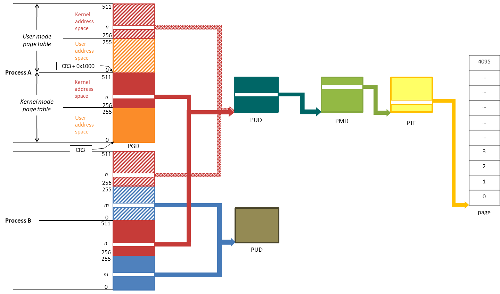
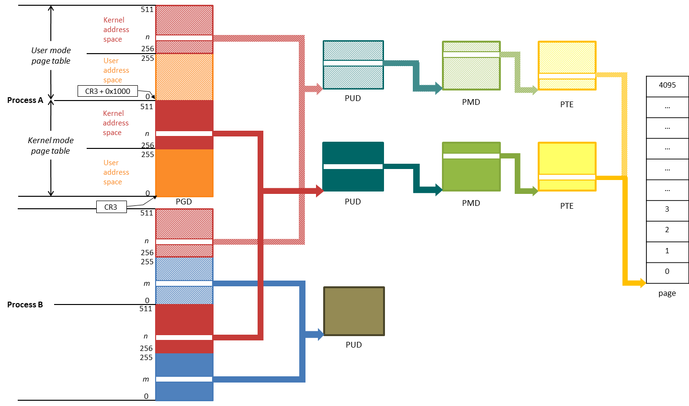
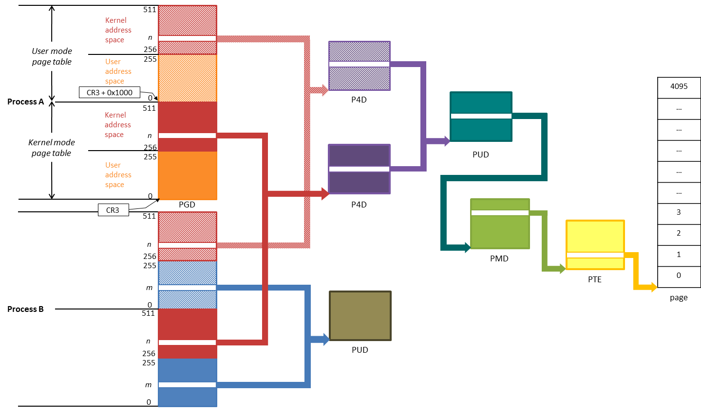
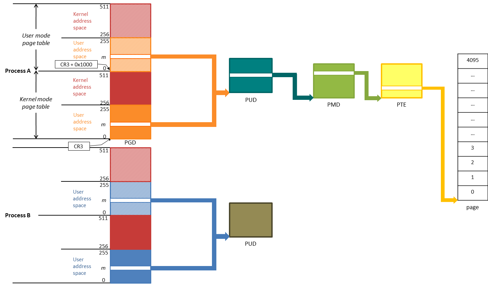

# KPTI
## 目录
- [KPTI与KAISER](#KPTI与KAISER)
	- [内核地址空间的页表映射](#内核地址空间的页表映射)
	- [用户地址空间的页表映射](#用户地址空间的页表映射)
- [上游仓库的pti分支](#上游仓库的pti分支)
- [pti.c](#ptic)
- [进程页表的创建](#进程页表的创建)
	- [一致映射区的起始地址](#一致映射区的起始地址)
	- [PGD的条目](#pgd的条目)
	- [新进程PGD的分配](#新进程pgd的分配)
	- [新进程PGD内核地址空间部分的初始化](#新进程pgd内核地址空间部分的初始化)
	- [新进程PGD用户地址空间部分的填充](#新进程pgd用户地址空间部分的填充)
- [中断](#中断)
- [系统调用](#系统调用)
- [References](#references)

## KPTI与KAISER
* **KPTI (Kernel Page Table Isolation)** 和 **KAISER (Kernel Address Isolation to have Side-channels Efficiently Removed)** 都是针对 Meltdown 问题的解决方案。
* KPTI 的 **内核态页表（kernel mode page table）** 和 **用户态页表（user mode page table）** 分别对应于 KAISER 的 **普通页表（normal page table）** 和 **影子页表（shadow page table）** 的概念。

### 内核地址空间的页表映射
* KAISER 的影子页表的 PGD 条目会在初始化时就分配用于映射内核地址空间的 256 个二级页表（PUD），然后填充到 PGD 条目里。这些二级页表占用 256 * 4096B = 1MB 的空间，各个进程会共享这些二级页表。
* KPTI 用于映射内核地址空间的二级页表则是按需分配，用户态页表和内核态页表有可能从第二级就开始共享（四级页表，克隆 P4D），有可能从第三级开始共享（五级页表，克隆 P4D），也有可能要到 page 一级才共享。
* 对于 **不同进程**，内核态页表与用户态页表用于映射内核地址空间部分的页表项是 **相同的**，这就是常说的 **一致映射、线性映射、直接映射**。
* 对于 **同一进程**，内核态页表与用户态页表用于映射内核地址空间部分的页表项是 **不同的**，这就是 **页表隔离**。
* 并非所有的内核页表条目在用户态页表内有克隆，仅仅是处理系统调用、中断、中断描述符、trace等最必要的一部分内核地址空间页表在用户态页表有克隆，否则切换`cr3`之后剩余的一些必要的内核代码无法执行或数据无法访问了。

#### 四级页表——共享PUD

* 对于某一段内核地址空间可以采用如下映射方式
	* 同一进程内核态页表和用户态页表的 PGD 页表项都存的是同一个 PUD 页的物理地址
	* 不同进程由于都是从父进程 clone 过来的，因此也共享该 PUD 页

#### 四级页表——共享page

* 对于某一段内核地址空间也可以采用如下映射方式
	* 内核态页表和用户态页表的各级页表都分配不同的 page 来存放下一级页表物理基址
	* 直到 PTE 一级才在内核态页表和用户态页表填入相同的 page 物理基址

#### 五级页表——共享PUD

* **四级页表——共享PUD** 是 **五级页表——共享PUD** 的简化方式，因为四级页表没有 P4D

### 用户地址空间的页表映射

* 用于映射用户地址空间的页表，**不同进程之间** 不共享（和原来的一样，也是虚拟内存管理的关键点之一）。
* 和过去不同的是，对于 **同一进程** 来说，新增的用户态页表用于映射用户地址空间的页表项与内核态页表的页表项相同，自第二级页表开始共享。用户地址空间当然不需要页表隔离。
* 建立新进程时，
	1. 先分配 PGD
	2. 再填充内核态页表和用户态页表的内核地址空间部分`dup_mm -> mm_init`
	3. 后填充填充内核态页表和用户态页表的进程地址空间部分`dup_mm -> dup_mmap`。
* 不隔离不意味着完全相同，填充内核态页表项时，KPTI 会给页表项加上`_PAGE_NX`标志，以阻止执行内核态页表所映射用户地址空间的代码。在 KAISER patch 里把这一步骤叫 *毒化（poison）*。

## 上游仓库的pti分支
* 可以跟踪 upstream 的 [tip/x86/pti](https://git.kernel.org/pub/scm/linux/kernel/git/tip/tip.git/?h=x86%2Fpti) 分支获得该问题 fix 的最新动态
	```
	git clone git://git.kernel.org/pub/scm/linux/kernel/git/stable/linux-stable.git
	git remote add tip git://git.kernel.org/pub/scm/linux/kernel/git/tip/tip.git
	git pull tip
	git checkout tip/x86/pti
	```
* 主有有以下几个 branch
	* [tip/x86/pti](https://git.kernel.org/pub/scm/linux/kernel/git/tip/tip.git/?h=x86/pti)
	* [WIP.x86/pti.entry](https://git.kernel.org/pub/scm/linux/kernel/git/tip/tip.git/?h=WIP.x86%2Fpti.entry)
	* [WIP.x86/pti.base](https://git.kernel.org/pub/scm/linux/kernel/git/tip/tip.git/?h=WIP.x86/pti.base)
	* [WIP.x86/pti.base.prep](https://git.kernel.org/pub/scm/linux/kernel/git/tip/tip.git/?h=WIP.x86/pti.base.prep)
	```
	git format-patch -M tip/WIP.x86/pti.base..64e16720ea0879f8ab4547e3b9758936d483909b
	git format-patch -M 7e86548e2cc8d308cb75439480f428137151b0de..tip/x86/pti
  ```

## pti.c
* arch/x86/include/asm/pgtable.h
```c
static inline unsigned long pgd_page_vaddr(pgd_t pgd)
{	// 根据 pgd 条目里的物理地址返回该地址对应的虚拟地址
	return (unsigned long)__va((unsigned long)pgd_val(pgd) & PTE_PFN_MASK);
}
```
* arch/x86/include/asm/pgtable_64.h
```c
static inline pgd_t *kernel_to_user_pgdp(pgd_t *pgdp)
{// 用户态页表和内核态页表的顶级页表（PGD）相邻，用户态页表向高地址偏移 4K
	return ptr_set_bit(pgdp, PTI_PGTABLE_SWITCH_BIT);
}

static inline pgd_t *user_to_kernel_pgdp(pgd_t *pgdp)
{// 将用户态页表的 PGD 条目第 13 位翻转为 0 即对应内核态页表的线性地址
	return ptr_clear_bit(pgdp, PTI_PGTABLE_SWITCH_BIT);
}
...
/*
 * Page table pages are page-aligned.  The lower half of the top
 * level is used for userspace and the top half for the kernel.
 *
 * Returns true for parts of the PGD that map userspace and
 * false for the parts that map the kernel.
 */
static inline bool pgdp_maps_userspace(void *__ptr)
{
	unsigned long ptr = (unsigned long)__ptr;
	// 页表页是页对齐的。顶级页表的低一半是用于用户空间的，高一半是用于内核的
	return (ptr & ~PAGE_MASK) < (PAGE_SIZE / 2);
}
...__```
```

* arch/x86/kernel/cpu/common.c
```c
// 没有投机执行的 x86 的 CPU
static const __initdata struct x86_cpu_id cpu_no_speculation[] = {
	{ X86_VENDOR_INTEL,	6, INTEL_FAM6_ATOM_CEDARVIEW,	X86_FEATURE_ANY },
	{ X86_VENDOR_INTEL,	6, INTEL_FAM6_ATOM_CLOVERVIEW,	X86_FEATURE_ANY },
	{ X86_VENDOR_INTEL,	6, INTEL_FAM6_ATOM_LINCROFT,	X86_FEATURE_ANY },
	{ X86_VENDOR_INTEL,	6, INTEL_FAM6_ATOM_PENWELL,	X86_FEATURE_ANY },
	{ X86_VENDOR_INTEL,	6, INTEL_FAM6_ATOM_PINEVIEW,	X86_FEATURE_ANY },
	{ X86_VENDOR_CENTAUR,	5 },
	{ X86_VENDOR_INTEL,	5 },
	{ X86_VENDOR_NSC,	5 },
	{ X86_VENDOR_ANY,	4 },
	{}
};
// x86 的 CPU 只要不是 AMD 的就被认为有 meltdown 漏洞并设上相应标志
static const __initdata struct x86_cpu_id cpu_no_meltdown[] = {
	{ X86_VENDOR_AMD },
	{}
};
/*
 * Do minimum CPU detection early.
 * Fields really needed: vendor, cpuid_level, family, model, mask,
 * cache alignment.
 * The others are not touched to avoid unwanted side effects.
 *
 * WARNING: this function is only called on the BP.  Don't add code here
 * that is supposed to run on all CPUs.
 */
static void __init early_identify_cpu(struct cpuinfo_x86 *c)
{
	...
	if (!x86_match_cpu(cpu_no_speculation)) {  // 检查是否不具备投机执行功能
		if (cpu_vulnerable_to_meltdown(c)) // 检查是不是有 meltdown 漏洞
			setup_force_cpu_bug(X86_BUG_CPU_MELTDOWN); //设上相应标志
		setup_force_cpu_bug(X86_BUG_SPECTRE_V1);
		setup_force_cpu_bug(X86_BUG_SPECTRE_V2);
	}
	...
}
...__```
```

* arch/x86/mm/pti.c
```c
/*
 * Copyright(c) 2017 Intel Corporation. All rights reserved.
 *
 * This program is free software; you can redistribute it and/or modify
 * it under the terms of version 2 of the GNU General Public License as
 * published by the Free Software Foundation.
 *
 * This program is distributed in the hope that it will be useful, but
 * WITHOUT ANY WARRANTY; without even the implied warranty of
 * MERCHANTABILITY or FITNESS FOR A PARTICULAR PURPOSE.  See the GNU
 * General Public License for more details.
 *
 * This code is based in part on work published here:
 *
 *	https://github.com/IAIK/KAISER
 *
 * The original work was written by and and signed off by for the Linux
 * kernel by:
 *
 *   Signed-off-by: Richard Fellner <richard.fellner@student.tugraz.at>
 *   Signed-off-by: Moritz Lipp <moritz.lipp@iaik.tugraz.at>
 *   Signed-off-by: Daniel Gruss <daniel.gruss@iaik.tugraz.at>
 *   Signed-off-by: Michael Schwarz <michael.schwarz@iaik.tugraz.at>
 *
 * Major changes to the original code by: Dave Hansen <dave.hansen@intel.com>
 * Mostly rewritten by Thomas Gleixner <tglx@linutronix.de> and
 *		       Andy Lutomirsky <luto@amacapital.net>
 */
...

#undef pr_fmt
#define pr_fmt(fmt)     "Kernel/User page tables isolation: " fmt

/* Backporting helper */
#ifndef __GFP_NOTRACK
#define __GFP_NOTRACK	0
#endif

static void __init pti_print_if_insecure(const char *reason)
{
	if (boot_cpu_has_bug(X86_BUG_CPU_MELTDOWN))
		pr_info("%s\n", reason);
}

static void __init pti_print_if_secure(const char *reason)
{
	if (!boot_cpu_has_bug(X86_BUG_CPU_MELTDOWN))
		pr_info("%s\n", reason);
}

void __init pti_check_boottime_disable(void)
{
	char arg[5];
	int ret;

	if (hypervisor_is_type(X86_HYPER_XEN_PV)) {
		pti_print_if_insecure("disabled on XEN PV.");
		return;
	}
	// 返回值为参数的长度，找不到参数时返回 -1
	ret = cmdline_find_option(boot_command_line, "pti", arg, sizeof(arg));
	if (ret > 0)  {
		if (ret == 3 && !strncmp(arg, "off", 3)) {
			pti_print_if_insecure("disabled on command line.");
			return;
		}
		if (ret == 2 && !strncmp(arg, "on", 2)) {
			pti_print_if_secure("force enabled on command line.");
			goto enable;
		}
		if (ret == 4 && !strncmp(arg, "auto", 4))
			goto autosel;
	}
	// 返回参数的位置（从 1 开始算起），找不到时返回 0
	if (cmdline_find_option_bool(boot_command_line, "nopti")) {
		pti_print_if_insecure("disabled on command line.");
		return;
	}
	// start_kernel
	// -> setup_arch
	//    -> early_cpu_init
	//       -> early_identify_cpu(&boot_cpu_data);
	// 此时会根据 if (c->x86_vendor != X86_VENDOR_AMD) 条件判断 CPU 是否有
	// meltdown 漏洞，并设置该标志位
autosel:
	if (!boot_cpu_has_bug(X86_BUG_CPU_MELTDOWN))
		return;
enable:
	setup_force_cpu_cap(X86_FEATURE_PTI);// 设置 c->x86_capability PTI 标志
}

pgd_t __pti_set_user_pgd(pgd_t *pgdp, pgd_t pgd)
{
	/*
	 * Changes to the high (kernel) portion of the kernelmode page
	 * tables are not automatically propagated to the usermode tables.
	 *
	 * Users should keep in mind that, unlike the kernelmode tables,
	 * there is no vmalloc_fault equivalent for the usermode tables.
	 * Top-level entries added to init_mm's usermode pgd after boot
	 * will not be automatically propagated to other mms.
	 */
	// 对内核态的页表的高地址（内核）部分的修改不会自动传播到用户态的
	// 页表。
	// 用户应该铭记，用户态的页表不像内核态的页表，没有 vmalloc_fault
	// 的等价物。启动后添加到 init_mm 的用户态表的顶级页表条目不会被自动
	// 传播到其他 mm 实例。
	//
	// 这里涉及到的一个知识点是，对于非线性映射的地址，如 vmalloc 分配的
	// 内存，会在其他进程访问时通过 vmalloc_fault 进行页表项同步。
	//
	// 这里检查传入的 pgdp 指向的条目是不是属于用户空间的。如果不是，说明要
	// 设置的是一个内核空间的 PGD 条目。由于用户态的内核空间部分的条目是
	// 在初始化时分配并填充为共享的二级 （即 PUD）页表，因此是无需在以后进
	// 行设置的，所以这里直接返回要设置的 pgd 内容即可。
	if (!pgdp_maps_userspace(pgdp))
		return pgd;
	// 如果传入的 pgdp 指向的条目是属于用户空间的，要改变的是内核态页表的
	// 用户地址空间部分的条目，则在设置该条目的同时，也要修改其用户态的页
	// 表条目。
	/*
	 * The user page tables get the full PGD, accessible from
	 * userspace:
	 */
	kernel_to_user_pgdp(pgdp)->pgd = pgd.pgd;// 设置用户态的 PGD 条目
	// 注意，设置到用户态页表的条目是没有 _PAGE_NX 标志的。
	/*
	 * If this is normal user memory, make it NX in the kernel
	 * pagetables so that, if we somehow screw up and return to
	 * usermode with the kernel CR3 loaded, we'll get a page fault
	 * instead of allowing user code to execute with the wrong CR3.
	 *
	 * As exceptions, we don't set NX if:
	 *  - _PAGE_USER is not set.  This could be an executable
	 *     EFI runtime mapping or something similar, and the kernel
	 *     may execute from it
	 *  - we don't have NX support
	 *  - we're clearing the PGD (i.e. the new pgd is not present).
	 */
	// 如果这映射的是普通的用户空间内存，设置它在内核态顶级页表（PGD）条
	// 目的不可执行标志（_PAGE_NX），如果我们以某种方式搞砸了，返回到用户态
	// 的时候加载的是内核的 pgd 到 CR3，我们会得到一个缺页错误，而不是允许
	// 用错误的 CR3 在执行用户代码。
	//
	// 如我们所期望的，如果有以下情况不会设置 NX 标志位：
	//   - _PAGE_USER 未设置。这可能是一个 EFI 运行时映射或者一些类似的东
	//     西，内核可能会执行它
	//   - 我们没有 NX 支持
	//   - 我们正在清除 PGD （例如，新的 pgd 不存在）。
	//
	// 这里可以看到，对大多数情况而言，某一进程用户态页表和内核态页表的用户
	// 地址空间部分映射的内容是相同的，即共享映射这部分地址的 PUD，不同的是
	// 它们的标志位，内核态页表顶级页表条目会有 _PAGE_NX 标志。
	if ((pgd.pgd & (_PAGE_USER|_PAGE_PRESENT)) == (_PAGE_USER|_PAGE_PRESENT) &&
	    (__supported_pte_mask & _PAGE_NX))
		pgd.pgd |= _PAGE_NX;
	// 当用这个返回值去设置内核态页表条目的时候，该条目已带上 _PAGE_NX 标志
	/* return the copy of the PGD we want the kernel to use: */
	return pgd;
}

/*
 * Walk the user copy of the page tables (optionally) trying to allocate
 * page table pages on the way down.
 *
 * Returns a pointer to a P4D on success, or NULL on failure.
 */
// 该函数传入某个内核空间的虚拟地址 address，返回其用户态页表中映射该虚拟地址的
// P4D 条目的线性地址。
// 如果该用户态页表中的 P4D 条目不存在，这里会分配 P4D 页并将该页填充到用户态的
// PGD 页表，然后再返回其 P4D 条目的线性地址。
static __init p4d_t *pti_user_pagetable_walk_p4d(unsigned long address)
{
	// pgd_offset_k(address) 取得虚拟地址 address 在内核地址映射中使用的
	// PGD 条目的线性地址，然后再转为用户态页表的 PGD 条目的线性地址。
	//
	// 这里利用用户态页表和内核态页表的顶级页表（PGD）相邻，且用户态页表在
	// 高地址那 4K 的特性，翻转第 13 位为 1 得到用户态页表 PGD 条目的线性地
	// 址。因为页表必然是直接映射，物理上偏移多少，虚拟地址上也偏移多少。
	pgd_t *pgd = kernel_to_user_pgdp(pgd_offset_k(address));
	gfp_t gfp = (GFP_KERNEL | __GFP_NOTRACK | __GFP_ZERO);
	// 该检查确保传入的虚拟地址必须是内核的地址
	if (address < PAGE_OFFSET) {
		WARN_ONCE(1, "attempt to walk user address\n");
		return NULL;
	}
	// *pgd 的内容即下一级页表 P4D 的基地址
	// 如果还未建立映射，先分配页，然后将新页的地址填充到 *pgd
	if (pgd_none(*pgd)) {
		// 分配一个线性映射的新页
		unsigned long new_p4d_page = __get_free_page(gfp);
		if (!new_p4d_page)
			return NULL;
		// __pa(new_p4d_page)：因为是线性映射，线性地址偏移得到物理地址
		// __pgd()：将 unsigned long 的物理地址转为 pgd_t 类型
		// set_pgd()：填充 pgd 条目的内容为下一级页表的基地址，即 P4D
		//            的物理地址
		// 在有 X86_FEATURE_PTI flag 的 CPU 上，该函数最终会调用上面的
		// __pti_set_user_pgd，然而，由于 pgd 这里指向的是内核空间的地址，
		// 该函数会在 if (!pgdp_maps_userspace(pgdp)) 判断后就返回了。
		set_pgd(pgd, __pgd(_KERNPG_TABLE | __pa(new_p4d_page)));
	}
	// 如果有的代码依赖于必然恒等的常数或其他编译时求值的条件，应该用
	// BUILD_BUG_ON() 宏来探测是否有人修改了条件，该宏利用 GCC 不允许创建负
	// 的大小的数组的功能来报错
	// 如果 pgd_large(*pgd) != 0 成立会引起编译时错误
	BUILD_BUG_ON(pgd_large(*pgd) != 0);
	// 根据 pgd 和 address 找到 address 在 P4D 中使用的条目的线性地址
	//
	// 1) pgd 指向某 PGD 条目，则 *pgd 为某 P4D 的基地址（当然是物理地址）
	// 2) 该函数先用 pgd_page_vaddr(*pgd) 根据 *pgd 将存储的 P4D 页的物理地
	//    址偏移得到其对应的虚拟地址，因为页表必然是一致映射的
	// 3) 再用 p4d_index(address) 根据 address 得到其在 P4D 页表中的索引
	// 4) 将第 2) 得到的虚拟基地址加上 3) 的索引则为 p4d 条目的线性地址
	return p4d_offset(pgd, address);
}

/*
 * Walk the user copy of the page tables (optionally) trying to allocate
 * page table pages on the way down.
 *
 * Returns a pointer to a PMD on success, or NULL on failure.
 */
// 该函数传入某个内核空间的虚拟地址 address，返回其用户态页表中映射该虚拟地址的
// PMD 条目的线性地址。
// 如果该用户态页表中的 PUD，PMD 条目不存在，这里会分配 PUD 和 PMD 页并将该页分
// 别填充到用户态的 P4D 和 PUD 页表，然后再返回其 PMD 条目的线性地址。
static __init pmd_t *pti_user_pagetable_walk_pmd(unsigned long address)
{
	gfp_t gfp = (GFP_KERNEL | __GFP_NOTRACK | __GFP_ZERO);
	p4d_t *p4d = pti_user_pagetable_walk_p4d(address);
	pud_t *pud;

	BUILD_BUG_ON(p4d_large(*p4d) != 0);
	if (p4d_none(*p4d)) {
		unsigned long new_pud_page = __get_free_page(gfp);
		if (!new_pud_page)
			return NULL;
		// 填充 p4d 条目的内容为下一级页表的基地址，即 PUD 的物理地址
		set_p4d(p4d, __p4d(_KERNPG_TABLE | __pa(new_pud_page)));
	}

	pud = pud_offset(p4d, address);
	/* The user page tables do not use large mappings: */
	if (pud_large(*pud)) {
		WARN_ON(1);
		return NULL;
	}
	if (pud_none(*pud)) {
		unsigned long new_pmd_page = __get_free_page(gfp);
		if (!new_pmd_page)
			return NULL;
		// 填充 pud 条目的内容为下一级页表的基地址，即 PMD 的物理地址
		set_pud(pud, __pud(_KERNPG_TABLE | __pa(new_pmd_page)));
	}
	// 根据 pud 和 address 找到 address 在 PMD 中使用的条目的线性地址
	return pmd_offset(pud, address);
}

#ifdef CONFIG_X86_VSYSCALL_EMULATION
/*
 * Walk the shadow copy of the page tables (optionally) trying to allocate
 * page table pages on the way down.  Does not support large pages.
 *
 * Note: this is only used when mapping *new* kernel data into the
 * user/shadow page tables.  It is never used for userspace data.
 *
 * Returns a pointer to a PTE on success, or NULL on failure.
 */
// 该函数传入某个内核空间的虚拟地址 address，返回其用户态页表中映射该虚拟地址的
// PTE 条目的线性地址。
// 如果该用户态页表中的 PTE 条目不存在，这里会分配 PTE 页并将该页填充到用户态的
// PMD 页表，然后再返回其 PTE 条目的线性地址。
//
// 注意：只能被用于将内核条目映射到用户态页表，绝不能用于用户空间的地址映射
static __init pte_t *pti_user_pagetable_walk_pte(unsigned long address)
{
	gfp_t gfp = (GFP_KERNEL | __GFP_NOTRACK | __GFP_ZERO);
	pmd_t *pmd = pti_user_pagetable_walk_pmd(address);
	pte_t *pte;

	/* We can't do anything sensible if we hit a large mapping. */
	if (pmd_large(*pmd)) {
		WARN_ON(1);
		return NULL;
	}

	if (pmd_none(*pmd)) {
		unsigned long new_pte_page = __get_free_page(gfp);
		if (!new_pte_page)
			return NULL;
		// 填充 pmd 条目的内容为下一级页表的基地址，即 PTE 的物理地址
		set_pmd(pmd, __pmd(_KERNPG_TABLE | __pa(new_pte_page)));
	}
	// 根据 pmd 和 address 找到 address 在页表中使用的条目的线性地址
	pte = pte_offset_kernel(pmd, address);
	// 因为 page 默认是 4kB 对齐，页表条目的高位是物理地址的基地址，
	// 低 12 位并不用于寻址，用于存放各种标志位，pte_flags() 就是取
	// 页表条目内容中标志位部分，_PAGE_USER 表明该页映射的是一个用户空间
	// 可寻址的地址。这里又做了一次检查。
	if (pte_flags(*pte) & _PAGE_USER) {
		WARN_ONCE(1, "attempt to walk to user pte\n");
		return NULL;
	}
	return pte;
}

static void __init pti_setup_vsyscall(void)
{
	pte_t *pte, *target_pte;
	unsigned int level;
	// 返回指向映射 vsyscall 基地址所在的 PTE 条目的指针
	pte = lookup_address(VSYSCALL_ADDR, &level);
	if (!pte || WARN_ON(level != PG_LEVEL_4K) || pte_none(*pte))
		return;
	// 返回指向映射 VSYSCALL 基地址所对应的用户态页表的 PTE 的指针
	target_pte = pti_user_pagetable_walk_pte(VSYSCALL_ADDR);
	if (WARN_ON(!target_pte))
		return;
	// VSYSCALL 所在的页，连 PTE 都是新分配的，用户态页表与内核态页表仅共享 page！
	*target_pte = *pte;
	// VSYSCALL 所在的页是仅有的在内核地址范围但却可以被用户访问的页。
	// 正常情况下，内核页表会清除 _PAGE_USER 标志，但如果 vsyscalls 使能
	// 的话，转换 VSYSCALL_ADDR 的表需要 _PAGE_USER 标志。
	//
	// 这里先根据 0 进程的 PGD 地址得到其用户态页表的 PGD 地址，然后以
	// 该 PGD 为根，逐级设置用户态页表映射 VSYSCALL_ADDR 涉及的各级页表的
	// _PAGE_USER 标志。
	set_vsyscall_pgtable_user_bits(kernel_to_user_pgdp(swapper_pg_dir));
}
#else
static void __init pti_setup_vsyscall(void) { }
#endif
// 克隆从起始地址到结束地址范围内的 PMD 页表，将内核态页表 PTE 的基地址填充到
// 用户态页表的 PMD 页表条目里，结果是，内核态页表和用户态页表共享给定地址范围
// 的最后一级页表（PTE）。
// 在地址翻译过程中，用户态和内核态访问该地址时用到的 PGD，P4D，PUD，PMD 是不同
// 的，直到 PTE 这级才共享。
static void __init
pti_clone_pmds(unsigned long start, unsigned long end, pmdval_t clear)
{
	unsigned long addr;

	/*
	 * Clone the populated PMDs which cover start to end. These PMD areas
	 * can have holes.
	 */
	for (addr = start; addr < end; addr += PMD_SIZE) {
		pmd_t *pmd, *target_pmd;
		pgd_t *pgd;
		p4d_t *p4d;
		pud_t *pud;

		pgd = pgd_offset_k(addr);
		if (WARN_ON(pgd_none(*pgd)))
			return;
		p4d = p4d_offset(pgd, addr);
		if (WARN_ON(p4d_none(*p4d)))
			return;
		pud = pud_offset(p4d, addr);
		if (pud_none(*pud))
			continue;
		pmd = pmd_offset(pud, addr);
		if (pmd_none(*pmd))
			continue;
		// target_pmd 的值是 PMD 页表条目的地址
		target_pmd = pti_user_pagetable_walk_pmd(addr);
		if (WARN_ON(!target_pmd))
			return;
		// 故 *target_pmd 的值是 PTE 页的基地址
		/*
		 * Copy the PMD.  That is, the kernelmode and usermode
		 * tables will share the last-level page tables of this
		 * address range
		 */
		// 拷贝 PMD 条目的值。也就是，内核态页表和用户态页表共享
		// 给定地址范围的最后一级页表（PTE）。
		*target_pmd = pmd_clear_flags(*pmd, clear);
	}
}

/*
 * Clone a single p4d (i.e. a top-level entry on 4-level systems and a
 * next-level entry on 5-level systems.
 */
// 克隆 addr 所在的内核态页表 P4D 条目到用户态页表，P4D 页不共享，共享的是 PUD
static void __init pti_clone_p4d(unsigned long addr)
{
	p4d_t *kernel_p4d, *user_p4d;
	pgd_t *kernel_pgd;
	// 得到用户态页表的 P4D 条目的线性地址
	user_p4d = pti_user_pagetable_walk_p4d(addr);
	kernel_pgd = pgd_offset_k(addr); // 得到内核态页表的 PGD 条目线性地址
	kernel_p4d = p4d_offset(kernel_pgd, addr); // 内核态页表 P4D 条目线性地址
	*user_p4d = *kernel_p4d; // 将条目的内容从内核态页表克隆到用户态页表
}

/*
 * Clone the CPU_ENTRY_AREA into the user space visible page table.
 */
static void __init pti_clone_user_shared(void)
{
	pti_clone_p4d(CPU_ENTRY_AREA_BASE);
}

/*
 * Clone the ESPFIX P4D into the user space visinble page table
 */
static void __init pti_setup_espfix64(void)
{
#ifdef CONFIG_X86_ESPFIX64
	pti_clone_p4d(ESPFIX_BASE_ADDR);
#endif
}

/*
 * Clone the populated PMDs of the entry and irqentry text and force it RO.
 */
static void __init pti_clone_entry_text(void)
{// 克隆已填充的 entry 和 irqentry 代码段 PMD 条目到用户态页表，并强制为只读。
	pti_clone_pmds((unsigned long) __entry_text_start,
			(unsigned long) __irqentry_text_end,
		       _PAGE_RW | _PAGE_GLOBAL);
}

/*
 * Initialize kernel page table isolation
 */
void __init pti_init(void)
{
	if (!static_cpu_has(X86_FEATURE_PTI))
		return;

	pr_info("enabled\n");
	// 通过克隆的方式，共享有限的内核态页表的内容到用户态页表
	pti_clone_user_shared(); // P4Ds 克隆，PUD 级开始共享
	pti_clone_entry_text();  // PMDs 克隆，PTE 级开始共享
	pti_setup_espfix64();    // P4Ds 克隆，PUD 级开始共享
	pti_setup_vsyscall();    // PTEs 是新分配的，仅 pages 是共享的
}
...__```
```
* 在最初的`KAISER`实现中，用户态页表在`KAISER`中叫 **影子页表**，它在`kaiser_init`的时候就分配了所有用于映射内核地址空间部分的二级页表，并填充到顶级页表
* 在 KPTI 的实现中没有这么做，而是采用按需分配的方式，见`pti_init()`
* 用`pti_clone_p4d()`克隆的页表让某地址寻址时，内核态页表与用户态页表从 PUD 级开始共享
	* 五级页表时，克隆使 P4D 级的页表内核态和用户态各有一份，然后需填充的 P4D 页表条目指向同一 PUD page
	* 四级页表时，P4D 级的页表是没有的，用户态 PGD 条目和内核态 PGD 条目指向同一 PUD page
* 目前，从 PUD、PTE、page 开始共享的情况都有，但还没有共享 PMD 的情况

## 进程页表的创建
```c
do_fork()
-> copy_process()
   -> copy_mm()
      -> dup_mm()
         +-> mm = allocate_mm()
         +-> mm_init()
         |   -> mm_alloc_pgd(mm)
         |      -> mm->pgd = pgd_alloc(mm)
         |         -> pgd = _pgd_alloc(mm);
         |            -> __get_free_pages(PGALLOC_GFP, PGD_ALLOCATION_ORDER)
         |         -> pgd_ctor(mm, pgd)
         |            -> clone_pgd_range(pgd + KERNEL_PGD_BOUNDARY,
         |                               swapper_pg_dir + KERNEL_PGD_BOUNDARY,
         |                               KERNEL_PGD_PTRS);
         |            -> pgd_list_add(pgd)
         |               -> list_add(&page->lru, &pgd_list)
         +-> dump_mmap(mm, oldmm)
```
* `mm`就是每个进程的`struct task_struct`的类型为`struct mm_struct *`的成员
* `struct mm_struct`的成员`pgd_t * pgd`指向进程的顶级页表

### 一致映射区的起始地址
* arch/x86/include/asm/page_64_types.h
```c
/*
 * Set __PAGE_OFFSET to the most negative possible address +
 * PGDIR_SIZE*16 (pgd slot 272).  The gap is to allow a space for a
 * hypervisor to fit.  Choosing 16 slots here is arbitrary, but it's
 * what Xen requires.
 */
#ifdef CONFIG_X86_5LEVEL
/*x86-64 五级页表一致映射区的起始地址*/
#define __PAGE_OFFSET_BASE      _AC(0xff10000000000000, UL)
#else
/*x86-64 四级页表一致映射区的起始地址*/
#define __PAGE_OFFSET_BASE      _AC(0xffff880000000000, UL)
#endif

#ifdef CONFIG_RANDOMIZE_MEMORY
/*开启内核地址随机化 （KASLR) 时的一致映射区的起始地址，不再是常量*/
#define __PAGE_OFFSET           page_offset_base
#else
/*未开启内核地址随机化 （KASLR) 时的一致映射区的起始地址*/
#define __PAGE_OFFSET           __PAGE_OFFSET_BASE
#endif /* CONFIG_RANDOMIZE_MEMORY */
...__```
```
* arch/x86/include/asm/page_types.h
```c
#define PAGE_OFFSET		((unsigned long)__PAGE_OFFSET)
...__```
```

### PGD的条目
* 一个 PGD 页为 `4KB`，一个 64 位的虚拟地址长度为 `8B`，故一个 PGD 页能映射
  `4KB / 8B = 512` 个下一级表项
* arch/x86/include/asm/pgtable_64_types.h
```c
#define SHARED_KERNEL_PMD	0

#ifdef CONFIG_X86_5LEVEL

/*
 * PGDIR_SHIFT determines what a top-level page table entry can map
 */
#define PGDIR_SHIFT	48   /*五级页表的 PGD 的索引从 1<<48 位开始算起*/
#define PTRS_PER_PGD	512  /*五级页表的 PGD 页有 512 个页表项*/

/*
 * 4th level page in 5-level paging case
 */
#define P4D_SHIFT	39  /*五级页表的 P4D 的索引从 1<<39 位开始算起*/
#define PTRS_PER_P4D	512 /*五级页表的 P4D 页有 512 个页表项*/
...
#else /* CONFIG_X86_5LEVEL */

/*
 * PGDIR_SHIFT determines what a top-level page table entry can map
 */
#define PGDIR_SHIFT	39  /*四级页表的 PGD 的索引从 1<<39 位开始算起*/
#define PTRS_PER_PGD	512 /*四级页表的 PGD 页有 512 个页表项*/

#endif /* CONFIG_X86_5LEVEL */
```
### 新进程PGD的分配
* KPTI 顶级页表 PGD 需要两个 pages 来表示，即 2<sup>1</sup>，故`PGD_ALLOCATION_ORDER`为 **1**
* 这两个页连续分配，大小为 8k 且 8k-对齐
  * `0 ～ 1<<12-1 = 4095 = 0x0fff` 表示 4096 个数，4k 对齐的页的地址低 12 位全零
  * `0 ～ 1<<13-1 = 8191 = 0x1fff` 表示 8192 个数，8k 对齐的页的地址低 13 位全零
  * 因此这两个页第一个页的低 13 位总是全零，第二个页的第 13 位总是为 **1**
* 所以我们翻转指向这两个页的指针的第 **13** 位来在这两个页之间切换
* 对于一个进程，低地址的页用做其内核态的 PGD，高地址的页用做其用户态的 PGD
* arch/x86/include/asm/pgalloc.h
```c
#ifdef CONFIG_PAGE_TABLE_ISOLATION
/*
 * Instead of one PGD, we acquire two PGDs.  Being order-1, it is
 * both 8k in size and 8k-aligned.  That lets us just flip bit 12
 * in a pointer to swap between the two 4k halves.
 */
#define PGD_ALLOCATION_ORDER 1
#else
#define PGD_ALLOCATION_ORDER 0
#endif
```
* 在未开启 PAE 的情况下，分配 PGD 页很简单，就是调用`__get_free_pages()`分配`PGD_ALLOCATION_ORDER`的页
* 该函数会调用`__get_free_pages()`分配 PGD 页，这意味这顶级页表是从 **线性映射（也叫一致映射，或直接映射）区** 分配的内存空间
* arch/x86/mm/pgtable.c
```c
#ifdef CONFIG_X86_PAE
...

#else
static inline pgd_t *_pgd_alloc(void)
{
	return (pgd_t *)__get_free_pages(PGALLOC_GFP, PGD_ALLOCATION_ORDER);
}
...
#endif /* CONFIG_X86_PAE */
```

### 新进程PGD内核地址空间部分的初始化
* `KERNEL_PGD_BOUNDARY` 为一致映射区在 PGD 页中的索引
* `KERNEL_PGD_PTRS` 为在 PGD 页中映射内核地址空间的条目数
* 计算方式见它们的宏定义
* arch/x86/include/asm/pgtable.h
```c
#define KERNEL_PGD_BOUNDARY	pgd_index(PAGE_OFFSET)
#define KERNEL_PGD_PTRS		(PTRS_PER_PGD - KERNEL_PGD_BOUNDARY)
...
/*
 * clone_pgd_range(pgd_t *dst, pgd_t *src, int count);
 *
 *  dst - pointer to pgd range anwhere on a pgd page
 *  src - ""
 *  count - the number of pgds to copy.
 *
 * dst and src can be on the same page, but the range must not overlap,
 * and must not cross a page boundary.
 */
static inline void clone_pgd_range(pgd_t *dst, pgd_t *src, int count)
{
	memcpy(dst, src, count * sizeof(pgd_t));
#ifdef CONFIG_PAGE_TABLE_ISOLATION
	if (!static_cpu_has(X86_FEATURE_PTI))
		return;
	/* Clone the user space pgd as well */
	/*根据拷贝的目的和源，找到对应的用户态页表中的目的和源，在用户态页表也进行相同的动作。*/
	memcpy(kernel_to_user_pgdp(dst), kernel_to_user_pgdp(src),
	       count * sizeof(pgd_t));
#endif
}
```
* `clone_pgd_range()` 拷贝指定范围的 PGD 条目，这里新增加了对 KPTI 的支持
* 注意，这个函数用于两个进程间顶级页表内容的拷贝
  * 对于用户态页表，它的 PGD 条目的内容和内核态页表的 PGD 条目的内容大部分必然是不一样的，所以只是对用户态页表执行一样的动作。
  * 可以理解为在 A 进程的用户态页表拷贝指定范围的内容到 B 进程的用户态页表。
* 看一个例子：`pgd_ctor()`
* arch/x86/mm/pgtable.c
```c
static void pgd_ctor(struct mm_struct *mm, pgd_t *pgd)
{
	/* If the pgd points to a shared pagetable level (either the
	   ptes in non-PAE, or shared PMD in PAE), then just copy the
	   references from swapper_pg_dir. */
	/*对于采用四级以上的页表进行内核部分页表条目的克隆，即映射内核部分从二级页表开始共享*/
	if (CONFIG_PGTABLE_LEVELS == 2 ||
	    (CONFIG_PGTABLE_LEVELS == 3 && SHARED_KERNEL_PMD) ||
	    CONFIG_PGTABLE_LEVELS >= 4) {
		/*从 swapper 进程的 PGD 中映射内核地址空间的页表内容拷贝至新进程的 PGD 映射内核地址的
		  那部分。之前解释过这个个宏的含义，这里应该很好理解*/
		clone_pgd_range(pgd + KERNEL_PGD_BOUNDARY,
				swapper_pg_dir + KERNEL_PGD_BOUNDARY,
				KERNEL_PGD_PTRS);
	}
	/*此时，新进程的内核部分从第二级页表开始处于共享状态*/
	/* list required to sync kernel mapping updates */
	/*对于 x86-64，SHARED_KERNEL_PMD 定义为 0，见 pgtable_64_types.h*/
	if (!SHARED_KERNEL_PMD) {
		pgd_set_mm(pgd, mm); /*将 pgd 的 page 描述符 index 成员指向 mm*/
		pgd_list_add(pgd);   /*将 pgd 的 page 描述符添加到 pgd_list 链表*/
	}
}
...
pgd_t *pgd_alloc(struct mm_struct *mm)
{
	pgd_t *pgd;
	pmd_t *pmds[PREALLOCATED_PMDS]; /*非 PAE 模式无需预填充任何页表条目*/
	/*开启 KPTI 的时候，分配的是两页*/
	pgd = _pgd_alloc();

	if (pgd == NULL)
		goto out;
	/*第一次将 mm->pgd 指向新分配的 pgd 页，返回 mm_alloc_pgd() 后还会再次指向它*/
	mm->pgd = pgd;
	/*非 PAE 模式该函数什么也不做*/
	if (preallocate_pmds(mm, pmds) != 0)
		goto out_free_pgd;
	/*未开启 CONFIG_PARAVIRT 该函数什么也不做*/
	if (paravirt_pgd_alloc(mm) != 0)
		goto out_free_pmds;

	/*
	 * Make sure that pre-populating the pmds is atomic with
	 * respect to anything walking the pgd_list, so that they
	 * never see a partially populated pgd.
	 */
	spin_lock(&pgd_lock);
	/*PGD 页 constructor*/
	pgd_ctor(mm, pgd); /*pgd 构造函数，拷贝 0 进程 PGD 内核部分条目，还有一些其他操作*/
	pgd_prepopulate_pmd(mm, pgd, pmds); /*非 PAE 模式该函数什么也不做*/

	spin_unlock(&pgd_lock);

	return pgd;
	...
out:
	return NULL;
}
```
* 开启 KPTI 后，`clone_pgd_range()`会同时完成 PGD 条目的内核态页表的拷贝和用户态页表的拷贝。
* 在系统初始化时，尽管`swapper`进程并没有用户态，但还是会给它建立一个用户态页表，用户地址空间部分没做映射。
* 而在`swapper`进程的用户态页表的内核地址空间部分做好了映射，仅仅映射最少的内容，目的是为了新进程的 **用户态页表** 的内核地址空间部分以此作为模版进行拷贝。
* 结果就是，所有进程的用户态页表的内核地址空间都共享一个极小的地址映射。

### 新进程PGD用户地址空间部分的填充
#### 五级页表时的填充
```c
do_fork()
-> copy_process()
   -> copy_mm()
      -> dup_mm()
         -> mm = allocate_mm()
         -> mm_init()
            -> mm_alloc_pgd(mm)
         -> dump_mmap(mm, oldmm)
            -> copy_page_range()
               -> copy_p4d_range()
                  +-> p4d_alloc()
                  |   -> __p4d_alloc()
                  |      -> p4d_alloc_one()
                  |      -> pgd_populate()
                  |         -> set_pgd(pgd, __pgd(_PAGE_TABLE | __pa(p4d)))
                  |         => native_set_pgd(pgdp, pgd)
                  |            -> *pgdp = pti_set_user_pgd(pgdp, pgd);
                  |               -> __pti_set_user_pgd(pgdp, pgd)
                  |                  -> kernel_to_user_pgdp(pgdp)->pgd = pgd.pgd;
                  +-> copy_pud_range()
```
* 子进程用户空间的页表从父进程的页表拷贝而来
* 首先，需要分配第二级页表`copy_p4d_range()`
* 然后，需要将新分配的第二级页表的地址填充到顶级页表`pgd_populate()`
* 填充 PGD 页表条目时，在`set_pgd() => native_set_pgd(pgdp, pgd)`这一步
  * 先用`pti_set_user_pgd(pgdp, pgd)`将第二级页表的地址填充到用户态页表的中的 PGD 条目，该条目的地址根据内核态页表条目的地址翻转第 13 位得到
  * 再将第二级页表的地址填充到内核态页表的中的 PGD 条目，该地址在`__pti_set_user_pgd()`被加工过，加上了`_PAGE_NX`标志以防止映射的代码被意外地执行

#### 四级页表时的填充
* 以上是采用五级页表的情况，对于四级页表，对`p4d`的引用都替换为`pgd`，以上调用关系退化为
```c
do_fork()
...
 -> copy_page_range()
    -> copy_p4d_range()
       -> p4d_alloc()
       -> copy_pud_range()
          +-> pud_alloc()
          |   -> __pud_alloc()
          |      -> pud_alloc_one()
          |      -> p4d_populate()
          |         -> set_p4d(p4d, __p4d(_PAGE_TABLE | __pa(pud)));
          |         => native_set_p4d(p4dp, p4d)
          |            -> *pgdp = pti_set_user_pgd(pgdp, pgd);
          |                -> __pti_set_user_pgd(pgdp, pgd)
          |                   -> kernel_to_user_pgdp(pgdp)->pgd = pgd.pgd;
          +-> copy_pmd_range()
```
* 由于`p4d`一级在四级页表时其实是`pgd`，所以`p4d_alloc()`其实没做什么
* 填充的操作发生在拷贝`pud`一级，此时它成了第二级页表
* 当采用四级页表时，`native_set_p4d()`与`pti_set_user_pgd()`做的事情是一样的

## References
- [Meltdown and Spectre](https://meltdownattack.com/)
- [melddown.pdf](https://meltdownattack.com/meltdown.pdf)
- [spectre.pdf](https://spectreattack.com/spectre.pdf)
- [kaiser.pdf](https://gruss.cc/files/kaiser.pdf)
- [Project Zero: Reading privileged memory with a side-channel](https://googleprojectzero.blogspot.co.at/2018/01/reading-privileged-memory-with-side.html)
- [lwn: KAISER: hiding the kernel from user space](https://lwn.net/Articles/738975/)
- [lwn: The current state of kernel page-table isolation](https://lwn.net/Articles/741878/)
- [KAISER github](https://github.com/IAIK/KAISER)
- [Meltdown & Spectre 攻击及缓解措施（一）](https://paper.seebug.org/501/)
