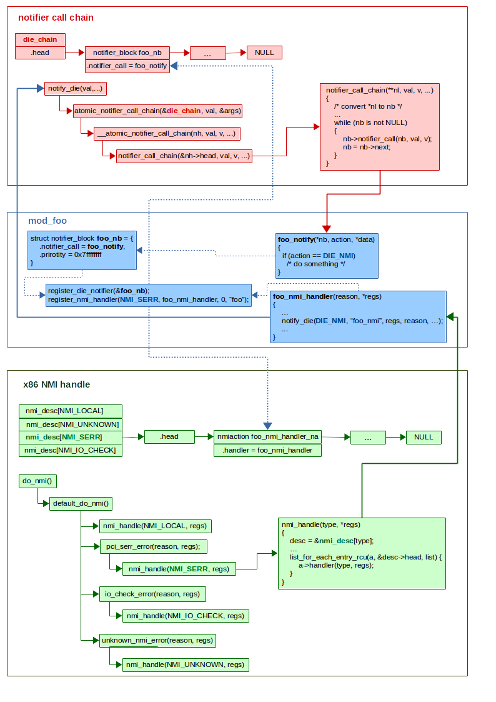

# NMI - x86

## 6.3 中断的来源
* 处理器从两个来源接收中断
  * 外部（硬件生成的）中断
  * 软件生成的中断

### 6.3.1 外部中断
* 通过 **处理器上的引脚** 或通过 **local APIC** 接收外部中断
* Pentium 4、Intel Xeon、P6 系列和 Pentium 处理器上的主要中断引脚是 `LINT[1:0]` 引脚，它们连接到 local APIC
  * 当启用 local APIC 时，可以通过 APIC 的 **本地向量表（LVT）** 对 `LINT[1:0]` 引脚进行编程，使其与任何处理器的异常或中断向量相关联
* 当 local APIC 全局/硬件禁用时，这些引脚分别配置为 `INTR` 和 `NMI` 引脚
  * Assert `INTR` 引脚会向处理器发出外部中断已发生的信号
  * 处理器从系统总线读取由外部中断控制器提供的中断向量编号，例如 8259A（请参阅第 6.2 节“异常和中断向量”）
  * Assert `NMI` 引脚会发出不可屏蔽中断（NMI）信号，该中断被分配给中断向量 `2`

## 6.4 异常的来源
* 处理器从三个来源接收异常：
  * 处理器检测到的程序错误异常
  * 软件生成的异常
  * Machine-check 异常

## 6.7 不可屏蔽中断 (NMI)
* 可以通过以下两种方式之一生成不可屏蔽中断 (NMI)：
  * 外部硬件 assert NMI 引脚
  * 处理器在系统总线（Pentium 4、Intel Core Duo、Intel Core 2、Intel Atom 和 Intel Xeon 处理器）或 APIC 串行总线（P6 系列和 Pentium 处理器）上收到 delivery mode 为 NMI 的消息
* 当处理器从这些来源中的任何一个接收到 NMI 时，处理器会立即通过调用编号为 `2` 的中断向量指向的 NMI 处理程序来处理它
* 处理器还会调用某些硬件条件以确保不会接收到其他中断，包括 NMI 中断 直到 NMI 处理程序完成执行（请参阅“处理多个 NMI”）
* 此外，当从上述任一来源接收到 NMI 时，它不能被 `RFLAGS` 寄存器中的 `IF` 标志屏蔽
* 可以向向量 `2` 发出可屏蔽硬件中断（通过 `INTR` 引脚）以调用 NMI 中断处理程序；然而，这个中断并不是真正的 NMI 中断。激活处理器的 NMI 处理硬件的真正 NMI 中断只能通过上面列出的机制之一来传递

### 6.7.1 处理多个 NMI
* 当 NMI 中断处理程序正在执行时，处理器会阻止后续 NMI 的传送，直到下一次执行 `IRET` 指令为止
  * NMI 的这种阻塞阻止了 NMI 处理程序的嵌套执行
* 建议通过中断门访问 NMI 中断处理程序以禁用可屏蔽硬件中断（请参阅“屏蔽可屏蔽硬件中断”）
* 执行 `IRET` 指令会解锁 NMI，即使该指令会导致错误
  * 例如，如果 `IRET` 指令在 `EFLAGS.VM = 1` 且 `IOPL` 小于 `3` 的情况下执行，则会生成 general-protection 异常。在这种情况下，NMI 在异常处理程序被调用之前被取消屏蔽