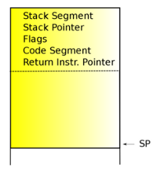

# [翻译] x86 NMI 的 iret 问题
中断是不可预测的并发性的根源，可能会给内核开发人员带来无穷无尽的麻烦。不过，即使是大多数内核黑客也不需要处理不可屏蔽中断（NMI），这本身就带来了一些额外的挑战。 x86 处理器中 NMI 实现的一些缺点长期以来一直限制着 NMI 处理程序的功能。最近，这些限制已被取消（lifted）。本文描述了 NMI 带来的困难，介绍了相关限制为何会造成阻碍，并详细讨论了解决方案。

## 正常中断
计算机的 CPU 是一种复杂的图灵兼容机器，它似乎按照指令在内存中的排列顺序来处理指令。硬件可以优化读取指令的实际顺序，但实际上，CPU 的行为就好像它正在按照程序员放置指令的方式读取指令（从当前处理器的角度来看）。当外部设备上发生事件时，例如 USB 驱动器、网卡或计时器，它需要通知 CPU 必须停止当前的指令序列并跳转到另一组指令来处理新事件。 这个新的指令序列称为 *处理程序*，设备使用中断来通知 CPU。

如果 CPU 当前正在处理的指令使用的数据在中断到来时也被中断处理程序使用，则中断处理程序可能会污染 CPU 正在修改的数据。为了防止这种情况发生，程序员在使用易受攻击的数据的关键路径期间禁用中断。通过正常中断，程序员可以使用禁用中断的功能将 CPU 正常工作流程中的指令处理与中断处理程序中的指令同步。

## 不可屏蔽中断
即使 CPU 禁用了中断，也可以触发一些特殊中断。这些不可屏蔽中断由 profiling 和看门狗等工具使用。对于 profiling，记录有关 CPU 将时间花在哪里的信息，并且通过忽略禁用的中断，profiler 可以记录禁用中断所花费的时间。如果 profiling 使用正常中断，则无法报告该时间。同样，看门狗需要检测内核是否卡在禁用中断的位置。同样，如果看门狗使用正常中断，则在这种情况下它不会有用，因为当中断被禁用时它永远不会触发。

正如你可以想象的那样，可以随时触发的代码是有的，这些代码需要在编写时进行特殊考虑。一方面，它不能获取在其他任何地方使用的任何锁（尽管它可以获取仅在 NMI 上下文中使用的锁来跨 CPU 同步 NMI，但如果可能的话应该避免这种情况）。理想情况下，NMI 处理程序应尽可能简单，以防止由不希望重入的代码引起的竞争条件。

虽然 NMI 可以在中断被禁用时触发，甚至在 CPU 正在处理正常中断时触发，但 NMI 在一个特殊的时候不会触发：当 CPU 正在处理另一个 NMI 时。在大多数架构上，CPU 在第一个 NMI 完成之前不会处理第二个 NMI。当 NMI 触发并调用 NMI 处理程序时，新的 NMI 必须等待，直到第一个 NMI 的处理程序完成。NMI 处理程序不需要担心嵌套，Linux NMI 处理程序在编写时就考虑到了这一事实。

## x86 NMI `iret` 流程
在 x86 上，与其他架构一样，CPU 在第一个 NMI 完成之前不会执行另一个 NMI。x86 架构的 NMI 问题是，当执行 `iret` 指令时，一次 NMI 被认为是完成了。`iret` 是 x86 指令，用于从中断或异常返回。当中断或异常触发时，硬件将自动将信息加载到栈上，这将允许处理程序返回到中断时的状态。`iret` 指令将使用栈上的信息来重置状态。

**First NMI on x86_64**

x86 上的缺陷是，如果在 NMI 处理程序期间发生异常，NMI 将被视为完成，因为异常将返回 `iret`。如果 NMI 处理程序触发 *缺页* 或 *断点*，则用于从这些异常返回的 `iret` 将重新使能 NMI。NMI 处理程序不会返回到异常触发时的状态，而是返回到一个允许新 NMI 抢占正在运行的 NMI 处理程序的状态。如果另一个 NMI 进来，它将跳转到不是为可重入而设计的代码中。更糟糕的是，在 x86_64 上，当 NMI 触发时，栈指针被设置为一个（per CPU 的）固定地址。如果在第一个 NMI 处理程序完成之前另一个 NMI 进入，则新的 NMI 的所有写入将在被抢占的 NMI 栈上。结果是返回原始 NMI 处理程序时发生非常严重的崩溃。i386 的 NMI 处理程序使用当前的内核栈，就像普通中断一样，并且不存在这个特定问题。

**Nested NMI on x86_64**

可以看到这一点的常见示例是将 task 的 stack dump 添加到 NMI 处理程序中。为了调试 lockups，内核开发人员可以将 `show_state()`（像 `sysrq-t` 一样显示所有 tasks 的状态）放入 NMI 看门狗处理程序中。当看门狗检测到系统被锁定时，`show_state()` 会触发，显示所有 tasks 的 stack trace。所有 tasks 的 stack 读取都要小心完成，因为栈帧可能指向错误的内存区域，这将触发一次缺页。

内核预计这里可能会发生故障并进行适当的处理。但缺页处理程序仍然执行 `iret` 指令。这将重新使能 NMI。所有任务的打印输出可能需要一些时间，尤其是通过串口输出时。这使得在输出完成之前很有可能触发另一个 NMI，从而导致系统崩溃。留给可怜的开发人员的将是一部分 dump，并且没有所有 tasks 的回溯。很有可能导致问题的 task 不会显示，开发人员将不得不想出另一种方法来调试问题。

由于这个 x86 NMI `iret` 缺陷，NMI 处理程序既不能触发缺页，也不能命中断点。听起来缺页不应该成为问题，但此限制会阻止 NMI 处理程序使用 `vmalloc()` 分配的内存。内核中的 `vmalloc()` 代码将虚拟内存映射到内核地址空间中。问题是内存在第一次使用时才被映射到 task 的页表中。如果 NMI 处理程序使用内存，并且恰好是当前 task（NMI 发生时执行的任务）第一次引用内存，则会触发缺页。

`vmalloc()` 缺页不需要获取锁，因为它所做的只是填充 task 的页表，因此在 NMI 处理程序中使用 `vmalloc()` 内存应该没有问题。但由于缺页导致的 `iret` 会再次启用 NMI，因此必须避免在 NMI 中使用 `vmalloc()` 内存，以防止上述竞争。内核模块使用 `vmalloc()` 加载，加载模块的文本部分位于虚拟内存中，在使用时出现缺页。如果模块要注册 NMI 处理程序回调，则该回调可能会导致 NMI 变得可重入。

由于断点也以 `iret` 返回，因此也不能将它们放置在 NMI 处理程序中。这可以防止 kprobe 被放置在 NMI 处理程序中。ftrace、perf 和其他几个跟踪工具使用 Kprobes 将动态跟踪点插入内核。但是，如果将 kprobe 添加到 NMI 处理程序调用的函数中，则由于断点处理程序调用的 `iret`，它可能会变得可重入。

## 我们为什么关心？

多年来，NMI 不允许出现缺页或命中断点；为什么我们今天需要它们？2010 年 7 月，Linux 内核上出现了这个问题，当时 Mathieu Desnoyers 提出解决在 NMI 中使用 `vmalloc()` 内存的问题。Desnoyers 的[解决方案](https://lkml.org/lkml/2010/7/14/204)是让缺页处理程序能够感知 NMI。从缺页返回时，处理程序将检查它是否在 NMI 上下文中触发，如果是，则不执行 `iret`，而是使用普通的 `ret` 指令。`ret` 指令是用于从函数返回的 x86 汇编命令。与 `iret` 不同，`ret` 仅将其必须跳到的返回地址从栈上弹出，并不将系统恢复到原始状态。在 Desnoyers 的解决方案中，状态将通过添加的指令直接恢复，以便从缺页返回到 NMI 处理程序，而不需要 `iret`。

Linus Torvalds 对这个解决方案并不满意。NMI 由于可以发生在任何地方，因此需要与内核其他区域不同的特殊处理。Torvalds 不希望这种处理[蔓延到内核的其他区域](https://lkml.org/lkml/2010/7/18/103)，例如缺页处理程序。他更喜欢即便让 NMI 代码更加复杂，但至少只将其包含在 NMI 处理程序中。无论如何，NMI 是一种特殊情况，不用于内核的正常操作，而缺页是内核中的关键热路径，不应该被不重要的 NMI 处理所阻碍（encumbered）。

直接的解决方案是更改 perf，使其不必在其 NMI 处理程序中使用 `vmalloc()` 内存。当然，Desnoyers 的目标不仅仅是修复 perf，而是让 LTTng 能够在 NMI 处理程序中使用 `vmalloc()` 内存。但在 NMI 处理程序中处理缺页并不是解决 x86 NMI `iret` 问题的唯一原因。还有充分的理由允许 NMI 处理程序使用断点。

## References
- [The x86 NMI iret problem - LWN.net](https://lwn.net/Articles/484932/)