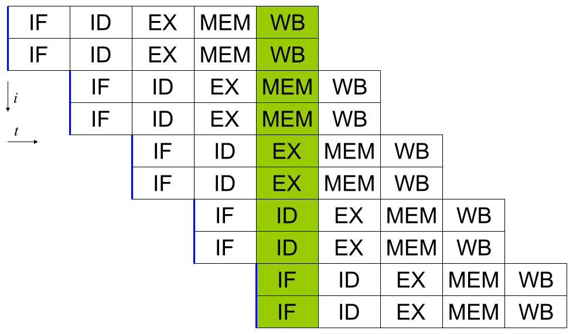
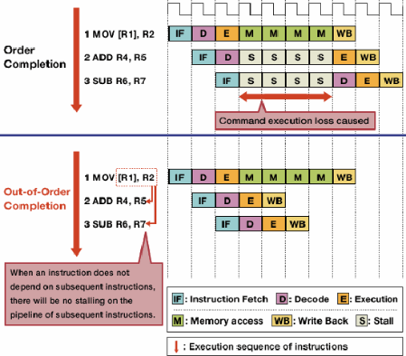
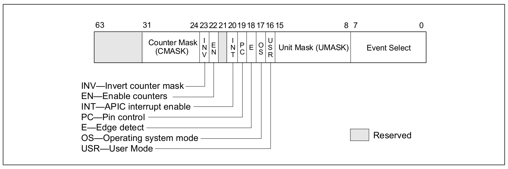

# Perf

## Perf的功能

* 评估程序对硬件资源的使用情况
	* 各级 cache 访问次数
	* 各级 cache 丢失次数
	* 流水线停顿周期
	* 前端总线访问次数
	* 更多
* 评估程序对操作系统资源的使用情况
	* 系统调用次数
	* Page Fault 次数
	* 上下文切换次数
	* 任务迁移次数
	* 更多
* 评估内核性能
	* Benchmarks
	* 调度器性能分析
	* 系统行为记录与重演
	* 动态添加探测点
	* 更多

* `perf` 命令以子命令结合的方式提供相应的功能
```
# perf help

 usage: perf [--version] [--help] [OPTIONS] COMMAND [ARGS]

 The most commonly used perf commands are:
   annotate        Read perf.data (created by perf record) and display annotated code
   archive         Create archive with object files with build-ids found in perf.data file
   bench           General framework for benchmark suites
   buildid-cache   Manage build-id cache.
   buildid-list    List the buildids in a perf.data file
   data            Data file related processing
   diff            Read perf.data files and display the differential profile
   evlist          List the event names in a perf.data file
   inject          Filter to augment the events stream with additional information
   kmem            Tool to trace/measure kernel memory properties
   kvm             Tool to trace/measure kvm guest os
   list            List all symbolic event types
   lock            Analyze lock events
   mem             Profile memory accesses
   record          Run a command and record its profile into perf.data
   report          Read perf.data (created by perf record) and display the profile
   sched           Tool to trace/measure scheduler properties (latencies)
   script          Read perf.data (created by perf record) and display trace output
   stat            Run a command and gather performance counter statistics
   test            Runs sanity tests.
   timechart       Tool to visualize total system behavior during a workload
   top             System profiling tool.
   trace           strace inspired tool
   probe           Define new dynamic tracepoints

 See 'perf help COMMAND' for more information on a specific command.
```

## 概念

### CPU cache
> A **CPU cache** is a hardware cache used by the central processing unit (CPU) of a computer to reduce the average cost (time or energy) to access data from the main memory. A cache is a smaller, faster memory, closer to a processor core, which stores copies of the data from frequently used main memory locations. Most CPUs have different independent caches, including instruction and data caches, where the data cache is usually organized as a hierarchy of more cache levels (L1, L2, etc.).


### Instruction pipelining
> **Instruction pipelining** is a technique that implements a form of parallelism called instruction-level parallelism within a single processor. It therefore allows faster CPU throughput (the number of instructions that can be executed in a unit of time) than would otherwise be possible at a given clock rate. The basic instruction cycle is broken up into a series called a pipeline. Rather than processing each instruction sequentially (finishing one instruction before starting the next), each instruction is split up into a sequence of dependent steps so different steps can be executed in parallel and instructions can be processed concurrently (starting one instruction before finishing the previous one).


* Basic five-stage pipeline
* **IF** = Instruction Fetch, **ID** = Instruction Decode, **EX** = Execute, **MEM** = Memory access, **WB** = Register write back
* In the fourth clock cycle (the green column), the earliest instruction is in MEM stage, and the latest instruction has not yet entered the pipeline

### Superscalar processor
> A **superscalar processor** is a CPU that implements a form of parallelism called instruction-level parallelism within a single processor. It therefore allows for more throughput (the number of instructions that can be executed in a unit of time) than would otherwise be possible at a given clock rate. A superscalar processor can execute more than one instruction during a clock cycle by simultaneously dispatching multiple instructions to different execution units on the processor. Each execution unit is not a separate processor (or a core if the processor is a multi-core processor), but an execution resource within a single CPU such as an arithmetic logic unit.


* Simple superscalar pipeline
* By fetching and dispatching two instructions at a time, a maximum of two instructions per cycle can be completed
* **IF** = Instruction Fetch, **ID** = Instruction Decode, **EX** = Execute, **MEM** = Memory access, **WB** = Register write back, **i** = Instruction number, **t** = Clock cycle [i.e., time]

### Out-of-order execution
> In computer engineering, **out-of-order execution** (or more formally **dynamic execution**) is a paradigm used in most high-performance microprocessors to make use of instruction cycles that would otherwise be wasted by a certain type of costly delay. In this paradigm, a processor executes instructions in an order governed by the availability of input data, rather than by their original order in a program. In doing so, the processor can avoid being idle while waiting for the preceding instruction to complete to retrieve data for the next instruction in a program, processing instead the next instructions that are able to run immediately and independently.



### Branch predication
> In computer science, **predication** is an architectural feature that provides an alternative to conditional branch instructions. Predication works by executing instructions from both paths of the branch and only permitting those instructions from the taken path to modify architectural state. The instructions from the taken path are permitted to modify architectural state because they have been associated (predicated) with a predicate, a Boolean value used by the instruction to control whether the instruction is allowed to modify the architectural state or not.

### Performance Monitor Unit

> **Performance Monitoring Unit**, or the **PMU**, is found in all high end processors these days. The PMU is basically hardware built inside a processor to measure it's performance parameters. We can measure parameters like instruction cycles, cache hits, cache misses, branch misses and many others depending on the support i.e. hardware provide by the processor. And as the measurement is done by the hardware there is very limited overhead.

* PMU 允许软件针对某种硬件事件设置 counter，此后处理器便开始统计该事件的发生次数，当发生的次数超过 counter 内设置的值后，便产生中断。
* 比如 cache miss 达到某个值后，PMU 便能产生相应的中断。捕获这些中断，便可以考察程序对这些硬件特性的利用效率。

#### Hardware performance counter

> In computers, **hardware performance counters**, or hardware counters are a set of special-purpose registers built into modern microprocessors to store the counts of hardware-related activities within computer systems. Advanced users often rely on those counters to conduct low-level performance analysis or tuning.

#### Model-Specific Registers
* Intel IA-32 架构里的 PMU 由两种类型的寄存器（或者说 **Model-Specific Registers (MSRs)**）组成。
	* Performance Event Select Registers
		* 度量一个 *性能事件* 需要对 Event Select Registers 编程
	* Performance Monitoring Counters (PMC)
		* *性能事件* 在 PMC 中计数
* 因此度量性能事件同时需要 event selector 和 PMC
* **Model-Specific**： 即使是来自同一公司的处理器，每个处理器模型有一些和其他模型不同的寄存器。

#### Intel IA32_PERFEVTSELx MSRs


* **Event select field (bits 0 through 7)**
	* 选择要探测性能监测事件的逻辑单元
	* 填充到该域的值取决于体系架构
* **Unit mask (UMASK) fields (bits 8-15)**
	* 被 Event Select field 选中的逻辑单元可能会有监测多个事件的能力。因此该 UMASK 域可以用于从这些事件中选择其中一个让逻辑单元来监控。
	* 根据选中的逻辑单元，UMASK 域可能有固定的值或者多个值，取决于体系结构
* **CMASK (Counter mask) field (bits 24 through 31)**
	* 如果该域的值大于零，那么该值会与一个时钟周期内产生的事件数进行比较。
		* 如果产生的事件数大于 CMASK 的值，那么计数器加一；
		* 否则计数器的值不增加。

#### 其他硬件提供的特性
##### Fixed function performance counter register and associated control register
* 还有一些计数器只能度量某一特定的事件，而不像那些可以配置成 *度量不同的事件的* 通用目的的计数器。

##### Global Control Registers
 * 一些架构还提供了可以被用于控制所有的或者一组 *控制寄存器或者计数器* 的 *全局控制寄存器*。
 * 减少修改控制寄存器需要的指令数，因此易于编程。

### Tracepoints

> A **tracepoint** placed in code provides a hook to call a function (probe) that you can provide at runtime. A tracepoint can be "on" (a probe is connected to it) or "off" (no probe is attached).
>
> You can put tracepoints at important locations in the code. They are lightweight hooks that can pass an arbitrary number of parameters, which *prototypes* are described in a tracepoint declaration placed in a *header file*.
>
> They can be used for *tracing* and *performance accounting*.

* Tracepoint 关闭
	* 极小的 **时间惩罚** （检查一个分支的条件）
	* 极小的 **空间惩罚** （在被 instrumented 函数的末尾添加一些代码以调用函数，并且在一个独立的 section 中添加一些数据结构）。
* Tracepoint 开启
  * 在调用者的执行上下文中，每次 tracepoint 被执行的时候，提供的函数都会被调用到。
  * 当提供的函数运行结束后，会返回到它的调用者（从 tracepoint 被调用的地方继续执行）。

## Perf原理

```
# cat /proc/interrupts
           CPU0       CPU1       
  0:        173          0   IO-APIC-edge      timer
  1:          3          0   IO-APIC-edge      i8042
  4:       3276          0   IO-APIC-edge      serial
  8:          0          0   IO-APIC-edge      rtc0
  9:          0          0   IO-APIC-fasteoi   acpi
 12:          5          0   IO-APIC-edge      i8042
 17:        517          0   IO-APIC  17-fasteoi   snd_hda_intel
 20:        347          0   IO-APIC  20-fasteoi   PCIe PME, pciehp, pata_via, uhci_hcd:usb2
 21:        279          0   IO-APIC  21-fasteoi   0000:00:0f.0, uhci_hcd:usb4
 22:      18614          0   IO-APIC  22-fasteoi   PCIe PME, pciehp, ehci_hcd:usb1, uhci_hcd:usb3
 23:          0          0   IO-APIC  23-fasteoi   uhci_hcd:usb5
 24:          0          0   IO-APIC   3-fasteoi   PCIe PME, pciehp
 25:          0          0   IO-APIC   7-fasteoi   PCIe PME, pciehp
 26:       2941          0   IO-APIC   4-fasteoi   eth0
NMI:       1450        111   Non-maskable interrupts
LOC:      20930      12254   Local timer interrupts
SPU:          0          0   Spurious interrupts
PMI:       1450        111   Performance monitoring interrupts
IWI:          2          0   IRQ work interrupts
RTR:          0          0   APIC ICR read retries
RES:       1556       2236   Rescheduling interrupts
CAL:         32          9   Function call interrupts
TLB:        106        137   TLB shootdowns
TRM:          0          0   Thermal event interrupts
THR:          0          0   Threshold APIC interrupts
MCE:          0          0   Machine check exceptions
MCP:          1          1   Machine check polls
ERR:          0
MIS:          0
```

## Perf Event

* **性能事件 （Perf Event）** 是指在处理器或操作系统中发生的，可能影响到程序性能的硬件事件或软件事件。
	* 比如 cache 丢失，流水线停顿，页面交换等。
	* 这些事件会对程序的执行时间造成较大的负面影响。在优化代码时,应尽可能减少此类事件发生。

* 查看 Perf Event
```
# perf-list

List of pre-defined events (to be used in -e):

  branch-instructions OR branches                    [Hardware event]
  branch-misses                                      [Hardware event]
  bus-cycles                                         [Hardware event]
  cache-misses                                       [Hardware event]
  cache-references                                   [Hardware event]
  cpu-cycles OR cycles                               [Hardware event]
  instructions                                       [Hardware event]
  ref-cycles                                         [Hardware event]

  alignment-faults                                   [Software event]
  context-switches OR cs                             [Software event]
  cpu-clock                                          [Software event]
  cpu-migrations OR migrations                       [Software event]
  dummy                                              [Software event]
  emulation-faults                                   [Software event]
  major-faults                                       [Software event]
  minor-faults                                       [Software event]
  page-faults OR faults                              [Software event]
  task-clock                                         [Software event]

  L1-dcache-load-misses                              [Hardware cache event]
  L1-dcache-loads                                    [Hardware cache event]
  L1-dcache-prefetches                               [Hardware cache event]
  L1-dcache-store-misses                             [Hardware cache event]
  L1-dcache-stores                                   [Hardware cache event]
  L1-icache-load-misses                              [Hardware cache event]
  L1-icache-loads                                    [Hardware cache event]
  LLC-load-misses                                    [Hardware cache event]
  LLC-loads                                          [Hardware cache event]
  LLC-store-misses                                   [Hardware cache event]
  LLC-stores                                         [Hardware cache event]
  branch-load-misses                                 [Hardware cache event]
  branch-loads                                       [Hardware cache event]
  dTLB-load-misses                                   [Hardware cache event]
  dTLB-loads                                         [Hardware cache event]
  dTLB-store-misses                                  [Hardware cache event]
  dTLB-stores                                        [Hardware cache event]
  iTLB-load-misses                                   [Hardware cache event]
  iTLB-loads                                         [Hardware cache event]

	branch-instructions OR cpu/branch-instructions/    [Kernel PMU event]
  branch-misses OR cpu/branch-misses/                [Kernel PMU event]
  bus-cycles OR cpu/bus-cycles/                      [Kernel PMU event]
  cache-misses OR cpu/cache-misses/                  [Kernel PMU event]
  cache-references OR cpu/cache-references/          [Kernel PMU event]
  cpu-cycles OR cpu/cpu-cycles/                      [Kernel PMU event]
  instructions OR cpu/instructions/                  [Kernel PMU event]
  intel_bts//                                        [Kernel PMU event]
  msr/aperf/                                         [Kernel PMU event]
  msr/mperf/                                         [Kernel PMU event]
  msr/tsc/                                           [Kernel PMU event]

  rNNN                                               [Raw hardware event descriptor]
  cpu/t1=v1[,t2=v2,t3 ...]/modifier                  [Raw hardware event descriptor]
   (see 'man perf-list' on how to encode it)

  mem:<addr>[/len][:access]                          [Hardware breakpoint]

  block:block_bio_backmerge                          [Tracepoint event]
  block:block_bio_bounce                             [Tracepoint event]
  block:block_bio_complete                           [Tracepoint event]
  block:block_bio_frontmerge                         [Tracepoint event]
...
```

## Perf Event的分类

* perf 工具和内核的 perf_events 接口可以接受和度量来自不同来源的 perf events。

### Software Events
* 来源自纯内核的计数器，例如：
	* context-switches
	* page-faults
	* cpu-migrations
* 不同版本的内核提供的软件性能事件不尽相同

### Hardware Events
* 来源自处理器自身和它的 PMU
* 提供了一系列用来度量微体系结构的事件，例如：
	* number of cycles
	* instructions retired
	* branch-misses
	* cache-misses
* 不同型号的 CPU 支持的硬件性能事件不尽相同

### Hardware Cache Events
* perf_events 接口也提供了一个小的通用 hardware events 的集合
	* 在每个处理器上，如果这些事件存在的话，就映射到一个 CPU 提供的事件
	* 否则事件无法使用

### Tracepoint Events
* 基于`ftrace`的框架实现
* 内核中所有的 tracepoint ,都可以作为 perf 的性能事件
* 不同版本的内核提供的 tracepoint events 不尽相同
* 现在不再通过`perf list`命令列出所有 tracepoint，可以通过 ftrace 的接口文件查看：
  ```
  /sys/kernel/debug/tracing/available_events
  ```

## 内核选项
### 配置perf
* perf_events 开关
	```
	CONFIG_PERF_EVENTS=y
	```
* 在没有硬件性能度量的体系结构上，仍然可以基于 **hrtimers** 的通用软件计数器来进行采样。
* 在这种情况下需要开启以下选项：
	```
	CONFIG_HAVE_PERF_EVENTS=y
	```
* 并且至少需要以下实现：
	- asm/perf_event.h - 首先需要满足的基本的 stub
	- atomic64 类型（以及相关的 helper functions）的支持

### 配置内核代码的符号表
```
# kernel symbols:
CONFIG_KALLSYMS=y
CONFIG_KALLSYMS_ALL=y
CONFIG_KALLSYMS_EXTRA_PASS=y
```
### `perf lock`命令依赖的选项
```
# kernel lock tracing:
CONFIG_LOCKDEP=y
# kernel lock statistic:
CONFIG_LOCK_STAT=y
```

### `perf probe`命令依赖的选项
```
# kernel-level dynamic tracing:
CONFIG_KPROBES=y
CONFIG_KPROBE_EVENTS=y
# user-level dynamic tracing:
CONFIG_UPROBES=y
CONFIG_UPROBE_EVENTS=y
```

## References

* [Intel® 64 and IA-32 Architectures
Software Developer’s Manual
Combined Volumes:
1, 2A, 2B, 2C, 3A, 3B, 3C and 3D](64-ia-32-architectures-software-developer-system-programming-manual-325384-vol-3.pdf)
* [Linux/tools/perf/Documentation/examples.txt](http://lxr.free-electrons.com/source/tools/perf/Documentation/examples.txt)
* [Perf -- Linux下的系统性能调优工具，第 1 部分](https://www.ibm.com/developerworks/cn/linux/l-cn-perf1/)
* [Perf -- Linux下的系统性能调优工具，第 2 部分](https://www.ibm.com/developerworks/cn/linux/l-cn-perf2/)
* [源码分析：动态分析 Linux 内核函数调用关系](http://tinylab.org/source-code-analysis-dynamic-analysis-of-linux-kernel-function-calls/)
* [perf Examples](http://www.brendangregg.com/perf.html)
* [Kernel Line Tracing: Linux perf Rides the Rocket](http://www.brendangregg.com/blog/2014-09-11/perf-kernel-line-tracing.html)
* [man PERF-KMEM(1)](http://man7.org/linux/man-pages/man1/perf-kmem.1.html)
* [man PERF-RECORD(1)](http://man7.org/linux/man-pages/man1/perf-record.1.html)
* [man PERF-REPORT(1)](http://man7.org/linux/man-pages/man1/perf-report.1.html)
* [perf kmem: Implement page allocation analysis (v8)](https://lwn.net/Articles/641187/)
* [Tracing and Profiling](https://wiki.yoctoproject.org/wiki/Tracing_and_Profiling)
* [perf.wiki: Perf examples](https://perf.wiki.kernel.org/index.php/Perf_examples)
* [perf.wiki: Perf Main Page](https://perf.wiki.kernel.org/index.php/Main_Page)
* [perf.wiki: Tutorial](https://perf.wiki.kernel.org/index.php/Tutorial)
* [LWN: 'perf sched': Utility to capture, measure and analyze scheduler latencies and behavior](https://lwn.net/Articles/353295/?cm_mc_uid=02964680288914742721405&cm_mc_sid_50200000=1490766881)
* [How to monitor the full range of CPU performance events](http://www.bnikolic.co.uk/blog/hpc-prof-events.html)
* [在Linux下做性能分析3：perf](https://zhuanlan.zhihu.com/p/22194920)
* [Linux下做性能分析4：怎么开始](https://zhuanlan.zhihu.com/p/22202885)
* [perf 性能分析实例——使用perf优化cache利用率](http://blog.csdn.net/trochiluses/article/details/17346803)
* [Linux 性能诊断 perf使用指南](https://yq.aliyun.com/articles/65255)
* [Using the Linux Kernel Tracepoints](https://www.kernel.org/doc/Documentation/trace/tracepoints.txt)
* [Notes on Analysing Behaviour Using Events and Tracepoints](https://www.kernel.org/doc/Documentation/trace/tracepoint-analysis.txt)
* [PMU性能分析系列1 - 相关概念](http://blog.csdn.net/gengshenghong/article/details/7383438)
* [PMU性能分析系列1 - 相关事件的理解 - Basic Performance Tuning Events](http://blog.csdn.net/gengshenghong/article/details/7384862)

### wikipedia
* [CPU cache](https://en.wikipedia.org/wiki/CPU_cache)
* [Cache memory](https://en.wikipedia.org/wiki/Cache_memory)
* [Instruction pipelining](https://en.wikipedia.org/wiki/Instruction_pipelining)
* [Superscalar processor](https://en.wikipedia.org/wiki/Superscalar_processor)
* [Branch predication](https://en.wikipedia.org/wiki/Branch_predication)
* [Branch predictor](https://en.wikipedia.org/wiki/Branch_predictor)
* [Branch misprediction](https://en.wikipedia.org/wiki/Branch_misprediction)
* [Hardware performance counter](https://en.wikipedia.org/wiki/Hardware_performance_counter)
* [Superscalar processor](https://en.wikipedia.org/wiki/Superscalar_processor)
