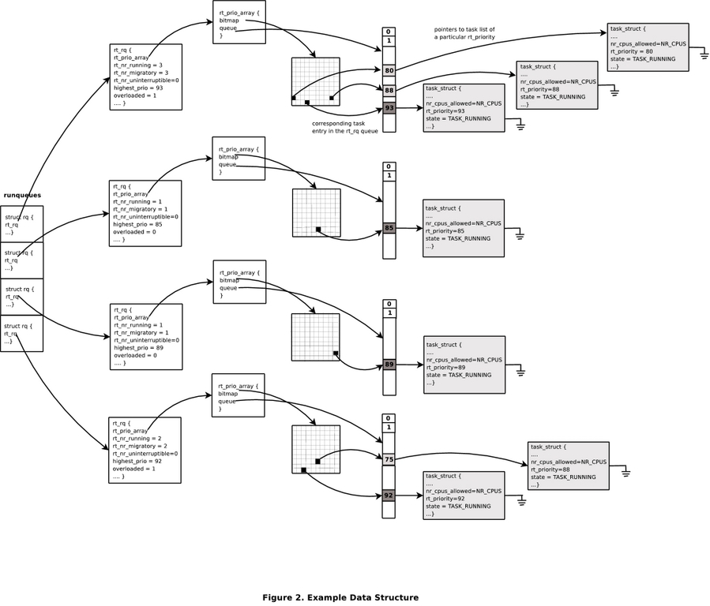

# Linux 实时调度
***
# 目录

- [概述](#概述)
- [实时调度数据结构](#实时调度数据结构)
	- [实时调度队列 rt_rq](#实时调度队列-rtrq)
	- [实时调度优先级队列 rt_prio_array](#实时调度优先级队列-rtprioarray)
	- [实时调度实体 sched_rt_entity](#实时调度实体-schedrtentity)
	- [实时调度器类 rt_sched_class](#实时调度器类-rtschedclass)
	- [数据结构间的关联](#数据结构间的关联)
		- [多核视角](#多核视角)
		- [单核视角](#单核视角)
- [参考资料](#参考资料)

# 概述
* Linux 支持`SCHED_RR`和`SCHED_FIFO`两种实时调度策略。
* 两种调度策略都是静态优先级，内核不为这两种实时进程计算动态优先级。
* 这两种实现都属于 *软实时*。
* 实时优先级的范围：**0 ~ MAX_RT_PRIO-1**
  * `MAX_RT_PRIO`默认值为 **100**
  * 故默认实时优先级范围：**0 ~ 99**。

# 实时调度数据结构

## 实时调度队列 rt_rq
* kernel/sched/sched.h
```c
/* Real-Time classes' related field in a runqueue: */
struct rt_rq {
        struct rt_prio_array active;
        unsigned int rt_nr_running;
        unsigned int rr_nr_running;
#if defined CONFIG_SMP || defined CONFIG_RT_GROUP_SCHED
        struct {
                int curr; /* highest queued rt task prio */
#ifdef CONFIG_SMP
                int next; /* next highest */
#endif
        } highest_prio;
#endif
#ifdef CONFIG_SMP
        unsigned long rt_nr_migratory;
        unsigned long rt_nr_total;
        int overloaded;
        struct plist_head pushable_tasks;
#ifdef HAVE_RT_PUSH_IPI
        int push_flags;
        int push_cpu;
        struct irq_work push_work;
        raw_spinlock_t push_lock;
#endif
#endif /* CONFIG_SMP */
        int rt_queued;

        int rt_throttled;
        u64 rt_time;
        u64 rt_runtime;
        /* Nests inside the rq lock: */
        raw_spinlock_t rt_runtime_lock;

#ifdef CONFIG_RT_GROUP_SCHED
        unsigned long rt_nr_boosted;

        struct rq *rq;
        struct task_group *tg;
#endif
};
```
* 关联到 Per-CPU 的`struct rq`调度队列的 *实时调度队列*（当然也是每个CPU只有一个），有对应的`struct rt_rq rt`成员。

## 实时调度优先级队列 rt_prio_array
* kernel/sched/sched.h
```c
/*
 * This is the priority-queue data structure of the RT scheduling class:
 */
struct rt_prio_array {
        DECLARE_BITMAP(bitmap, MAX_RT_PRIO+1); /* include 1 bit for delimiter */
        struct list_head queue[MAX_RT_PRIO];
};
```
* 每个`struct rt_rq` 有一个 *实时调度优先级队列*。
* 实时调度优先级队列是一组链表，每个实时优先级有一个对应的链表。
* 实时调度中，运行进程根据 *优先级* 放到对应的队列里。
* 对于相同优先级的进程，后面来的进程追加到同一优先级队列的队尾。

## 实时调度实体 sched_rt_entity
* include/linux/sched.h
```c
struct sched_rt_entity {
        struct list_head run_list;
        unsigned long timeout;
        unsigned long watchdog_stamp;
        unsigned int time_slice;
        unsigned short on_rq;
        unsigned short on_list;

        struct sched_rt_entity *back;
#ifdef CONFIG_RT_GROUP_SCHED
        struct sched_rt_entity  *parent;
        /* rq on which this entity is (to be) queued: */
        struct rt_rq            *rt_rq;
        /* rq "owned" by this entity/group: */
        struct rt_rq            *my_q;
#endif
};
```
* 调度器操作的是挂在实时调度优先级队列上的 *实时调度实体*，而不是直接操作`struct task_struct`所代表的进程。
* `struct task_struct`内嵌一个`struct sched_rt_entity`类型的`rt`成员，同理，对应 CFS 有`se`成员，对应 Deadline 有`dl`成员。

## 实时调度器类 rt_sched_class
* kernel/sched/rt.c
```c
const struct sched_class rt_sched_class = {
        .next                   = &fair_sched_class,
        .enqueue_task           = enqueue_task_rt,
        .dequeue_task           = dequeue_task_rt,
        .yield_task             = yield_task_rt,

        .check_preempt_curr     = check_preempt_curr_rt,

        .pick_next_task         = pick_next_task_rt,
        .put_prev_task          = put_prev_task_rt,

#ifdef CONFIG_SMP
        .select_task_rq         = select_task_rq_rt,

        .set_cpus_allowed       = set_cpus_allowed_common,
        .rq_online              = rq_online_rt,
        .rq_offline             = rq_offline_rt,
        .task_woken             = task_woken_rt,
        .switched_from          = switched_from_rt,
#endif

        .set_curr_task          = set_curr_task_rt,
        .task_tick              = task_tick_rt,

        .get_rr_interval        = get_rr_interval_rt,

        .prio_changed           = prio_changed_rt,
        .switched_to            = switched_to_rt,

        .update_curr            = update_curr_rt,
};
```
* `struct task_struct`内有一个`const struct sched_class *sched_class;`指针，指向该进程的调度器类。
* 注意：没有实现`struct sched_class`的`task_fork`，`task_dead`和`switched_from`方法。

## 数据结构间的关联

### 多核视角

* 注意：此图尚未引入`struct sched_rt_entity`结构体，现在内核的实现是通过嵌在`strct task_struct`结构里的`struct sched_rt_entity rt`成员来将任务挂在任务链表上的。

### 单核视角

* 注意：此图尚未引入`struct sched_rt_entity`结构体，现在内核的实现将`run_list`成员移到了内嵌在`strct task_struct`结构里的`struct sched_rt_entity rt`成员里。


# 参考资料
- [Real-Time Linux Kernel Scheduler](http://www.linuxjournal.com/magazine/real-time-linux-kernel-scheduler)
- [linux进程调度](http://lib.csdn.net/article/linux/39622)
