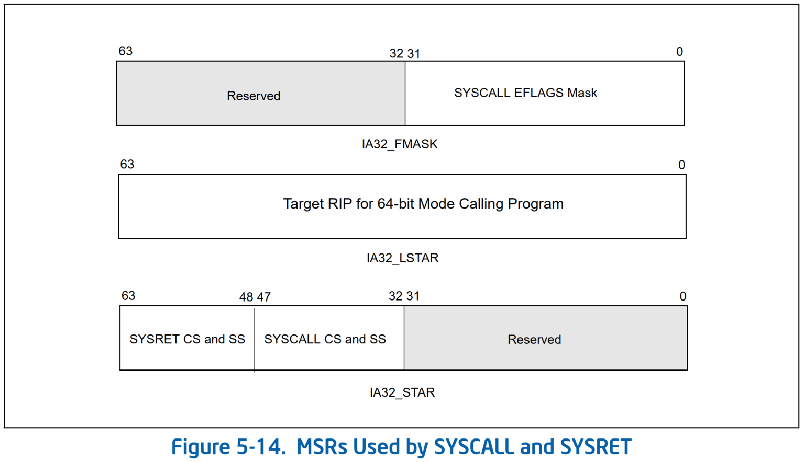

# x86-64 系统调用
* x86-64 位 flat 模式提供了快速系统调用硬件机制
  * 使用`syscall`指令触发系统调用，CPU 从用户态（Ring3）切换到特权态（Ring0）
  * 使用`sysret`指令，CPU 从内核态切换到用户态
* 注意：`sysret`指令和`iret`指令是 CPU 从内核态切换到用户态的两种方式

## syscall 指令
* 执行`syscall`指令，发生系统调用时，CPU 硬件执行以下动作：
  1. 把`MSR_LSTAR`寄存器中的值加载到`RIP`寄存器，并把当前程序运行的下一条指令（即`syscall`指令的下一条指令）保存在`RCX`寄存器中
  2. 把当前的`RFLAGS`寄存器的值保存在`R11`寄存器，并使用`MSR_FMASK`寄存器的值 mask 当前`RFLAGS`的值。一般通过这种方式关闭中断，保证进入系统调用后，CPU 的中断是关闭的
  3. 把`MSR_STAR`寄存器的·`47-32`位的`SYSCALL CS and SS`分别加载到 CPU 的`CS`和`SS`段寄存器，同时更新`CS`和`SS`的不可见部分
* 注意：`syscall`指令不会更新`RSP`寄存器的值，由操作系统去负责切换程序栈

> The `SYSCALL` instruction does not save the stack pointer (`RSP`). If the OS system-call handler will change the stack pointer, it is the responsibility of software to save the previous value of the stack pointer. This might be done prior to executing `SYSCALL`, with software restoring the stack pointer with the instruction following `SYSCALL` (which will be executed after `SYSRET`). Alternatively, the OS system-call handler may save the stack pointer and restore it before executing `SYSRET`.
> -- SDM, Vol. 2B, SYSCALL -Fast System Call

## sysret 指令
* 执行`sysret`指令，CPU 从内核特权态（Ring0）返回到用户态（Ring3），从`syscall`的指令的下一条指令处继续执行
* CPU硬件执行以下动作：
  1. 把`RCX`寄存器中的值加载到`RIP`寄存器
  2. 把`R11`寄存器中的值加载到`RFLAGS`寄存器
  3. 把`MSR_STAR`寄存器中的`SYSRET CS and SS`分别加载到`CS`和`SS`段寄存器
* 注意：`sysret`指令不修改`RSP`寄存器的值，操作系统负责切换程序栈

## 系统调用的初始化



* 系统启动过程中`cpu_init()`会调用 `syscall_init()`初始化系统调用的相关 MSRs
```cpp
/* May not be marked __init: used by software suspend */
void syscall_init(void)
{   // wrmsr() 第二个参数为低 32 位，第三个参数为高 32 位
    wrmsr(MSR_STAR, 0, (__USER32_CS << 16) | __KERNEL_CS);
    wrmsrl(MSR_LSTAR, (unsigned long)entry_SYSCALL_64);

#ifdef CONFIG_IA32_EMULATION
    ...
#endif

    /*
     * Flags to clear on syscall; clear as much as possible
     * to minimize user space-kernel interference.
     */
    wrmsrl(MSR_SYSCALL_MASK,
           X86_EFLAGS_CF|X86_EFLAGS_PF|X86_EFLAGS_AF|
           X86_EFLAGS_ZF|X86_EFLAGS_SF|X86_EFLAGS_TF|
           X86_EFLAGS_IF|X86_EFLAGS_DF|X86_EFLAGS_OF|
           X86_EFLAGS_IOPL|X86_EFLAGS_NT|X86_EFLAGS_RF|
           X86_EFLAGS_AC|X86_EFLAGS_ID);
}
```

## References
- [X86_64处理器系统调用机制在linux上的实现](https://codeantenna.com/a/zVXomEIQ1H)